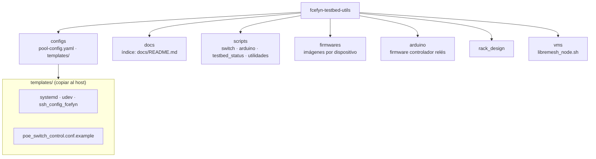

# fcefyn-testbed-utils

Infraestructura complementaria del banco de pruebas HIL (Hardware-in-the-Loop) de FCEFyN: configs, scripts y firmwares que no forman parte de los repositorios contribuidos libremsh-tests y openwrt-tests

---

## Estructura



En **templates/**: servicios `arduino-relay-daemon`, `labgrid-exporter-*`, `99-serial-devices.rules`, etc.

---

## Setup (Ansible)

El setup productivo y local se hace con **Ansible** desde libremesh-tests (o openwrt-tests):

```bash
cd openwrt-tests   # o libremesh-tests
ansible-playbook -i inventory.ini playbook_labgrid.yml -l labgrid-fcefyn -K
```

El playbook despliega exporter, PDUDaemon, dnsmasq, netplan, places.yaml, etc. Ver [docs/configuracion/ansible-labgrid.md](docs/configuracion/ansible-labgrid.md).

---

## Scripts

| Script | Uso |
|--------|-----|
| `scripts/switch/poe_switch_control.py` | Puertos PoE del switch TP-Link (OpenWRT One, Librerouter). |
| `scripts/switch/switch_vlan_preset.py` | Cambia VLANs del switch (isolated vs mesh) y actualiza gateway en DUTs. |
| `scripts/switch/pool-manager.py` | Modo híbrido: exporters por pool, switch differential apply, gateway por DUT. |
| `scripts/switch/dut_gateway.py` | Módulo: actualiza gateway/DNS en DUTs vía SSH paralelo. Usado por preset y pool-manager. |
| `scripts/switch/constants.py` | Módulo: constantes de red compartidas (IPs, VLANs, paths). |
| `scripts/arduino/arduino_relay_control.py` | Control de relés Arduino (power on/off). Usado por PDUDaemon. |
| `scripts/arduino/arduino_daemon.py` | Daemon de conexión persistente al Arduino. Servicio `arduino-relay-daemon`. |
| `scripts/arduino/start_daemon.sh` | Arranque manual del daemon Arduino. |
| `scripts/testbed_status/` | TUI de estado del lab (modo, relés, servicios, pools, DUTs). Ejecutar: `testbed-status`. |
| `scripts/generate_places_yaml.py` | Genera `places.yaml` desde labnet.yaml. |
| `scripts/provision_mesh_ip.py` | Provisiona 10.13.200.x + ruta 10.13.0.0/16 por serial para SSH en mesh. Ver host-config §3.6. |
| `scripts/resolve_target.py` | Resuelve target file desde device name. |

Los scripts de control deben estar en `/usr/local/bin/` o en el PATH; el playbook puede copiarlos.

---

## Prerrequisitos

- **git-lfs** — `apt install git-lfs` antes de clonar (firmwares).
- **Python 3.11+** y dependencias: `pip install -r requirements.txt` (netmiko, pyserial, pyyaml, jinja2).
- dnsmasq, ser2net, `pipx` — el playbook Ansible instala la mayoría.
