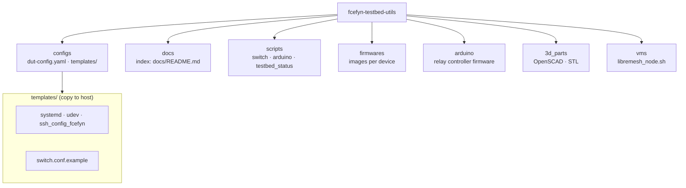

# fcefyn-testbed-utils

Complementary infrastructure for the FCEFyN HIL (Hardware-in-the-Loop) testbed: configs, scripts, and firmwares that are not part of the contributed repositories libremesh-tests and openwrt-tests.

---

## Structure



In **templates/**: `arduino-relay-daemon` service, `99-serial-devices.rules`, `switch.conf.example`, etc.

**Rack CAD (models only):** directory **`3d_parts/`**. Description and images: [docs/diseno/rack-diseno-3d.md](docs/diseno/rack-diseno-3d.md).

---

## Setup (Ansible)

Production and local setup is done with **Ansible** from libremesh-tests (or openwrt-tests):

```bash
cd openwrt-tests   # or libremesh-tests
ansible-playbook -i inventory.ini playbook_labgrid.yml -l labgrid-fcefyn -K
```

The playbook deploys exporter, PDUDaemon, dnsmasq, netplan, places.yaml, etc. See [docs/configuracion/ansible-labgrid.md](docs/configuracion/ansible-labgrid.md).

---

## Scripts

| Script | Description |
|--------|-------------|
| `scripts/switch/poe_switch_control.py` | PoE ports on the TP-Link switch (OpenWRT One, Librerouter). Uses `labgrid-switch-abstraction`. |
| `scripts/switch/dut_gateway.py` | Module: updates gateway/DNS on DUTs via parallel SSH. |
| `scripts/arduino/arduino_relay_control.py` | Arduino relay control (power on/off). Used by PDUDaemon. |
| `scripts/arduino/arduino_daemon.py` | Persistent connection daemon for the Arduino. Service `arduino-relay-daemon`. |
| `scripts/arduino/start_daemon.sh` | Manual startup for the Arduino daemon. |
| `scripts/testbed_status/` | Lab status TUI (VLAN state, relays, services, DUTs). Run: `testbed-status`. Docs: [docs/operar/testbed-status.md](docs/operar/testbed-status.md). |
| `scripts/generate_places_yaml.py` | Generates `places.yaml` from labnet.yaml. |
| `scripts/provision_mesh_ip.py` | Provisions 10.13.200.x + route 10.13.0.0/16 via serial for SSH in mesh. See host-config §3.6. |
| `scripts/resolve_target.py` | Resolves target file from device name. |


Control scripts should be in `/usr/local/bin/` or in PATH; the playbook can copy them.

---

## Prerequisites

- **git-lfs** - `apt install git-lfs` before cloning (firmwares).
- **Python 3.11+** and dependencies: `pip install -r requirements.txt` (netmiko, pyserial, pyyaml, jinja2).
- dnsmasq, ser2net, `pipx` - the Ansible playbook installs most of these.
