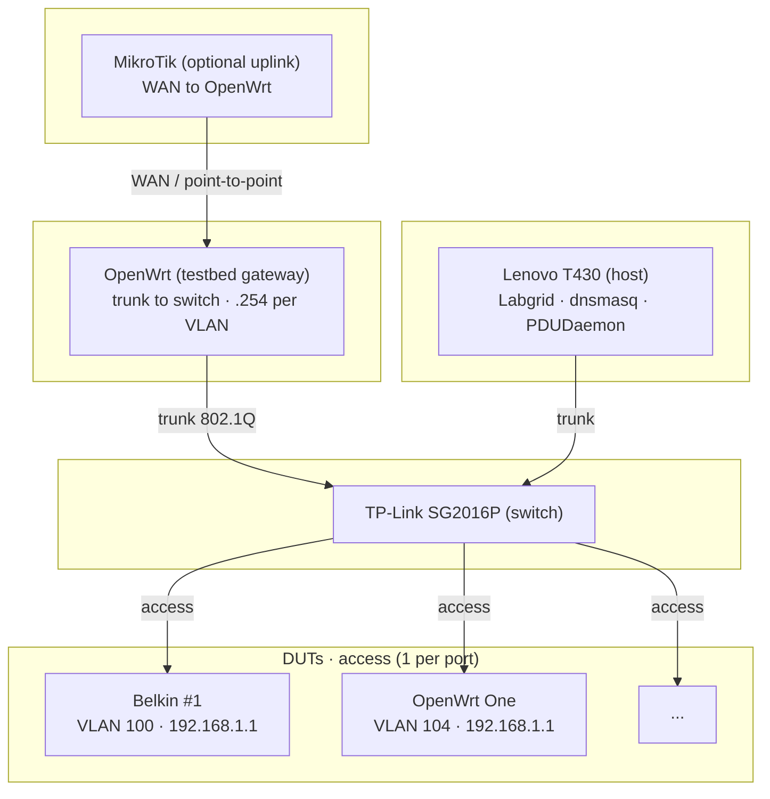

# Docs - FCEFyN lab

Documentation for the OpenWrt and LibreMesh HIL testbed.

---

## Guide by role

| Role | Read first | Then |
|------|------------|------|
| **Lab admin** | [SOM](operar/SOM.md) | [Lab procedures](operar/lab-procedures.md), [rack-cheatsheets](operar/rack-cheatsheets.md), [adding-dut-guide](operar/adding-dut-guide.md), [build-firmware-manual](operar/build-firmware-manual.md) |
| **Test developer** | [SSH access to DUTs](operar/dut-ssh-access.md), [labgrid-troubleshooting](operar/labgrid-troubleshooting.md) | [Lab procedures](operar/lab-procedures.md), [build-firmware-manual](operar/build-firmware-manual.md); [LibreMesh testing approach](https://github.com/francoriba/libremesh-tests/blob/main/docs/libremesh-testing-approach.md), [CI firmware catalog](https://github.com/francoriba/libremesh-tests/blob/main/docs/ci-firmware-catalog.md) (libremesh-tests repo) |
| **Reviewer (thesis)** | [hybrid-lab (historical)](diseno/hybrid-lab-proposal.md) | [hybrid-lab-tracking](diseno/hybrid-lab-tracking.md) for status, [CI use cases](diseno/ci-use-cases.md) for CI |

---

## Technical references (as needed)

[host-config](configuracion/host-config.md) · [switch-config](configuracion/switch-config.md) · [duts-config](configuracion/duts-config.md) · [gateway](configuracion/gateway.md) · [arduino-relay](configuracion/arduino-relay.md) · [tftp-server](configuracion/tftp-server.md) · [ansible-labgrid](configuracion/ansible-labgrid.md) · [ci-runner](configuracion/ci-runner.md) · [observabilidad](configuracion/observabilidad.md) · [grafana-public-access](configuracion/grafana-public-access.md) · [rack-diseno-3d](diseno/rack-diseno-3d.md) · [Lab procedures](operar/lab-procedures.md) · [build-firmware-manual](operar/build-firmware-manual.md) · [dut-ssh-access](operar/dut-ssh-access.md) · [labgrid-troubleshooting](operar/labgrid-troubleshooting.md) · [adding-dut-guide](operar/adding-dut-guide.md) · [wake-on-lan-setup](operar/wake-on-lan-setup.md) · [zerotier-remote-access](operar/zerotier-remote-access.md)

---

## Architecture

**Host:** runs tests, power control, SSH to DUTs. dnsmasq DHCP and TFTP per VLAN.  
**Switch:** VLAN per DUT (100-108) or shared (200 mesh).  
**Gateway:** OpenWrt on trunk to switch; routes between testbed VLANs and Internet (via uplink). Does not provide DHCP on test VLANs (host does). Detail: [gateway](configuracion/gateway.md).

---

## Paths on the host

| Component | Path | Source |
|-----------|------|--------|
| Exporter | `/etc/labgrid/exporter.yaml` | Ansible |
| PDUDaemon | `/etc/pdudaemon/pdudaemon.conf` | Ansible |
| dnsmasq | `/etc/dnsmasq.conf` | Ansible |
| Netplan | `/etc/netplan/labnet.yaml` | Ansible |
| Coordinator | `/etc/labgrid/places.yaml` | Ansible or `generate_places_yaml.py` |
| SSH config | `~/.ssh/config` | Static `ProxyCommand` per DUT (template: `configs/templates/ssh_config_fcefyn`). See [dut-ssh-access](operar/dut-ssh-access.md). |
| TFTP root | `/srv/tftp/` | Manual |
| Switch config | `~/.config/switch.conf` | `configs/templates/switch.conf.example` |
| Udev serial | `/etc/udev/rules.d/99-serial-devices.rules` | `configs/templates/99-serial-devices.rules` |

---

## Migrating to another host

1. Ubuntu, Ethernet interface for trunk. Clone `openwrt-tests` and `fcefyn-testbed-utils`.
2. Netplan: copy, adjust `link`, `netplan apply`.
3. dnsmasq, PDUDaemon, exporter: copy, restart. PoE override if applicable; see [host-config 5.2.1](configuracion/host-config.md#521-poe-pdu-password-with-dynamicuser).
4. Udev: copy rules, `udevadm control --reload-rules`.
5. Scripts: install `scripts/arduino/arduino_relay_control.py`, `scripts/switch/poe_switch_control.py` to `/usr/local/bin/`. Service `arduino-relay-daemon`; see [arduino-relay daemon](configuracion/arduino-relay.md#arduino-relay-daemon).
6. TFTP: create `/srv/tftp/` and subfolders.
7. SSH: `ssh_config_fcefyn` block, `labgrid-bound-connect`, sudoers.
8. Coordinator: `places.yaml`, systemd.

Detail: [SOM](operar/SOM.md), [Lab procedures](operar/lab-procedures.md), [ansible-labgrid](configuracion/ansible-labgrid.md).
