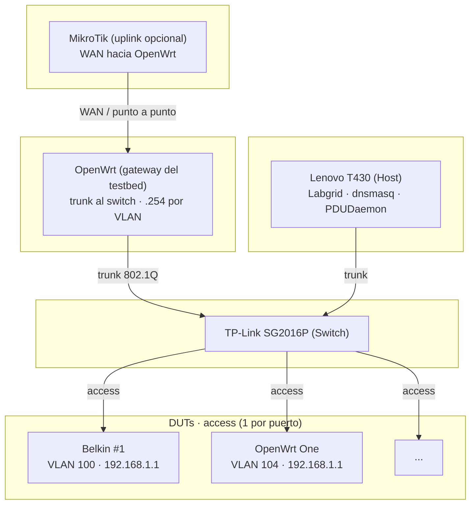

# Docs – Lab FCEFyN

Documentación del banco de pruebas HIL para OpenWrt y LibreMesh.

---

## Guía por rol

| Rol | Lee primero | Luego |
|-----|-------------|-------|
| **Administrador del lab** | [SOM](operar/SOM.md) | [testbed-status](operar/testbed-status.md), [rack-cheatsheets](operar/rack-cheatsheets.md), [adding-dut-guide](operar/adding-dut-guide.md), referencias según necesidad |
| **Revisor (tesis/propuesta)** | [hybrid-lab-proposal](diseno/hybrid-lab-proposal.md) | [hybrid-lab-tracking](diseno/hybrid-lab-tracking.md) para estado, [ci-use-cases-proposal](diseno/ci-use-cases-proposal.md) para CI |
| **Desarrollador (tests)** | [libremesh-testing-approach](tests/libremesh-testing-approach.md) | [SOM](operar/SOM.md) para ejecutar |

---

## Referencias técnicas (consulta según necesidad)

[host-config](configuracion/host-config.md) · [switch-config](configuracion/switch-config.md) · [duts-config](configuracion/duts-config.md) · [gateway](configuracion/gateway.md) · [arduino-relay](configuracion/arduino-relay.md) · [tftp-server](configuracion/tftp-server.md) · [ansible-labgrid](configuracion/ansible-labgrid.md) · [ci-runner](configuracion/ci-runner.md) · [rack-diseno-3d](diseno/rack-diseno-3d.md) · [dut-proxy-por-modo](tests/dut-proxy-por-modo.md) · [labgrid-troubleshooting](tests/labgrid-troubleshooting.md) · [ssh-dual-mode](tests/ssh-dual-mode-flow.md) · [adding-dut-guide](operar/adding-dut-guide.md) · [testbed-status](operar/testbed-status.md) · [wake-on-lan-setup](operar/wake-on-lan-setup.md) · [zerotier-acceso](operar/zerotier-acceso.md)

---

## Arquitectura

**Host:** orquesta tests, control de alimentación, SSH a los DUTs. dnsmasq DHCP y TFTP en cada VLAN.  
**Switch:** VLAN por DUT (100–108) o compartida (200 mesh).  
**Gateway:** OpenWrt en el trunk al switch; enruta entre VLANs del testbed e internet (vía uplink). No proporciona DHCP en las VLANs de prueba (lo hace el host). Detalle: [gateway](configuracion/gateway.md).

---

## Rutas en el host

| Componente | Ruta | Origen |
|------------|------|--------|
| Exporter | `/etc/labgrid/exporter.yaml` | Ansible |
| PDUDaemon | `/etc/pdudaemon/pdudaemon.conf` | Ansible |
| dnsmasq | `/etc/dnsmasq.conf` | Ansible |
| Netplan | `/etc/netplan/labnet.yaml` | Ansible |
| Coordinator | `/etc/labgrid/places.yaml` | Ansible o `generate_places_yaml.py` |
| dut-proxy | `/etc/labgrid/dut-proxy.yaml` | Ansible o pool-manager. Ver [dut-proxy-por-modo](tests/dut-proxy-por-modo.md). |
| TFTP root | `/srv/tftp/` | Manual |
| PoE config | `~/.config/poe_switch_control.conf` | `configs/templates/poe_switch_control.conf.example` |
| Udev serial | `/etc/udev/rules.d/99-serial-devices.rules` | `configs/templates/99-serial-devices.rules` |

---

## Migración a otro host

1. Ubuntu, interfaz Ethernet para trunk. Clonar `openwrt-tests` y `fcefyn-testbed-utils`.
2. Netplan: copiar, ajustar `link`, `netplan apply`.
3. dnsmasq, PDUDaemon, exporter: copiar, reiniciar. Override PoE si aplica; ver [host-config 5.2.1](configuracion/host-config.md#521-pdu-poe-fcefyn-poe-contraseña-para-pdudaemon-con-dynamicuser).
4. Udev: copiar reglas, `udevadm control --reload-rules`.
5. Scripts: instalar `scripts/arduino/arduino_relay_control.py`, `scripts/switch/poe_switch_control.py` en `/usr/local/bin/`. Servicio `arduino-relay-daemon`; ver [arduino-relay 6](configuracion/arduino-relay.md#6-arduino-relay-daemon-arduino_daemonpy).
6. TFTP: crear `/srv/tftp/` y subcarpetas.
7. SSH: bloque `ssh_config_fcefyn`, `labgrid-bound-connect`, sudoers.
8. Coordinator: `places.yaml`, systemd.

Detalle: [SOM](operar/SOM.md), [ansible-labgrid](configuracion/ansible-labgrid.md).
