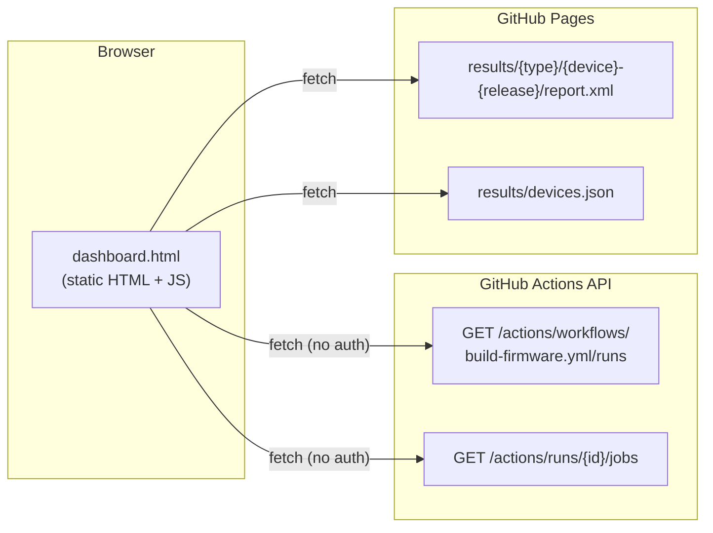

# Dashboard Architecture

The dashboard is a fully static page — no backend, no database. All data is fetched client-side at load time from two sources.

## Data sources



### Source 1 — GitHub Actions REST API

Used for: **job status, run history, duration, links**.

- Endpoint: `https://api.github.com/repos/libremesh/lime-packages/actions/...`
- No authentication required (public repo)
- Rate limit: 60 requests/hour per IP (unauthenticated)
- Job names are parsed to extract device, place, and release:
  `test-firmware (belkin_rt3200_1 / 24.10.6)` → place=`belkin_rt3200_1`, release=`24.10.6`
- Supported job name patterns: see [Device registry — Job types](devices.md#job-types)

### Source 2 — Published `report.xml` files

Used for: **per-test-case breakdown** (pass / fail / skip counts and individual test names).

- Served from this repo's GitHub Pages alongside `dashboard.html`
- JUnit XML format, generated by pytest (`--junitxml`)
- Populated by the `collect-lime-results.yml` workflow, which pulls artifacts from `libremesh/lime-packages` CI every 6h — see [Publishing results](publishing.md)
- Path convention: `results/{type}/{identifier}/report.xml`
- Direct links to reports use `PAGES_BASE` (configured at the top of `dashboard.html`):
  ```js
  const PAGES_BASE = 'https://fcefyn-testbed.github.io/fcefyn_testbed_utils/ci-results/results/';
  ```

### Source 3 — `devices.json`

Used for: **registering device/release combinations** that should always appear in the dashboard, even with no recent CI runs.

- Fetched from `results/devices.json` on the same Pages deployment
- Merged with the entries discovered from the GitHub API

## Request flow

1. Page loads → skeleton cards shown immediately (no blank state while loading)
2. JS fetches last 10 workflow runs from GitHub API
3. For each run, fetches the job list (parallel requests)
4. Parses job names → builds a map of `{id → entry}` with run history
5. Fetches `devices.json` to merge in any registered entries not found via API
6. Renders device cards immediately with API data; release dropdown populated
7. In parallel, fetches each `report.xml` from Pages
8. Cards with a `report.xml` re-render to show test case details; stats bar updates

## Error handling

| Condition | Behaviour |
|-----------|-----------|
| GitHub API unreachable or rate-limited | Error banner with retry button shown in place of the grid |
| `report.xml` missing or not yet published | Card shows "Test details not yet published" |
| `devices.json` missing | Dashboard still works using API-discovered entries only |

## Configuration

All tuneable constants are at the top of the `<script>` block in `dashboard.html`:

| Constant | Default | Description |
|----------|---------|-------------|
| `REPO` | `libremesh/lime-packages` | GitHub repo to query |
| `WF` | `build-firmware.yml` | Workflow filename |
| `RUNS` | `10` | Number of recent runs to fetch |
| `RESULTS_BASE` | `results/` | Local path to `report.xml` files (relative to `dashboard.html`) |
| `PAGES_BASE` | `https://fcefyn-testbed.github.io/…` | Absolute URL used for direct report links; set to `''` to hide the links |
