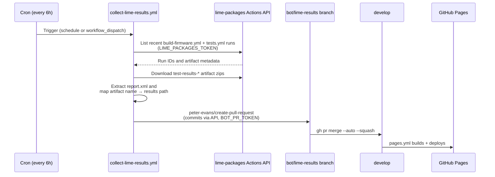

# Publishing Test Results

Test reports are pulled into this repository from `libremesh/lime-packages` CI runs on a schedule, then served alongside the dashboard. Once published, the dashboard renders individual test-case details instead of "Test details not yet published".

## How it works

The pipeline runs entirely from this repository — `lime-packages` does not need any changes. The `collect-lime-results.yml` workflow uses the GitHub Actions REST API to download `report.xml` artifacts from recent CI runs and commits them via an auto-merged PR.



### Why this direction

The CI workflow now lives in upstream `libremesh/lime-packages` (merged via PR #1259). This repo pulls results from there rather than having `lime-packages` push them, keeping the integration decoupled from the upstream workflow.

## Artifact → results path mapping

The collect workflow recognises these artifact name patterns produced by `lime-packages` CI and routes them to the layout the dashboard expects:

| Artifact name | Destination |
|--|--|
| `test-results-unit` | `docs/ci-results/results/unit/report.xml` |
| `test-results-qemu-single-{device}-{release}` | `docs/ci-results/results/qemu-single/{device}-{release}/report.xml` |
| `test-results-qemu-mesh-{device}-{release}` | `docs/ci-results/results/qemu-mesh/{device}-{release}/report.xml` |
| `test-results-mesh-pairs-{pair}-{release}` | `docs/ci-results/results/mesh-pairs/{pair}-{release}/report.xml` |
| `test-results-mesh-{release}` | `docs/ci-results/results/mesh/{release}/report.xml` |
| `test-results-{place}-{release}` | `docs/ci-results/results/physical/{place}-{release}/report.xml` |

Already-collected reports are skipped, so re-running the workflow is idempotent and only picks up new runs.

## Results directory structure

```
docs/ci-results/results/
├── devices.json
├── physical/
│   ├── belkin_rt3200_1-24.10.6/report.xml
│   ├── belkin_rt3200_2-24.10.6/report.xml
│   ├── belkin_rt3200_3-24.10.6/report.xml
│   ├── bananapi_bpi-r4-24.10.6/report.xml
│   └── openwrt_one-24.10.6/report.xml
├── mesh/
│   └── 24.10.6/report.xml
├── mesh-pairs/
│   ├── 1-24.10.6/report.xml
│   ├── 2-24.10.6/report.xml
│   └── 3-24.10.6/report.xml
├── qemu-single/
│   ├── qemu_x86_64-24.10.6/report.xml
│   └── qemu_x86_64-25.12.2/report.xml
└── qemu-mesh/
    ├── qemu_x86_64-24.10.6/report.xml
    └── qemu_x86_64-25.12.2/report.xml
```

## Required secrets

| Secret | Stored in | Purpose | Permissions |
|--|--|--|--|
| `LIME_PACKAGES_TOKEN` | `fcefyn_testbed_utils` | Read CI runs and download artifacts from `lime-packages` | Fine-grained PAT scoped to `libremesh/lime-packages` with **Actions: Read** |
| `BOT_PR_TOKEN` | `fcefyn_testbed_utils` | Open the auto-merged PR with the collected results | Fine-grained PAT scoped to `fcefyn-testbed/fcefyn_testbed_utils` with **Contents: Read and write** + **Pull requests: Read and write** |

## Repository settings required

These need to be enabled once for the auto-merge step to work:

- **Settings → Actions → General → Workflow permissions** → "Allow GitHub Actions to create and approve pull requests" (toggled via the `BOT_PR_TOKEN`, but the repo-level toggle must also be on)
- **Settings → General → Pull Requests** → "Allow auto-merge"
- **`develop` branch protection** → keep "Require signed commits" **off** (PRs created via the GitHub API with a user PAT are not auto-signed by GitHub; enabling this would block the bot)

## Triggering manually

To force an immediate collection (e.g. after a fresh CI run in `lime-packages`):

1. Go to **Actions → Collect lime-packages test results**.
2. **Run workflow** → branch `develop` → optionally set `runs` (how many recent CI runs to scan, default 10).

A bot PR (`bot/lime-results`) appears and auto-merges as soon as required checks pass. If there are no new reports the workflow exits cleanly without opening a PR.
