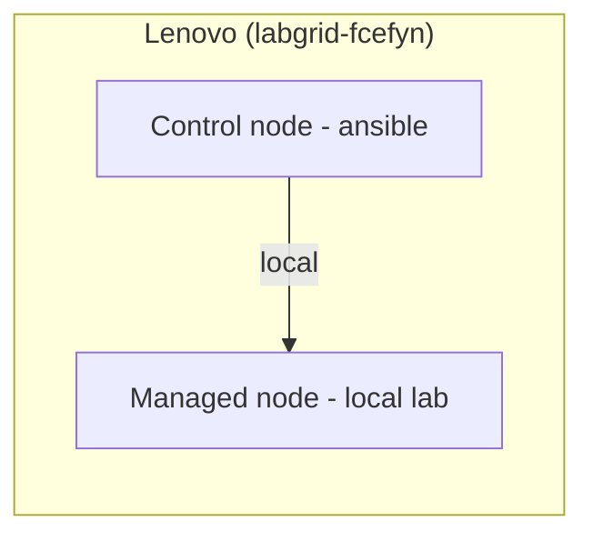
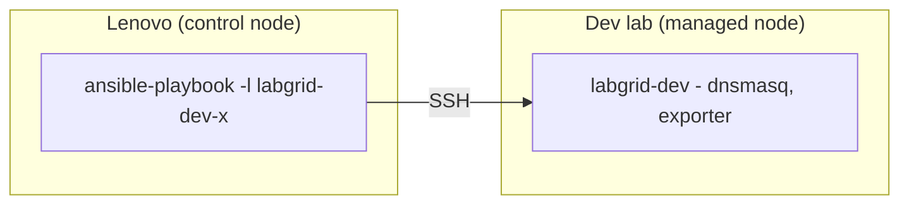
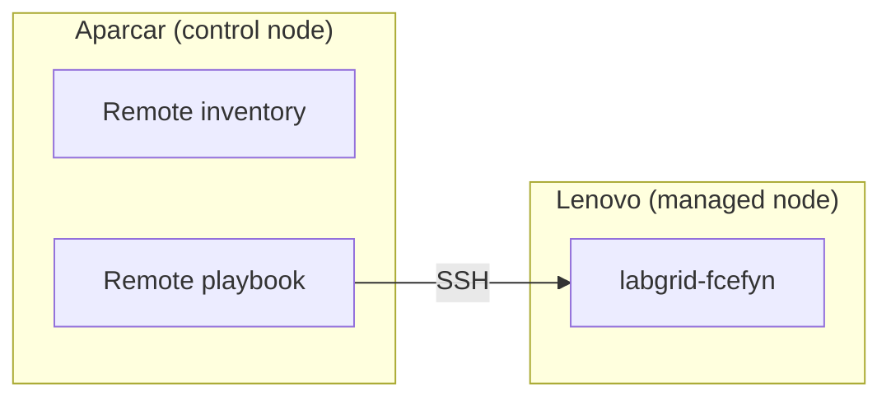

# Ansible and the Labgrid playbook (openwrt-tests)

**`playbook_labgrid.yml`** and Ansible inventory live in [**aparcar/openwrt-tests**](https://github.com/aparcar/openwrt-tests) (`ansible/playbook_labgrid.yml`, `ansible/inventory*`). **fcefyn_testbed_utils** adds roles, templates, and **`ansible/playbook_testbed.yml`** for FCEFyN-specific extras (Arduino relay, PoE, ZeroTier, observability). Host deployment (tags, files, ZeroTier, etc.): [host-config - Ansible](host-config.md#8-ansible-integration).

---

## 1. Summary

The **Ansible playbook** (`playbook_labgrid.yml` in [aparcar/openwrt-tests](https://github.com/aparcar/openwrt-tests)) automates full setup of a lab host:

- User `labgrid-dev`, SSH keys, groups
- Labgrid (pipx), PDUDaemon, dnsmasq
- Netplan (VLANs), exporter, coordinator
- TFTP, udev, labgrid-bound-connect

Everything [host-config](host-config.md) describes as manual configuration can be deployed with this playbook, provided `ansible/files/exporter/<lab>/` exists with lab-specific files (netplan, dnsmasq, pdudaemon, exporter).

---

## 2. Concepts: control node vs managed node

| Role | Description |
|------|-------------|
| **Control node** | Machine where `ansible-playbook` runs. Must have Ansible installed and access (SSH or local) to managed nodes. |
| **Managed node** | Machine Ansible configures. Receives playbook tasks (packages, files, services). |

**Example:** If `ansible-playbook` runs from the Lenovo to `labgrid-fcefyn`, the Lenovo is the control node and host `labgrid-fcefyn` is the managed node. When that host is the same Lenovo, use `ansible_connection=local` to avoid SSH to itself.

---

## 3. Use cases and flows

### 3.1 Maintainer configuring their own lab (openwrt-tests)

The Lenovo is both control and managed node. Run the playbook locally against the same host.



**Inventory:** `labgrid-fcefyn ansible_connection=local`  
**Command:** `ansible-playbook playbook_labgrid.yml -l labgrid-fcefyn -K`

From the Lenovo (control node), with the lab in inventory and `ansible_host` set:

### 3.2 Maintainer configuring another contributor's lab (openwrt-tests)

When a developer contributes their lab to openwrt-tests, the maintainer runs the playbook from the Lenovo toward the contributor's host. The contributor provides SSH access (public key, VPN, etc.).



**Inventory:** `labgrid-dev-x ansible_host=192.168.x.x` (or resolvable hostname)  
**Command:** `ansible-playbook playbook_labgrid.yml -l labgrid-dev-x -K`

```bash
ansible-playbook playbook_labgrid.yml -l labgrid-fcefyn -K --check
```

### 3.3 openwrt-tests (Aparcar) configuring the lab

The Lenovo is only a managed node. The control node lives in Aparcar/upstream infrastructure.



**Do not use the local inventory or playbook.** Aparcar has theirs and they point at the lab host. The Lenovo only needs to be reachable by SSH from their control node.

### 3.4 Tagged tasks only

If the playbook uses tags (e.g. `export` for exporter/coordinator):

```bash
ansible-playbook playbook_labgrid.yml -l labgrid-fcefyn -K --tags export
```

---

### 3.5 Summary of Lenovo roles

| Scenario | Lenovo is |
|---------|-----------|
| Self-setup of own lab (3.1) | Control + managed (local) |
| Setting up another contributor's lab (3.2) | Control node |
| Aparcar managing the host upstream (3.3) | Managed node only |

---

## 4. Files and purpose

All of this lives in the [aparcar/openwrt-tests](https://github.com/aparcar/openwrt-tests) repo, under `ansible/`:

| File | Purpose |
|------|---------|
| `inventory.ini` | Host list (labs, coordinator). Defines connection (local or SSH) and `ansible_host` if needed. |
| `ansible.cfg` | Ansible settings (default inventory, etc.). |
| `playbook_labgrid.yml` | Main playbook. Host setup tasks. |
| `files/exporter/<lab>/netplan.yaml` | Network config (VLANs) for that lab. Copied to `/etc/netplan/labnet.yaml`. |
| `files/exporter/<lab>/dnsmasq.conf` | dnsmasq config. Copied to `/etc/dnsmasq.conf`. |
| `files/exporter/<lab>/pdudaemon.conf` | PDUDaemon config (power control). |
| `files/exporter/<lab>/exporter.yaml` | Labgrid exporter config. |
| `files/coordinator/places.yaml.j2` | Template to generate coordinator `places.yaml`. Uses `labnet.yaml`. |
| `files/exporter/labgrid-exporter.service` | Exporter systemd unit. |
| `files/exporter/pdudaemon.service` | PDUDaemon systemd unit. |
| `files/coordinator/labgrid-coordinator.service` | Coordinator systemd unit. |
| `files/exporter/labgrid-bound-connect` | Script for SSH connections bound to a VLAN interface. |
| `files/exporter/usbsdmux.rules` | udev rules for USB-SD-Mux (if applicable). |

**labnet.yaml** is at the repo root (not under `ansible/`) and is loaded as variables for the playbook.

---

## 5. Inventory

### 5.1 Structure

```ini
[labs]
labgrid-fcefyn ansible_connection=local
# labgrid-other-dev ansible_host=192.168.1.50   # When someone else contributes

[coordinator]
labgrid-fcefyn ansible_connection=local
```

- **`[labs]`**: Hosts the playbook configures (exporter, dnsmasq, netplan, etc.).
- **`[coordinator]`**: Host running labgrid-coordinator. Can be the same as a lab.

### 5.2 `ansible_connection=local`

When the managed node is the same machine running Ansible, use `ansible_connection=local`. That avoids SSH and runs tasks locally. Required for case 3.1 (self-setup).

### 5.3 Adding another contributor's lab

1. The contributor provides SSH (key or network access).
2. Add a line to `inventory.ini`:
   ```ini
   labgrid-new-lab ansible_host=IP_OR_HOSTNAME
   ```
3. Create `ansible/files/exporter/labgrid-new-lab/` with netplan, dnsmasq, pdudaemon, exporter.yaml.
4. Add the lab and its devices to `labnet.yaml`.
5. Run: `ansible-playbook playbook_labgrid.yml -l labgrid-new-lab -K`

---

## 6. Playbook

### 6.1 Variable loading

The playbook needs `labs` and `developers` from `labnet.yaml` to:

- Add developers' SSH keys to `labgrid-dev`
- Generate the TFTP device/instance list
- Generate coordinator `places.yaml`

**Options:**

- **`vars_files: - ../labnet.yaml`** in the playbook (recommended): automatic load.
- **`-e @../labnet.yaml`** on the command line: manual load.

### 6.2 What the playbook does

Approximate task order:

| Task | Result |
|------|--------|
| Set hostname | Managed node hostname |
| Create labgrid-dev | User for Labgrid |
| Add SSH keys | Developers' keys on labgrid-dev |
| Install packages | pipx, microcom, ser2net, socat, iptables, etc. |
| Install Labgrid | via pipx |
| Install PDUDaemon | via pipx |
| Configure netplan | Copy host-specific `netplan.yaml` to `/etc/netplan/labnet.yaml` |
| Configure dnsmasq | Copy host-specific `dnsmasq.conf` |
| Configure PDUDaemon | Copy `pdudaemon.conf`, deploy unit |
| Copy exporter | Copy `exporter.yaml` to `/etc/labgrid/` |
| Add places.yaml | Generate from `labnet.yaml` |
| labgrid-bound-connect | Script + sudoers for bound SSH |
| Udev rules | USB-SD-Mux (if applicable) |
| TFTP folders | `/srv/tftp/` structure per device instance |
| Enable IP forwarding | For routing between VLANs |
| Restart services | dnsmasq, coordinator, exporter, pdudaemon |

### 6.3 Host-specific file priority

For netplan, dnsmasq, and pdudaemon, the playbook checks `files/exporter/<inventory_hostname>/`. If present, it uses that file; otherwise the default template under `files/exporter/`. For labgrid-fcefyn the host-specific directory should always exist.

---

## 7. labnet.yaml

File at the **openwrt-tests repo root** (`../labnet.yaml` relative to `ansible/`); see [aparcar/openwrt-tests/labnet.yaml](https://github.com/aparcar/openwrt-tests/blob/main/labnet.yaml). Not part of Ansible directly; loaded as variables.

### 7.1 Structure

```yaml
devices:
  openwrt_one: { name, target, firmware }
  bananapi_bpi-r4: ...
  linksys_e8450: ...
  librerouter_librerouter-v1: ...

labs:
  labgrid-fcefyn:
    devices: [linksys_e8450, openwrt_one, ...]
    device_instances:
      linksys_e8450: [belkin_rt3200_1, belkin_rt3200_2, belkin_rt3200_3]
      librerouter_librerouter-v1: [librerouter_1]
    developers: [fcefyn-lab]

developers:
  fcefyn-lab:
    sshkey: "ssh-ed25519 AAAA..."
```

### 7.2 Use in the playbook

- `hostvars[inventory_hostname]['labs'][inventory_hostname]` → current lab config.
- `hostvars[inventory_hostname]['developers']` → SSH keys to install.
- `lookup('file', '../labnet.yaml')` → generating `places.yaml`.

---

## 8. Commands by scenario

### Sudo requirement

The playbook uses `become` (sudo) to copy files under `/etc/`, restart services, etc. If the user has no passwordless sudo:

- Use **`-K`** (or `--ask-become-pass`) so Ansible prompts for the password.
- Or **configure passwordless sudo** (typical on the lab host): `echo "USER ALL=(ALL) NOPASSWD: ALL" | sudo tee /etc/sudoers.d/labgrid`

Example: `ansible-playbook playbook_labgrid.yml -l labgrid-fcefyn --ask-become-pass`.

### 8.1 Self-setup (local lab on the Lenovo)

From the control node (the Lenovo):

```bash
cd ~/testbed_fcefyn/openwrt-tests/ansible
ansible-playbook playbook_labgrid.yml -l labgrid-fcefyn -K
```

`-K` asks for the sudo password. Run from `ansible/` so `ansible.cfg` picks up the right inventory. If the playbook has `vars_files: - ../labnet.yaml`, you do not need `-e @../labnet.yaml`.

### 8.2 Setup of another contributor's lab

```bash
cd ~/testbed_fcefyn/openwrt-tests/ansible
ansible-playbook playbook_labgrid.yml -l labgrid-new-lab -K
```

### 8.3 Dry run (check mode)

```bash
ansible-playbook playbook_labgrid.yml -l labgrid-fcefyn -K --check
```