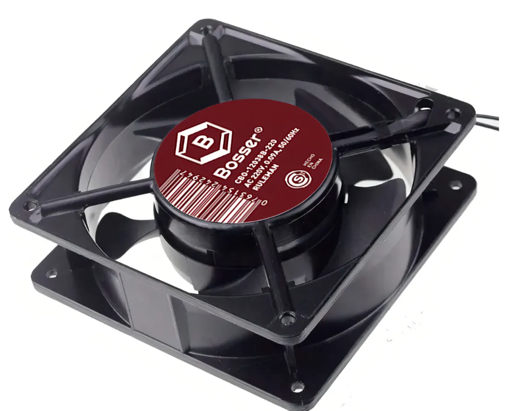

# Catálogo de hardware del lab

Se presentan **imágenes y datos de identificación** del equipamiento físico del banco de pruebas. Los enlaces en cada bloque apuntan a la configuración y operación.

## Aportes y agradecimientos

Parte del equipamiento llegó como **aporte** de fabricantes e instituciones:

| Aportante | Equipamiento |
|-----------|----------------|
| [**Banana Pi**](https://banana-pi.org/) | Placas **OpenWrt One** y **Banana Pi R4** (y material asociado). |
| [**Nisuta**](https://nisuta.com/) | **Hub USB** usado en el host (sección Hub). |
| [**AlterMundi**](https://altermundi.net/) | Unidades **LibreRouter** del proyecto comunitario. |
| [**INTI**](https://www.argentina.gob.ar/inti) (Instituto Nacional de Tecnología Industrial) | Notebook **Lenovo ThinkPad T430** (host); routers **Belkin RT3200**; router gateway **TP-Link TL-WDR3500**. |

## Relés Arduino (rack)

El **Arduino Nano** controla la potencia de los DUTs y de la infraestructura del rack vía **11 canales** USB-Serial. Detalle de canales, UTP, comandos y daemon: [arduino-relay.md](arduino-relay.md).

### Arduino Nano

{: style="max-width: 320px; width: 100%; height: auto; display: block;" }

| Característica | Detalle |
|----------------|---------|
| MCU | Microchip **ATmega328P** |
| Voltaje lógico | 5 V |
| USB | Mini-USB o USB según clon (serial hacia el PC) |
| Reloj | 16 MHz (típico) |
| En el lab | Firmware propio; **11 salidas** hacia módulos SSR y relés mecánicos |

### Módulo SSR de 4 canales (Omron G3MB-202P)

{: style="max-width: 280px; width: 100%; height: auto; display: block;" }

En el laboratorio usamos **CH1** para el switch TP-Link SG2016P (canal lógico 8) y **CH2** para el cooler AC (canal 9). Los canales **CH3** y **CH4** quedan libres.

| Parámetro | Valor |
|-----------|--------|
| Relé | Omron G3MB-202P por canal; fototriac; zero-cross |
| Control | 5 V DC; activo en bajo (~0-2,5 V, ~2 mA); módulo hasta ~48 mA |
| Carga | 100-240 V AC, 0,1-2 A por canal; fusible |
| Placa / conexiones | ~57 x 55 x 25 mm; **DC+** / **DC-**; **CH1-CH4** |
| En el lab | CH1 switch, CH2 cooler; CH3-CH4 libres |

### Fotek SSR-25DA (canal 10)

{: style="max-width: 220px; width: 100%; height: auto; display: block;" }

Este relé corta la fase hacia la carga en **CA** del canal 10 (la fuente del rack). En el firmware del Arduino la lógica es **activa en alto** (canal 10: HIGH = ON; canales 0-9: LOW = ON).

| Parámetro | Valor |
|-----------|--------|
| Tipo | CC → CA, alto voltaje |
| Entrada | 4-32 V DC |
| Salida | 90-480 V AC, hasta 25 A (según fabricante y cableado) |

### Módulo de 8 relés (DUTs 0-7)

{: style="max-width: 280px; width: 100%; height: auto; display: block;" }

Sirve para los canales **0 a 7** (pines **D2-D9** del Arduino): relés electromecánicos optoacoplados, alimentación **5 V DC**.

| Parámetro | Valor |
|-----------|--------|
| Alimentación | 5 V DC; opto; LED SMD por canal |
| Contactos | Hasta 10 A @ 250 V AC o 30 V DC / 10 A (según módulo) |
| Firmware | Mismo patrón de disparo digital que el resto de entradas |

**Cajas de tomas:** Llave Luz Armada Richi Quantum ERA 2 Tomas 3 Módulos Blanco PVC (corte de fase).

{: style="max-width: 320px; width: 100%; height: auto; display: block;" }

## Fuente AC (carga canal 10)

La fuente que alimenta esa rama de **CA** se enchufa detrás del **Fotek**; el papel del canal 10 en el rack se explica en [arduino-relay](arduino-relay.md). Datos de la unidad **Coper Light** metálica:

{: style="max-width: 260px; width: 100%; height: auto; display: block;" }

| Especificación | Valor |
|----------------|-------|
| Marca/Modelo | Coper Light Metálica |
| Potencia | 480 W |
| Entrada | 12-110 VAC, 50/60 Hz |
| Salida | 12-220 V |
| Temperatura de funcionamiento | 0-40 °C |
| Protección | Cortocircuito |

## Ventilador Bosser 120 mm (rack)

Axial de marco **120 mm** a **220 V** de red en la **base del rack** (no es alimentación 12 V del Arduino). Empuja aire hacia el conducto curvo impreso; el ensamble con piezas 3D está en [Rack del banco de pruebas](../diseno/rack-diseno-3d.md).

{: style="max-width: 420px; width: 100%; height: auto; display: block;" }

| Característica | Valor |
|----------------|-------|
| Marca | Bosser |
| Línea | Coolers 220 V |
| Modelo | **CBO-12038B-220** |
| Alimentación | AC **220 V** |
| Corriente | 0,09 A |
| Frecuencia | 50 / 60 Hz |
| Rodamiento | Ruleman |
| Formato | Marco **120 × 120 mm** |

En el lab el encendido del cooler va por **SSR** (canal 9); detalle en [arduino-relay](arduino-relay.md).

## Hub USB

Ubicado en el rack y conectado al host de orquestacón hay un hub de **carcasa metálica** con varios puertos USB 3.0.

*Aporte **Nisuta** (ver [tabla arriba](#aportes-y-agradecimientos)).*

{: style="max-width: 280px; width: 100%; height: auto; display: block;" }

| Característica | Detalle |
|----------------|---------|
| Puertos USB | 10 x USB 3.0 (5 Gbps), tipo A hembra |
| Carga rápida | 1 puerto QC3.0 (5 V / 3 A; 9 V / 2 A; 12 V / 1,5 A) |
| Compatibilidad | USB 2.0 y versiones anteriores |
| Carcaza | Metálica |
| Cable incluido | USB 3.0 A macho - B macho, 1 m (hacia la PC) |
| Fuente externa | 12 V, 5,4 A |
| Por puerto USB 3.0 | Hasta 5 V, 0,9 A máx. por puerto |

Con varios adaptadores seriales y periféricos, el hub se usa con **fuente externa conectada** además del bus USB de la PC.

## Switch gestionado (TP-Link SG2016P)

Switch **L2+** del lab: trunk al host y al gateway, puertos access a DUTs, parte de los puertos con **PoE**. Configuración: [switch-config.md](switch-config.md).

{: style="max-width: 380px; width: 100%; height: auto; display: block;" }

| Característica | Detalle |
|----------------|---------|
| Modelo | **TP-Link SG2016P** |
| Puertos | **16× Gigabit Ethernet** |
| PoE | **8 puertos** con PoE (802.3af/at según datasheet del fabricante) |
| Gestión | Web / SNMP; VLAN 802.1Q, trunk y access |
| En el lab | Puerto 9 trunk **host** (Lenovo), 10 trunk **gateway**, 1-4 y 11-16 a DUTs (ver switch-config) |

## Host de orquestación (Lenovo ThinkPad T430)

El host de orquestación del laboratorio es un **Lenovo ThinkPad T430** con **Ubuntu**: Labgrid, dnsmasq/TFTP, scripts del switch, PDUDaemon y runner de CI. Documentación: [host-config.md](host-config.md).

{: style="max-width: 420px; width: 100%; height: auto; display: block;" }

| Característica | Detalle |
|----------------|---------|
| Modelo | **Lenovo ThinkPad T430** |
| Rol en el lab | Orquestación HIL, DHCP/TFTP por VLAN, SSH a DUTs, exporter Labgrid |
| Red | Trunk 802.1Q al switch (Netplan + NetworkManager); ver host-config |

*Aporte **INTI** (Instituto Nacional de Tecnología Industrial).*

## Adaptadores USB-TTL (serial)

Son conversores **USB - UART TTL** para entrar por consola serial a routers y DUTs. Los nombres estables bajo `/dev/` (symlinks por equipo) y las reglas **udev** están documentados en [host-config, sección Udev](host-config.md#7-reglas-udev-para-adaptadores-seriales).

### CH340

{: style="max-width: 260px; width: 100%; height: auto; display: block;" }

Diseño habitual con chip **CH340**; suele ser el más económico. El nivel lógico depende del cable o placa (**3,3 V** o **5 V**). Formato típico: dongle con USB a un lado y pinera o conector a la placa.

### FTDI FT232RNL (familia FT232)

{: style="max-width: 260px; width: 100%; height: auto; display: block;" }

Interfaz **FTDI**, referencia **FT232RNL**; en Linux suele usarse con los drivers del kernel.

## Gateway del testbed (TP-Link TL-WDR3500)

Router **OpenWrt** en el trunk al switch: VLANs de DUTs, gateway `.254` por subred. Detalle en [gateway.md](gateway.md).

{: style="max-width: 420px; width: 100%; height: auto; display: block;" }

| Característica | Detalle |
|----------------|---------|
| Fabricante | TP-Link |
| SoC | Qualcomm Atheros **AR9344** (MIPS 74Kc) ~560 MHz |
| Arquitectura | MIPS |
| RAM | 128 MB |
| Flash | 8 MB NOR |
| Ethernet | 5× **100 Mbit/s** (1 WAN + 4 LAN, switch integrado AR934x) |
| Wi-Fi | Doble banda **N600**: 2,4 GHz 2×2 + 5 GHz 2×2 (802.11n) |
| PoE | No |
| USB | 1× USB 2.0 |
| OpenWrt | **ath79**; en el lab como gateway (p. ej. 24.x / 25.x). [TOH / techdata](https://openwrt.org/toh/hwdata/tp-link/tp-link_tl-wdr3500_v1) |

*Nota:* Para estándares actuales el CPU y el Ethernet Fast-Ethernet son limitantes; basta como **router VLAN/gateway** del banco, no como DUT de alto rendimiento.

*Aporte **INTI** (Instituto Nacional de Tecnología Industrial).*

## DUTs y routers del banco (referencia de hardware)

Estado en rack, puertos del switch, VLANs y firmware: [duts-config.md](duts-config.md). Siguen fichas técnicas por modelo en uso; los datos pueden variar según revisión de placa. Referencia general: [OpenWrt Techdata](https://openwrt.org/toh/start).

### OpenWrt One

Placa **oficial de la comunidad OpenWrt** (hardware Banana Pi); doble flash NAND + NOR orientada a recuperación.

{: style="max-width: 420px; width: 100%; height: auto; display: block;" }

| Característica | Detalle |
|----------------|---------|
| Fabricante / diseño | Banana Pi (hardware) + **OpenWrt** (diseño oficial del proyecto) |
| SoC | MediaTek **MT7981B** (Filogic 820), dual-core Cortex-A53 @ 1,3 GHz |
| Arquitectura | ARM64 |
| RAM | 1 GB DDR4 |
| Almacenamiento | **256 MB** SPI NAND + **16 MB** SPI NOR (recuperación) |
| Expansión | **M.2** 2242/2230 **NVMe** (PCIe Gen2 x1) |
| Ethernet | 1× **2,5 GbE** (WAN) + 1× **1 GbE** (LAN) |
| Wi-Fi | Wi-Fi 6, chip **MT7976C**: 2,4 GHz **2×2** + 5 GHz **3×3** |
| PoE | **Sí** (802.3af/at en entrada WAN, según documentación del producto) |
| USB | 1× USB 2.0 tipo A + **USB-C** (alimentación / datos, según SKU) |
| Otras | RTC con pila, **mikroBUS**, antenas MMCX |
| OpenWrt | Soporte **oficial** (imágenes `mediatek/filogic`) |

*Aporte **Banana Pi**.*

### Banana Pi BPI-R4

Router potente con **10G** y opción Wi-Fi 7 por módulos miniPCIe; usado en el lab como DUT de alto rendimiento.

{: style="max-width: 420px; width: 100%; height: auto; display: block;" }

| Característica | Detalle |
|----------------|---------|
| Fabricante | Banana Pi (Sinovoip) |
| SoC | MediaTek **MT7988A** (Filogic 880), quad-core Cortex-A73 @ 1,8 GHz |
| Arquitectura | ARM64 |
| RAM | **4 GB u 8 GB** DDR4 (según variante comercial) |
| Almacenamiento | **8 GB eMMC** + SPI-NAND (**128 MB o 256 MB**, según revisión) |
| Expansión | microSD + **M.2 NVMe** (KEY-M) + M.2 KEY-B (celular, según placa) |
| Ethernet | **4× 1 GbE** + **2× 10 GbE SFP+** (existen variantes combo RJ45/SFP según SKU) |
| Wi-Fi | Sin radio integrada en la placa base; **2× miniPCIe** (PCIe 3.0) para módulos (p. ej. Wi-Fi 7) |
| PoE | No integrado en la placa base |
| USB | 1× **USB 3.2** |
| OpenWrt | **Sí** (`mediatek/filogic`); en el lab como DUT con enlaces 10G |

*Aporte **Banana Pi**.*

### Libre Router (AlterMundi / LibreRouter.org)

Hardware abierto orientado a **redes comunitarias** y LibreMesh; en el lab con carcasa o placa según unidad.

{: style="max-width: 420px; width: 100%; height: auto; display: block;" }

{: style="max-width: 420px; width: 100%; height: auto; display: block;" }

| Característica | Detalle |
|----------------|---------|
| Fabricante / proyecto | **AlterMundi** / comunidad **LibreRouter** |
| SoC | Qualcomm Atheros **QCA9558** MIPS @ ~720 MHz |
| Arquitectura | MIPS |
| RAM | 128 MB DDR2 |
| Flash | 16 MB NOR |
| Ethernet | 2× **1 GbE** (switch QCA8337), **PoE** y **passthrough** según diseño |
| Wi-Fi | 2,4 GHz **2×2** integrado + hasta **2× miniPCIe** para radios 5 GHz (p. ej. 802.11an/ac) |
| USB | **2× USB 2.0** en PCB (pueden no quedar accesibles según carcasa) |
| Otras | Esquemas/Gerbers publicados, GPIO, watchdog |
| OpenWrt / LibreMesh | **Sí**; en el lab a menudo **LibreRouterOS** / LibreMesh derivado de OpenWrt |

*Aporte **AlterMundi** (proyecto LibreRouter).*

### Belkin RT3200 / Linksys E8450

Mismo hardware con marcas **Belkin** (RT3200) y **Linksys** (E8450). OpenWrt usa layout **UBI**.

{: style="max-width: 360px; width: 100%; height: auto; display: block;" }

{: style="max-width: 360px; width: 100%; height: auto; display: block;" }

| Característica | Detalle |
|----------------|---------|
| Fabricante comercial | **Belkin** (RT3200) / **Linksys** (E8450) |
| SoC | MediaTek **MT7622BV** (dual Cortex-A53) + **MT7915E** (Wi-Fi 6) |
| Arquitectura | ARM64 |
| RAM | 512 MB DDR3 |
| Flash | 128 MB SPI-NAND (layout **UBI** en OpenWrt) |
| Ethernet | 5× **1 GbE** (1 WAN + 4 LAN) |
| Wi-Fi | Doble banda **AX3200** (según especificación del fabricante) |
| PoE | No |
| USB | 1× USB 2.0 en el chasis |
| OpenWrt | Instalación y migración **UBI**: [TOH E8450 / RT3200](https://openwrt.org/toh/linksys/e8450) |

*Aporte **INTI** (Instituto Nacional de Tecnología Industrial).*
