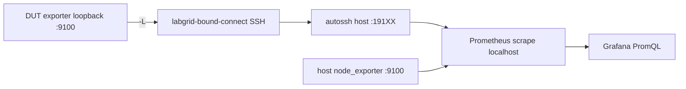
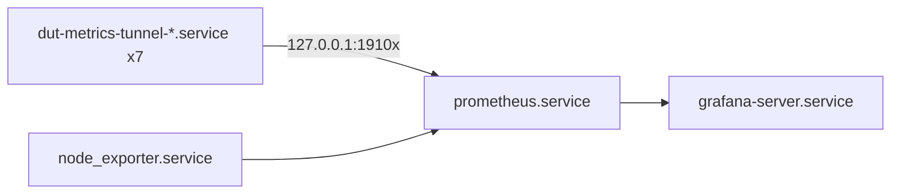

# Observability - DUT and host metrics

The **lab host** runs the metrics stack. On each **DUT**, only the OpenWrt exporter is required (`prometheus-node-exporter-lua`); the orchestration host exposes its own metrics via `prometheus-node-exporter`. The Ansible **`observability`** role automates the following on the host.

**Public HTTPS** access to Grafana (Oracle VM, Nginx, reverse SSH tunnel) is documented in [grafana-public-access.md](grafana-public-access.md). This page covers only the stack on the lab host (scrape, local dashboards).

---

## What Ansible automates

| Action | Detail |
|--------|--------|
| Packages | Installs `autossh`, `prometheus`, `grafana` (official Grafana repo), `prometheus-node-exporter` (host). |
| DUT tunnels | For each `observability_duts` row: unit **`dut-metrics-tunnel-<name>.service`** (`autossh`, forward `127.0.0.1:<local_port>` to `127.0.0.1:9100` on the DUT). |
| Host node exporter | Installs `prometheus-node-exporter`, binds to loopback `127.0.0.1:9100`, generates job `orchestrator-host` in `jobs.d/`. |
| Prometheus | Writes **`/etc/prometheus/prometheus.yml`** from template; validates with `promtool`. Loads jobs from **`/etc/prometheus/jobs.d/*.yml`**. |
| Grafana | Creates **Prometheus** datasource (`uid: prometheus`) via provisioning. Provisions dashboards from JSON in the repo: **Orchestrator Host** and **DUTs & gateway**. |
| Services | Enables and starts tunnels, `prometheus`, `prometheus-node-exporter`, `grafana-server`. |

**Does not** automate: exporter installation on the DUT (opkg) or optional Wi-Fi/hwmon collectors.

---

## Data flow



Prometheus only talks to **127.0.0.1** on the host; the DUT IP on the VLAN is resolved via SSH + `labgrid-bound-connect` (static isolated VLAN per DUT). If the DUT VLAN changes briefly during tests, the session drops and **`autossh`** brings the forward back up.

---

## systemd units on the host (multiple DUTs)

Each DUT with observability has **its own** tunnel unit. Prometheus and Grafana are **one** each. The host exposes its metrics directly (no tunnel).



One tunnel unit per `observability_duts` entry. Useful commands: `systemctl status dut-metrics-tunnel-<name>`, `journalctl -u dut-metrics-tunnel-<name> -n 30`.

---

## Web UIs

| Service | URL | Access |
|---------|-----|--------|
| Prometheus | [http://127.0.0.1:9090](http://127.0.0.1:9090) | Host or SSH tunnel only |
| Grafana (local) | [http://127.0.0.1:3000](http://127.0.0.1:3000) | Host or SSH tunnel only |
| Grafana (public) | [https://fcefyn-testbed.duckdns.org](https://fcefyn-testbed.duckdns.org) | Internet via Oracle VPS + HTTPS |

In Prometheus: **Status → Targets** lists each job (name = `name` in `observability_duts`). In Grafana: **Prometheus** datasource is provisioned by Ansible.

VPS, Certbot, and tunnel unit: [grafana-public-access.md](grafana-public-access.md).

---

## Grafana dashboards

Two dashboards:

| Dashboard | Source | Description |
|-----------|--------|---------------|
| **FCEFyN Testbed - DUTs & gateway** | Provisioned (JSON in repo) | DUTs + WDR3500 gateway. **device** variable with `label_values(up{dut!="lab-orchestrator"}, dut)`: **does not** include the orchestration host. All queries use `dut="$device"` and datasource `uid: prometheus`. |
| **FCEFyN Testbed - Orchestrator Host** | Provisioned (JSON in repo) | Orchestration host (~30 panels). Job `orchestrator-host`, label `dut=lab-orchestrator`. |

### DUTs & gateway dashboard sections

| Section | Content |
|---------|---------|
| Overview | Uptime, CPU, RAM, load, disk `/`, `up` |
| Device info | Instant tables `node_uname_info`, `node_openwrt_info` |
| CPU & load | CPU by mode (stacked), load 1/5/15m |
| Memory | Total / available / used |
| Network | Traffic and packets per interface (excluding `lo`) |
| Disk | Usage % per mountpoint, free space |
| Temperature | `node_hwmon_temp_celsius`, `node_thermal_zone_temp`, CPU stats / max / ieee80211 radios |
| Wi-Fi | `wifi_network_*` (AP), `wifi_stations` / `wifi_station_signal_dbm` (stations, if opkg packages present) |
| Labels | Table of scrape labels (`firmware`, `target`, etc.) from `up{dut="$device"}` |

### Orchestrator Host dashboard sections

| Section | Panels |
|---------|--------|
| System Overview | Uptime, CPU %, RAM %, Disk %, Swap %, Load, Processes, Open FDs |
| CPU | Usage stacked by mode, Load Average (1/5/15m + cores), Context Switches/Interrupts, Processes & Threads |
| Memory | Usage stacked (apps/buffers/cached/free), Swap |
| Disk / Filesystem | Usage % (bar gauge), Available Space, Inodes % |
| Disk I/O | Throughput (read/write), IOPS, I/O Wait Time, I/O in Progress |
| Network - Physical | Bandwidth (bps), Packets/s, Errors & Drops, TCP Connections |
| Network - VLANs | Bandwidth and packets for vlan100-108, vlan200 (collapsible) |
| System Internals | File Descriptors, Entropy, Sockets by Protocol, Systemd Units (active/failed), Socket Memory |

For **orchestration host only** metrics, always use **Orchestrator Host**; the DUT dashboard excludes it on purpose from the **device** dropdown.

---

## Deploy (Ansible)

```bash
ansible-playbook -i ansible/inventory/hosts.yml ansible/playbook_testbed.yml --tags observability -K
```

Active DUTs are listed in `ansible/roles/observability/defaults/main.yml` (repo root) under `observability_duts`.

---

## Adding a DUT

### Step 1 - On the DUT (manual, once over SSH)

Requires Internet on the DUT (opkg feeds). See also [duts-config - Internet access](duts-config.md#internet-access-opkg).

```sh
opkg update
opkg install prometheus-node-exporter-lua prometheus-node-exporter-lua-openwrt
uci set prometheus-node-exporter-lua.main.listen_interface='loopback'
uci commit prometheus-node-exporter-lua
/etc/init.d/prometheus-node-exporter-lua enable
/etc/init.d/prometheus-node-exporter-lua start
```

Verify: `wget -qO- http://127.0.0.1:9100/metrics | head -5`

The exporter listens **only on loopback** for security.

Optional collectors (hardware dependent):

```sh
opkg install prometheus-node-exporter-lua-hwmon prometheus-node-exporter-lua-wifi
```

#### Filesystem collector (no official package)

The `node_filesystem_*` collector is not an opkg package: upstream PR [#25535](https://github.com/openwrt/packages/pull/25535) has been open since 2020. Install manually as a Lua file:

```sh
cat > /usr/lib/lua/prometheus-collectors/filesystem.lua << 'EOF'
local nix = require "nixio"

local function scrape()
  local metric_size_bytes = metric("node_filesystem_size_bytes", "gauge")
  local metric_free_bytes = metric("node_filesystem_free_bytes", "gauge")
  local metric_avail_bytes = metric("node_filesystem_avail_bytes", "gauge")
  local metric_files = metric("node_filesystem_files", "gauge")
  local metric_files_free = metric("node_filesystem_files_free", "gauge")
  local metric_readonly = metric("node_filesystem_readonly", "gauge")

  for e in io.lines("/proc/self/mounts") do
    local fields = space_split(e)
    local device, mount_point, fs_type = fields[1], fields[2], fields[3]

    if mount_point:find("/dev/?", 1) ~= 1
    and mount_point:find("/proc/?", 1) ~= 1
    and mount_point:find("/sys/?", 1) ~= 1
    and fs_type ~= "overlay" and fs_type ~= "squashfs"
    and fs_type ~= "tmpfs"   and fs_type ~= "sysfs"
    and fs_type ~= "proc"    and fs_type ~= "devtmpfs"
    and fs_type ~= "devpts"  and fs_type ~= "debugfs"
    and fs_type ~= "cgroup"  and fs_type ~= "cgroup2"
    and fs_type ~= "pstore" then
      local ok, stat = pcall(nix.fs.statvfs, mount_point)
      if ok and stat then
        local labels = { device = device, fstype = fs_type, mountpoint = mount_point }
        local ro = (nix.bit.band(stat.flag, 0x001) == 1) and 1 or 0
        metric_size_bytes(labels, stat.blocks * stat.bsize)
        metric_free_bytes(labels, stat.bfree  * stat.bsize)
        metric_avail_bytes(labels, stat.bavail * stat.bsize)
        metric_files(labels, stat.files)
        metric_files_free(labels, stat.ffree)
        metric_readonly(labels, ro)
      end
    end
  end
end

return { scrape = scrape }
EOF
```

After creating or editing the file, **restart** the service so the collector loads (without restart, `wget … | grep node_filesystem` is often empty):

```sh
/etc/init.d/prometheus-node-exporter-lua restart
wget -qO- http://127.0.0.1:9100/metrics | grep node_filesystem
```

Requires `nixio` (usual dependency of `prometheus-node-exporter-lua`; if it fails, `opkg install luci-lib-nixio`).

**Note:** Root filesystem `/` is `overlay` (filtered by design, same as standard node_exporter).

### Thermal sensors by device

Not all SoCs expose temperature sensors in Linux. The table shows which devices report `node_hwmon_temp_celsius`:

| DUT | CPU sensor | Wi-Fi radio sensor | Notes |
|-----|-------------|-------------------|-------|
| openwrt-one | Yes (`thermal_thermal_zone0`) | Yes (`ieee80211_phy0`, `phy1`) | MediaTek Filogic |
| bananapi | Yes (`thermal_thermal_zone0`) | Yes (`ieee80211_phy0`) | MediaTek MT7988 |
| belkin-1 | No | Yes (`ieee80211_phy0`, `phy1`) | MediaTek MT7622 |
| belkin-2 | No | Yes (`ieee80211_phy0`) | MediaTek MT7622 |
| belkin-3 | No | Yes (`ieee80211_phy0`) | MediaTek MT7622 |
| librerouter-1 | No | No | IPQ4019 - not supported |
| gateway-wdr3500 | No | No | QCA9558 (ath79) - not supported |

In Grafana, temperature panels show "No data" for devices without sensors.

### Step 2 - In the repo

Add an entry under `observability_duts` in `ansible/roles/observability/defaults/main.yml`:

```yaml
observability_duts:
  - name: dut-name
    ssh_alias: dut-dut-name
    local_port: 19106
    remote_port: 9100
    labels:
      dut: dut-name
      firmware: openwrt-X.Y.Z
      target: platform-arch
```

Local ports (`local_port`) per DUT (align with [duts-config](duts-config.md) when changing firmware):

| `dut` (Grafana label) | Device | `local_port` | `ssh_alias` |
|-----------------------|--------|--------------|-------------|
| openwrt-one | OpenWrt One | 19100 | `dut-openwrt-one` |
| belkin-1 | Belkin RT3200 #1 | 19101 | `dut-belkin-1` |
| belkin-2 | Belkin RT3200 #2 | 19102 | `dut-belkin-2` |
| belkin-3 | Belkin RT3200 #3 | 19103 | `dut-belkin-3` |
| bananapi | Banana Pi R4 | 19104 | `dut-bananapi` |
| librerouter-1 | Librerouter 1 | 19105 | `dut-librerouter-1` |

Until step 1 is done, the Prometheus target stays **DOWN** for that name; the tunnel may restart in a loop if the DUT is off.

### Step 3 - Apply

```bash
ansible-playbook -i ansible/inventory/hosts.yml ansible/playbook_testbed.yml --tags observability -K
```

---

## Verification

```bash
systemctl status dut-metrics-tunnel-<name>
curl -sS http://127.0.0.1:<local_port>/metrics | head -5
promtool check config /etc/prometheus/prometheus.yml
```

In [Prometheus](http://127.0.0.1:9090): **Status → Targets** - all DUTs plus `orchestrator-host` should appear. In [Grafana](http://127.0.0.1:3000): **FCEFyN Testbed - DUTs & gateway** and **FCEFyN Testbed - Orchestrator Host** (both provisioned by Ansible).

```bash
# Host node exporter
curl -sS http://127.0.0.1:9100/metrics | head -5
systemctl status prometheus-node-exporter
```

---

## Key files

Paths are relative to the repository root.

| Path | Description |
|------|-------------|
| `ansible/roles/observability/defaults/main.yml` | `observability_duts`, `orchestrator_node_exporter`, `grafana_public_tunnel`, `grafana_config` |
| `ansible/roles/observability/templates/dut-metrics-tunnel.service.j2` | autossh unit per DUT |
| `ansible/roles/observability/templates/dut-scrape-job.yml.j2` | Scrape fragment per DUT |
| `ansible/roles/observability/templates/orchestrator-scrape-job.yml.j2` | Host scrape fragment |
| `ansible/roles/observability/templates/prometheus.yml.j2` | Main `prometheus.yml` |
| `ansible/roles/observability/templates/grafana-dashboards-provider.yml.j2` | File-based dashboard provider in Grafana |
| `ansible/roles/observability/files/dashboards/orchestrator-node.json` | Orchestrator host dashboard JSON |
| `ansible/roles/observability/files/dashboards/duts-node.json` | DUTs + gateway dashboard JSON (variable excludes `lab-orchestrator`) |
