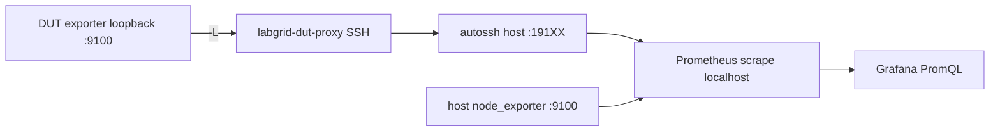
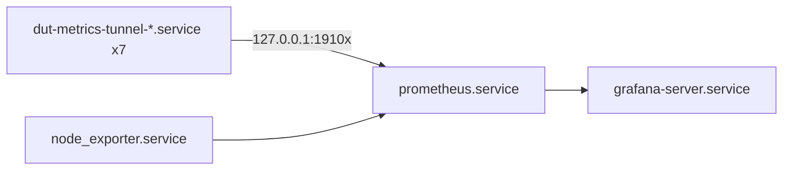

# Observabilidad - Métricas de DUTs y host

En el **host del lab** corre el stack de lectura de métricas. En cada **DUT** solo hace falta el exporter en OpenWrt (`prometheus-node-exporter-lua`); el host de orquestación expone sus propias métricas via `prometheus-node-exporter`. El role Ansible **`observability`** automatiza en el host lo que sigue.

El acceso **HTTPS público** a Grafana (VM Oracle, Nginx, túnel SSH reverso) está en [grafana-publico.md](grafana-publico.md). Aqui solo se presenta el stack instalado en el host del lab (scrape, dashboards locales).

---

## Qué automatiza Ansible

| Acción | Detalle |
|--------|---------|
| Paquetes | Instala `autossh`, `prometheus`, `grafana` (repo oficial Grafana), `prometheus-node-exporter` (host). |
| Túneles DUT | Por cada fila de `observability_duts`: unit **`dut-metrics-tunnel-<name>.service`** (`autossh`, forward `127.0.0.1:<local_port>` → `127.0.0.1:9100` en el DUT). |
| Node exporter host | Instala `prometheus-node-exporter`, lo fija en loopback `127.0.0.1:9100`, genera job `orchestrator-host` en `jobs.d/`. |
| Prometheus | Escribe **`/etc/prometheus/prometheus.yml`** desde template; valida con `promtool`. Carga jobs desde **`/etc/prometheus/jobs.d/*.yml`**. |
| Grafana | Crea datasource **Prometheus** (`uid: prometheus`) por provisioning. Provisiona dashboards desde JSON en el repo: **Orchestrator Host** y **DUTs & gateway**. |
| Servicios | Habilita y arranca túneles, `prometheus`, `prometheus-node-exporter`, `grafana-server`. |

**No** automatiza: instalación del exporter en el DUT (opkg) ni collectors opcionales Wi-Fi/hwmon.

---

## Flujo de datos



Prometheus solo habla con **127.0.0.1** en el host; la IP del DUT en la VLAN la resuelve SSH + `labgrid-dut-proxy`. Si cambia el modo del testbed, la sesión cae y **`autossh`** vuelve a levantar el forward.

---

## Units systemd en el host (varios DUTs)

Cada DUT con observabilidad tiene **su propio** unit de túnel. Prometheus y Grafana son **uno** cada uno. El host expone sus métricas directamente (sin túnel).



Un unit de túnel por entrada en `observability_duts` del role. Comandos útiles: `systemctl status dut-metrics-tunnel-<name>`, `journalctl -u dut-metrics-tunnel-<name> -n 30`.

---

## Interfaces web

| Servicio | URL | Acceso |
|----------|-----|--------|
| Prometheus | [http://127.0.0.1:9090](http://127.0.0.1:9090) | Solo desde el host o túnel SSH |
| Grafana (local) | [http://127.0.0.1:3000](http://127.0.0.1:3000) | Solo desde el host o túnel SSH |
| Grafana (público) | [https://fcefyn-testbed.duckdns.org](https://fcefyn-testbed.duckdns.org) | Internet via Oracle VPS + HTTPS |

En Prometheus: **Status → Targets** para ver cada job (nombre = `name` en `observability_duts`). En Grafana: el datasource **Prometheus** queda configurado por Ansible.

Despliegue del VPS, Certbot y unit del túnel: [grafana-publico.md](grafana-publico.md).

---

## Dashboards en Grafana

Dos dashboards:

| Dashboard | Origen | Descripción |
|-----------|--------|-------------|
| **FCEFyN Testbed - DUTs & gateway** | Provisionado (JSON en repo) | DUTs + gateway WDR3500. Variable **device** con `label_values(up{dut!="lab-orchestrator"}, dut)`: **no** incluye el host de orquestación. Todas las queries usan `dut="$device"` y datasource `uid: prometheus`. |
| **FCEFyN Testbed - Orchestrator Host** | Provisionado (JSON en repo) | Host de orquestación (~30 paneles). Job `orchestrator-host`, label `dut=lab-orchestrator`. |

### Secciones del dashboard DUTs & gateway

| Sección | Contenido |
|---------|-----------|
| Overview | Uptime, CPU, RAM, load, disco `/`, `up` |
| Device info | Tablas instant `node_uname_info`, `node_openwrt_info` |
| CPU & load | CPU por modo (stacked), load 1/5/15m |
| Memory | Total / available / used |
| Network | Tráfico y paquetes por interfaz (sin `lo`) |
| Disk | Uso % por mountpoint, espacio libre |
| Temperatura | `node_hwmon_temp_celsius`, `node_thermal_zone_temp`, stats CPU / máximo / radios ieee80211 |
| Wi-Fi | `wifi_network_*` (AP), `wifi_stations` / `wifi_station_signal_dbm` (estaciones, si están los paquetes opkg) |
| Labels | Tabla con labels de scrape (`firmware`, `target`, etc.) desde `up{dut="$device"}` |

### Secciones del dashboard Orchestrator Host

| Sección | Paneles |
|---------|---------|
| System Overview | Uptime, CPU %, RAM %, Disk %, Swap %, Load, Processes, Open FDs |
| CPU | Usage stacked por modo, Load Average (1/5/15m + cores), Context Switches/Interrupts, Processes & Threads |
| Memory | Usage stacked (apps/buffers/cached/free), Swap |
| Disk / Filesystem | Usage % (bar gauge), Available Space, Inodes % |
| Disk I/O | Throughput (read/write), IOPS, I/O Wait Time, I/O in Progress |
| Network - Physical | Bandwidth (bps), Packets/s, Errors & Drops, TCP Connections |
| Network - VLANs | Bandwidth y packets de vlan100-108, vlan200 (colapsable) |
| System Internals | File Descriptors, Entropy, Sockets by Protocol, Systemd Units (active/failed), Socket Memory |

Para métricas del **solo** host de orquestación usar siempre el dashboard **Orchestrator Host**; el de DUTs los excluye a propósito del desplegable **device**.

---

## Deploy (Ansible)

```bash
ansible-playbook -i ansible/inventory/hosts.yml ansible/playbook_testbed.yml --tags observability -K
```

Los DUTs activos se listan en [`ansible/roles/observability/defaults/main.yml`](../../ansible/roles/observability/defaults/main.yml) bajo `observability_duts`.

---

## Agregar un DUT

### Paso 1 - En el DUT (manual, una vez via SSH)

Requiere Internet en el DUT (feeds opkg). Ver también [duts-config - Acceso a Internet](duts-config.md#acceso-a-internet-opkg).

```sh
opkg update
opkg install prometheus-node-exporter-lua prometheus-node-exporter-lua-openwrt
uci set prometheus-node-exporter-lua.main.listen_interface='loopback'
uci commit prometheus-node-exporter-lua
/etc/init.d/prometheus-node-exporter-lua enable
/etc/init.d/prometheus-node-exporter-lua start
```

Verificar: `wget -qO- http://127.0.0.1:9100/metrics | head -5`

El exporter escucha **solo en loopback** por seguridad.

Collectors opcionales (según soporte del hardware):

```sh
opkg install prometheus-node-exporter-lua-hwmon prometheus-node-exporter-lua-wifi
```

#### Collector de filesystem (sin paquete oficial)

El colector `node_filesystem_*` no existe como paquete opkg: la PR upstream [#25535](https://github.com/openwrt/packages/pull/25535) lleva desde 2020 sin merge. Se instala manualmente como archivo Lua:

```sh
cat > /usr/lib/lua/prometheus-collectors/filesystem.lua << 'EOF'
local nix = require "nixio"

local function scrape()
  local metric_size_bytes = metric("node_filesystem_size_bytes", "gauge")
  local metric_free_bytes = metric("node_filesystem_free_bytes", "gauge")
  local metric_avail_bytes = metric("node_filesystem_avail_bytes", "gauge")
  local metric_files = metric("node_filesystem_files", "gauge")
  local metric_files_free = metric("node_filesystem_files_free", "gauge")
  local metric_readonly = metric("node_filesystem_readonly", "gauge")

  for e in io.lines("/proc/self/mounts") do
    local fields = space_split(e)
    local device, mount_point, fs_type = fields[1], fields[2], fields[3]

    if mount_point:find("/dev/?", 1) ~= 1
    and mount_point:find("/proc/?", 1) ~= 1
    and mount_point:find("/sys/?", 1) ~= 1
    and fs_type ~= "overlay" and fs_type ~= "squashfs"
    and fs_type ~= "tmpfs"   and fs_type ~= "sysfs"
    and fs_type ~= "proc"    and fs_type ~= "devtmpfs"
    and fs_type ~= "devpts"  and fs_type ~= "debugfs"
    and fs_type ~= "cgroup"  and fs_type ~= "cgroup2"
    and fs_type ~= "pstore" then
      local ok, stat = pcall(nix.fs.statvfs, mount_point)
      if ok and stat then
        local labels = { device = device, fstype = fs_type, mountpoint = mount_point }
        local ro = (nix.bit.band(stat.flag, 0x001) == 1) and 1 or 0
        metric_size_bytes(labels, stat.blocks * stat.bsize)
        metric_free_bytes(labels, stat.bfree  * stat.bsize)
        metric_avail_bytes(labels, stat.bavail * stat.bsize)
        metric_files(labels, stat.files)
        metric_files_free(labels, stat.ffree)
        metric_readonly(labels, ro)
      end
    end
  end
end

return { scrape = scrape }
EOF
```

Tras crear o editar el archivo, **reiniciar** el servicio para que cargue el collector (sin restart, `wget … | grep node_filesystem` suele quedar vacío):

```sh
/etc/init.d/prometheus-node-exporter-lua restart
wget -qO- http://127.0.0.1:9100/metrics | grep node_filesystem
```

Requiere `nixio` (dependencia habitual de `prometheus-node-exporter-lua`; si falla, `opkg install luci-lib-nixio`).

**Nota:** El filesystem raíz `/` es `overlay` (filtrado por diseño, igual que en el node_exporter estándar).

### Soporte de sensores térmicos por dispositivo

No todos los SoCs exponen sensores de temperatura en Linux. La tabla indica qué dispositivos tienen métricas `node_hwmon_temp_celsius`:

| DUT | Sensor CPU | Sensor radio Wi-Fi | Notas |
|-----|-----------|-------------------|-------|
| openwrt-one | Sí (`thermal_thermal_zone0`) | Sí (`ieee80211_phy0`, `phy1`) | MediaTek Filogic |
| bananapi | Sí (`thermal_thermal_zone0`) | Sí (`ieee80211_phy0`) | MediaTek MT7988 |
| belkin-1 | No | Sí (`ieee80211_phy0`, `phy1`) | MediaTek MT7622 |
| belkin-2 | No | Sí (`ieee80211_phy0`) | MediaTek MT7622 |
| belkin-3 | No | Sí (`ieee80211_phy0`) | MediaTek MT7622 |
| librerouter-1 | No | No | IPQ4019 - sin soporte |
| gateway-wdr3500 | No | No | QCA9558 (ath79) - sin soporte |

En Grafana, los paneles de temperatura muestran "No data" para dispositivos sin sensores.

### Paso 2 - En el repo

Añadir una entrada en `observability_duts` en [`ansible/roles/observability/defaults/main.yml`](../../ansible/roles/observability/defaults/main.yml):

```yaml
observability_duts:
  - name: nombre-dut
    ssh_alias: dut-nombre-dut
    local_port: 19106
    remote_port: 9100
    labels:
      dut: nombre-dut
      firmware: openwrt-X.Y.Z
      target: plataforma-arch
```

Puertos locales (`local_port`) por DUT (alinear con [duts-config](duts-config.md) al cambiar firmware):

| `dut` (label Grafana) | Dispositivo | `local_port` | `ssh_alias` |
|-----------------------|-------------|--------------|-------------|
| openwrt-one | OpenWrt One | 19100 | `dut-openwrt-one` |
| belkin-1 | Belkin RT3200 #1 | 19101 | `dut-belkin-1` |
| belkin-2 | Belkin RT3200 #2 | 19102 | `dut-belkin-2` |
| belkin-3 | Belkin RT3200 #3 | 19103 | `dut-belkin-3` |
| bananapi | Banana Pi R4 | 19104 | `dut-bananapi` |
| librerouter-1 | Librerouter 1 | 19105 | `dut-librerouter-1` |

Hasta que el paso 1 no esté hecho, el target en Prometheus queda **DOWN** para ese nombre; el túnel puede reiniciar en bucle si el DUT está apagado.

### Paso 3 - Aplicar

```bash
ansible-playbook -i ansible/inventory/hosts.yml ansible/playbook_testbed.yml --tags observability -K
```

---

## Verificación

```bash
systemctl status dut-metrics-tunnel-<nombre>
curl -sS http://127.0.0.1:<local_port>/metrics | head -5
promtool check config /etc/prometheus/prometheus.yml
```

En [Prometheus](http://127.0.0.1:9090): **Status → Targets** - deben aparecer todos los DUTs más `orchestrator-host`. En [Grafana](http://127.0.0.1:3000): **FCEFyN Testbed - DUTs & gateway** y **FCEFyN Testbed - Orchestrator Host** (ambos provisionados por Ansible).

```bash
# Verificar node exporter del host
curl -sS http://127.0.0.1:9100/metrics | head -5
systemctl status prometheus-node-exporter
```

---

## Archivos clave

| Archivo | Descripción |
|---------|-------------|
| [`ansible/roles/observability/defaults/main.yml`](../../ansible/roles/observability/defaults/main.yml) | `observability_duts`, `orchestrator_node_exporter`, `grafana_public_tunnel`, `grafana_config` |
| [`ansible/roles/observability/templates/dut-metrics-tunnel.service.j2`](../../ansible/roles/observability/templates/dut-metrics-tunnel.service.j2) | Unit autossh por DUT |
| [`ansible/roles/observability/templates/dut-scrape-job.yml.j2`](../../ansible/roles/observability/templates/dut-scrape-job.yml.j2) | Fragmento scrape por DUT |
| [`ansible/roles/observability/templates/orchestrator-scrape-job.yml.j2`](../../ansible/roles/observability/templates/orchestrator-scrape-job.yml.j2) | Fragmento scrape del host |
| [`ansible/roles/observability/templates/prometheus.yml.j2`](../../ansible/roles/observability/templates/prometheus.yml.j2) | `prometheus.yml` principal |
| [`ansible/roles/observability/templates/grafana-dashboards-provider.yml.j2`](../../ansible/roles/observability/templates/grafana-dashboards-provider.yml.j2) | Provider de dashboards por archivo en Grafana |
| [`ansible/roles/observability/files/dashboards/orchestrator-node.json`](../../ansible/roles/observability/files/dashboards/orchestrator-node.json) | Dashboard JSON del host de orquestación |
| [`ansible/roles/observability/files/dashboards/duts-node.json`](../../ansible/roles/observability/files/dashboards/duts-node.json) | Dashboard JSON DUTs + gateway (variable sin `lab-orchestrator`) |
