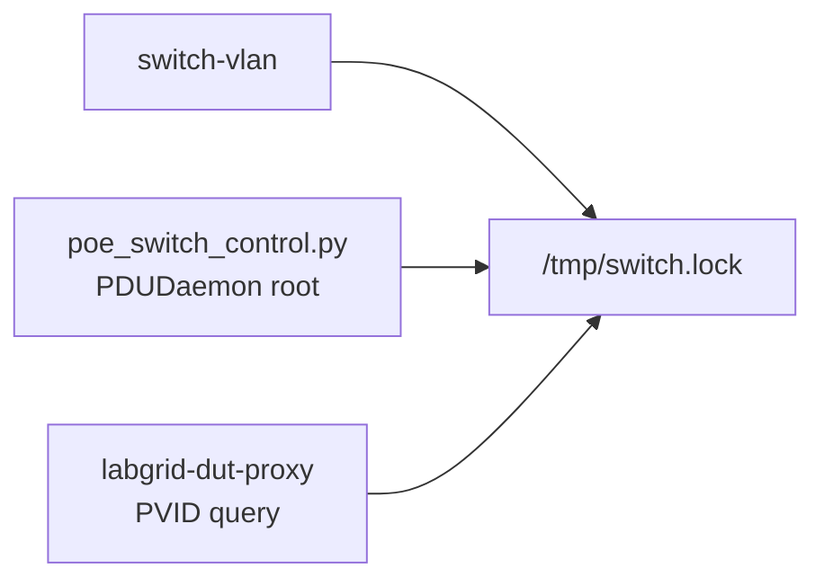

# Switch configuration

The lab uses a **TP-Link SG2016P** (16× Gigabit, 8× PoE). **VLAN configuration** is **applied by scripts**, not as a manual CLI routine. Another **802.1Q** switch can reuse the same scheme with another driver under `scripts/switch/switch_drivers/`.

---

## 1. Context

The switch connects three roles:

1. **Gateway** (OpenWrt; formerly MikroTik): layer 3, routes between VLANs and Internet. [gateway.md](./gateway.md).
2. **Host** (Lenovo T430): Labgrid, dnsmasq/TFTP, SSH to DUTs.
3. **DUTs:** one OpenWrt or LibreMesh router per VLAN.

Gateway and host use **trunk** ports (802.1Q, tagged traffic). Each DUT is **access** (untagged traffic on its VLAN).

| Type   | Role | Traffic |
|--------|------|---------|
| **Access** | One DUT per port | Untagged |
| **Trunk**  | Multi-VLAN | Tagged (802.1Q) |

Trunks carry several VLANs; each DUT has a dedicated access port.

---

## 2. Switch requirements

- **802.1Q:** numeric IDs (e.g. 100+); each port access (untagged) or trunk (tagged).
- **PVID:** default VLAN if the frame arrives untagged (access = DUT VLAN; trunk = 1).
- **Ingress checking** on; **acceptable frame types:** Admit All.

---

## 3. Port-to-device mapping (FCEFyN)

### 3.1 Assignment table

| SG2016P port | Device       | VLAN | Type   |
|--------------|--------------|------|--------|
| 1              | OpenWrt One       | 104  | Access |
| 2              | LibreRouter #1    | 105  | Access |
| 3              | LibreRouter #2    | 106  | Access |
| 4              | LibreRouter #3    | 107  | Access |
| 9              | Lenovo T430 (server) | Trunk | Trunk |
| 10             | OpenWrt router (gateway) | Trunk | Trunk |
| 11             | Belkin RT3200 #1  | 100  | Access |
| 12             | Belkin RT3200 #2  | 101  | Access |
| 13             | Belkin RT3200 #3  | 102  | Access |
| 14             | Banana Pi R4      | 103  | Access |
| 15             | (available)      | -    | -      |
| 16             | OpenWrt One (LAN) | 104  | Access |

Port 16 connects **LAN** of OpenWrt One when **PoE** power is on port 1; see [duts-config OpenWrt One](duts-config.md#openwrt-one). Ports 5-8 unassigned (default VLAN 1).

### 3.2 VLAN names in use

| VLAN ID | Name on switch   | Subnet           |
|---------|------------------|------------------|
| 100     | belkin_rt3200_1    | 192.168.100.0/24 |
| 101     | belkin_rt3200_2    | 192.168.101.0/24 |
| 102     | belkin_rt3200_3    | 192.168.102.0/24 |
| 103     | banana-pi-r4       | 192.168.103.0/24 |
| 104     | openwrt-one        | 192.168.104.0/24 |
| 105     | libre_router_1     | 192.168.105.0/24 |
| 106     | libre_router_2     | 192.168.106.0/24 |
| 107     | libre_router_3     | 192.168.107.0/24 |
| **200** | **mesh**           | 192.168.200.0/24 |

!!! note "Gateway and Internet on DUTs when changing mode"
    Besides **applying the VLAN preset on the switch**, `switch-vlan` (labgrid-switch-abstraction) can open **parallel SSH** to each DUT and adjust gateway, routes, and interfaces per preset. Steps and tables: [duts-config Internet access (opkg)](duts-config.md#internet-access-opkg).

    - **isolated:** per-VLAN gateway `192.168.XXX.254`.
    - **mesh:** gateway `192.168.200.254`.

    In both cases the script sets a **secondary IP** on the gateway subnet (`192.168.{vlan}.x` or `192.168.200.x` per `libremesh_fixed_ip`). Without it the testbed gateway does not route return traffic correctly (NAT / Internet). The same flow **stops the firewall** on the DUT.

---

## 4. Automated configuration

Testbed VLAN configuration is **not done manually** on the switch; these tools apply it:

| Tool | Use |
|------|-----|
| **switch-vlan** | [labgrid-switch-abstraction](https://github.com/fcefyn-testbed/labgrid-switch-abstraction) CLI: per-DUT VLAN change (`switch-vlan <dut> <vlan>`, `--restore`, `--restore-all`). Used by tests and manual ops. |
| **labgrid-bound-connect** | SSH ProxyCommand (`socat` + `SO_BINDTODEVICE`) binds each DUT alias to its isolated VLAN. See [SSH access to DUTs](../operar/dut-ssh-access.md). |

Day-to-day: [Routine operations - Dynamic VLAN](../operar/lab-routine-operations.md#dynamic-vlan-and-switch-vlan) (`switch-vlan` / [labgrid-switch-abstraction](https://github.com/fcefyn-testbed/labgrid-switch-abstraction); design: [Lab architecture](../diseno/lab-architecture.md)).

### 4.1 Config persistence {: #config-persistence }

#### Observed failure

After a power outage or switch reboot, the lab appeared to have **lost all VLAN configuration** (default IP `192.168.0.1`, factory credentials, flat VLAN 1). CI tests failed because DUTs received DHCP from the wrong segment and TFTP targeted the wrong server IP.

The switch had **not** necessarily performed a true factory reset. On TP-Link JetStream (SG2016P), changes applied via CLI or web UI **Apply** land in **running-config** (RAM) only. They are lost on reboot unless explicitly saved to **startup-config** (flash) with:

- Web UI: **Save Config** (separate from Apply)
- CLI: `copy running-config startup-config`

Before the fix, `switch-vlan --init` and other VLAN commands updated running-config but **never saved to flash**. Every power cycle looked like a factory reset even though the root cause was missing persistence.

| Symptom after reboot | Likely cause |
|--------------------|--------------|
| Default IP `192.168.0.1`, VLAN 1 flat, `admin`/empty password | Startup-config never saved (most common in this lab) |
| Web UI unreachable with DUT cables connected | IP conflict: all DUTs default to `192.168.1.1` on flat VLAN 1 |
| True factory reset (Reset button, firmware bug) | Rare; same recovery procedure, but SSH/password must be reconfigured manually |

#### Automatic save (current behavior)

`labgrid-switch-abstraction` runs `copy running-config startup-config` after every successful `send_config_commands()` session (driver `save_command()` in `tplink_jetstream.py`). Log line to expect:

```text
Configuration saved to startup-config
```

This applies to `switch-vlan --init`, per-DUT VLAN changes, and `--restore-all`. After upgrading the package, run `switch-vlan --init` once to apply and persist the full topology.

!!! note "Manual save still required for web UI changes"
    Changes made only through the switch web UI still need **Save Config** in the UI. The automatic save covers CLI operations via `switch-vlan` and `SwitchClient`.

!!! warning "SSH and password are not automated"
    The TP-Link SG2016P does not expose password or SSH configuration via its CLI. After a **true** factory reset, enabling SSH and setting the admin password must be done manually through the web interface.

!!! note "Manual configuration (reference)"
    For recovery or debug: one test VLAN per access port (untagged); trunk ports with all VLANs tagged; PVID and ingress as in §2 (Admit All).

---

## 5. TP-Link SG2016P: SSH and PoE

### 5.1 SSH and CLI access

The switch accepts SSH for CLI management. Default IP: `192.168.0.1`. The switch **does not accept public-key auth**; use **password**.

See [host-config 3.6](host-config.md#36-ssh-config-for-manual-access-sshconfig) or template `configs/templates/ssh_config_fcefyn`.

Connect:

```bash
ssh switch-fcefyn
```

Prompt is `SG2016P>`.

!!! note "SSH client and authentication"
    The client tries public keys first; the switch rejects and drops the session. Set `PreferredAuthentications password` and `PubkeyAuthentication no` (template above).

**OpenWrt One** is on port 1 (PoE). For software power-cycle:

**Manual (SSH from host):**
```text
enable
configure
interface gigabitEthernet 1/0/1
power inline supply disable    # Power off OpenWrt One
# Wait 5-10 seconds
power inline supply enable     # Power on OpenWrt One
end
```

**Automatic (script):** Install via Ansible (recommended) or manually. Script needs `switch_client.py` and `switch_drivers/` alongside.

**Ansible install:**
```bash
# From fcefyn_testbed_utils
ansible-playbook -i ansible/inventory/hosts.yml ansible/playbook_testbed.yml --tags poe_switch -K
```

**Manual install:** the openwrt-tests [`playbook_labgrid.yml`](https://github.com/aparcar/openwrt-tests/blob/main/ansible/playbook_labgrid.yml) installs `labgrid-switch-abstraction` via pipx for every lab (see [Ansible and Labgrid](ansible-labgrid.md)); only run `pip install git+https://github.com/fcefyn-testbed/labgrid-switch-abstraction.git` manually if the playbook has not been applied. Copy `scripts/switch/poe_switch_control.py` to `/usr/local/bin/`. Switch config in `~/.config/switch.conf`.

!!! warning "Credentials (out of repo)"
    That file holds the switch password: restrictive perms (`chmod 600`) and do not commit to git.

```bash
# Once: copy template and set switch password
cp configs/templates/switch.conf.example ~/.config/switch.conf
chmod 600 ~/.config/switch.conf
# Edit and set SWITCH_PASSWORD=real_password

# Use (from any directory)
poe_switch_control.py on 1    # Power on port 1 (OpenWrt One)
poe_switch_control.py off 1   # Power off
poe_switch_control.py cycle 1 # Power cycle (off, 5s, on)
arduino_relay_control.py on 4 # Librerouter 1 (relay, not PoE)
```

!!! note "Running with sudo"
    Both `poe_switch_control.py` and `switch-vlan` read config from the home of the user who invoked sudo (`SUDO_USER`). If you run `sudo switch-vlan libremesh`, password comes from `/home/<user>/.config/switch.conf`, not `/root/.config/`.

#### Multi-user setup (recommended for labs with remote devs)

Remote developers SSH as a shared user (e.g. `labgrid-dev`), not as the lab admin. For `switch-vlan` to work for any SSH user without per-user duplication, install the conf system-wide. `labgrid-switch-abstraction` reads `/etc/switch.conf` automatically as fallback when no per-user `~/.config/switch.conf` exists (see `client.py` in [labgrid-switch-abstraction](https://github.com/fcefyn-testbed/labgrid-switch-abstraction)).

```bash
sudo groupadd -f labgrid
sudo usermod -aG labgrid <admin-user>
sudo usermod -aG labgrid <ssh-shared-user>   # e.g. labgrid-dev
sudo install -m 640 -g labgrid /home/<admin>/.config/switch.conf /etc/switch.conf

# Optional: symlink the admin's per-user conf to the system-wide one to keep one source of truth
mv ~/.config/switch.conf ~/.config/switch.conf.bak
ln -s /etc/switch.conf ~/.config/switch.conf
```

Group changes only apply to **new** sessions: log out and SSH in again so the `labgrid` group is loaded (verify with `id`). Existing sessions keep the old group set.

Shared lock file setup: [Switch SSH lock](#switch-lock).

Verify from a remote machine (no local switch credentials needed):

```bash
ssh <lab-host> 'whoami; ls -la /etc/switch.conf /tmp/switch.lock; switch-vlan --help'
```

#### Switch SSH lock (`/tmp/switch.lock`) {: #switch-lock }

All switch SSH (VLAN changes, PoE, PVID queries) takes an exclusive `fcntl.flock` on `/tmp/switch.lock`. TP-Link JetStream does not tolerate concurrent SSH sessions.



##### Observed failures

| Symptom | Cause |
|---------|--------|
| `PermissionError: [Errno 13] Permission denied: '/tmp/switch.lock'` then `Operation not permitted` on `chmod` | File created by root with mode `0644`. `os.open(..., 0o666)` is masked by umask `0o022`. Sticky-bit `/tmp`: only the owner or root can `chmod` or delete. |
| `Timed out after 60.0s waiting for switch lock` | Another process holds `LOCK_EX`. Typical: six `dut-metrics-tunnel-*.service` units reconnect at once; each `labgrid-dut-proxy` calls `get_port_pvid()` and waits 60s. Serial queue ~90-120s, so `switch-vlan --restore-all` never enters. Killing proxies does not help: `autossh` respawns them. |
| Mesh CI: `VLAN switch to 200 failed` | Same lock errors, seen by pytest via SSH `switch-vlan`. |

`flock -n /tmp/switch.lock` with no command prints `bad file descriptor`. Probe with:

```bash
flock -n /tmp/switch.lock echo "lock is FREE"
```

Holder:

```bash
sudo fuser -v /tmp/switch.lock
```

##### Permissions on the host

`labgrid-switch-abstraction` `SwitchClient._open_lock_file` creates the file then `os.fchmod(fd, 0o666)` so umask cannot leave `0644`. PDUDaemon still creates the file first on a cold `/tmp`; tmpfiles must pre-create it.

On `labgrid-fcefyn`:

```text
/etc/tmpfiles.d/switch-lock.conf
f /tmp/switch.lock 0666 root root -
```

Apply and verify:

```bash
sudo systemd-tmpfiles --create
ls -la /tmp/switch.lock
# expected: -rw-rw-rw- 1 root root
```

Do not `sudo rm /tmp/switch.lock` as a routine fix: the next root PoE command recreates `0644` until tmpfiles or `fchmod` run. Prefer `sudo chmod 666 /tmp/switch.lock` while the inode exists.

##### Metrics tunnels must not wait

SSH aliases use `ProxyCommand sudo labgrid-dut-proxy ...`. `sudo` strips systemd `Environment=`, so `SWITCH_LOCK_TIMEOUT=0` on `dut-metrics-tunnel-*.service` has no effect.

The script `/usr/local/sbin/labgrid-dut-proxy` (source: `scripts/labgrid-dut-proxy`) sets `os.environ.setdefault("SWITCH_LOCK_TIMEOUT", "0")`. If the lock is busy, `get_port_pvid()` returns `None` and the proxy falls back to the isolated VLAN (correct for Prometheus forwards).

Confirm:

```bash
grep SWITCH_LOCK_TIMEOUT /usr/local/sbin/labgrid-dut-proxy
```

Redeploy: copy `scripts/labgrid-dut-proxy` to `/usr/local/sbin/labgrid-dut-proxy` (`0755`).

##### Recovery (no CI on the switch)

Stopping tunnels without stopping the units causes an immediate respawn loop. Order:

```bash
sudo systemctl stop dut-metrics-tunnel-{bananapi,belkin-1,belkin-2,belkin-3,librerouter-1,openwrt-one}.service
sudo pkill -f labgrid-dut-proxy
flock -n /tmp/switch.lock echo "lock is FREE"
switch-vlan --restore-all
sudo systemctl start dut-metrics-tunnel-{bananapi,belkin-1,belkin-2,belkin-3,librerouter-1,openwrt-one}.service
sleep 10 && flock -n /tmp/switch.lock echo "lock is FREE"
```

Do not run this while lime-packages mesh jobs are in progress.

!!! note "PoE and concurrent SSH sessions"
    PDUDaemon may invoke several `poe_switch_control.py` in parallel (multiple PoE DUTs). TP-Link firmware **does not reliably tolerate** concurrent SSH sessions (timeouts). The script serializes access with a lock (`/tmp/switch.lock`, `fcntl.flock`); background calls queue.

!!! note "PDUDaemon integration"
    PoE uses **one** PDUDaemon PDU (`fcefyn-poe`); Labgrid selects the switch port via **index** (same number as in `poe_switch_control.py`). Multiple PoE DUTs do not use separate PDU names. Concurrent power scripts queue on a **lockfile** (switch SSH is not safe in parallel). See [host-config 5.2](host-config.md#52-pdudaemon-etcpdudaemonpdudaemonconf). If PDUDaemon was installed with Ansible (DynamicUser), use systemd override with `SWITCH_PASSWORD`; see [host-config 5.2.1](host-config.md#521-poe-pdu-password-with-dynamicuser).

### 5.2 OpenWrt One: two cables (PoE + LAN for U-Boot TFTP)

!!! note "WAN PHY timeout and second link (LAN)"
    With PoE on port 1, U-Boot on WAN (EN8811H) can hit PHY timeout. **Two links:** WAN (PoE) to port 1; LAN to port 16. Port 16 is VLAN 104 (untagged, PVID 104) so DHCP/TFTP reach the host. More in [duts-config OpenWrt One](duts-config.md#openwrt-one).

!!! note "LibreRouter 1 (port 2) - no PoE"
    LibreRouter 1 is now powered via 12V DC barrel jack (Arduino relay channel 4). PoE is disabled on switch port 2.

---

## 6. Labgrid integration

### 6.1 Consistency with exporter

VLAN ↔ DUT mapping must match Labgrid `exporter.yaml`:

```yaml
labgrid-fcefyn-belkin_rt3200_1:
  NetworkService:
    address: "192.168.1.1%vlan100"   # VLAN 100 = port 11
    username: "root"

labgrid-fcefyn-openwrt_one:
  NetworkService:
    address: "192.168.1.1%vlan104"   # VLAN 104 = port 1
    username: "root"
```

The `%vlanXXX` in `address` must match the DUT port **VLAN ID** on the switch; tagged traffic hits that interface on the server.

### 6.2 Traffic flow

1. Server sends to `192.168.1.1` from `192.168.1.100` (`vlan100` interface).
2. Frame leaves tagged VLAN 100 toward switch (port 9).
3. Switch forwards on port 11 (VLAN 100 access) untagged to Belkin.
4. Belkin replies; switch retags and sends to port 9 (server) or 10 (gateway) as appropriate.

---

## 7. Recovery after config loss {: #recovery-after-factory-reset }

If the switch loses its VLAN topology (power event, unsaved config, true factory reset, or firmware update), follow this procedure to restore the testbed from declarative `dut-config.yaml`.

Most power outages in this lab were **config loss from RAM**, not hardware factory reset. After deploying [config persistence](#config-persistence), a normal reboot should keep VLANs. Use this section when the switch still shows defaults (`192.168.0.1`, flat VLAN 1) or `switch_healthcheck.py` reports mismatches.

### Prerequisites

- Physical or network access to the switch default IP (`192.168.0.1`).
- `labgrid-switch-abstraction` installed on the host (`switch-vlan --help`).
- `~/.config/switch.conf` (or `/etc/switch.conf`) with `SWITCH_PASSWORD` set.

### Step-by-step

1. **Disconnect DUT cables** from the switch to avoid IP conflicts (all DUTs default to `192.168.1.1` on a flat VLAN 1).

2. **Access the switch web UI** at `http://192.168.0.1` (factory credentials: `admin` / empty password).

3. **Enable SSH** and **set a secure password** via the web UI (System → User Management). This is the only manual step; `switch-vlan --init` cannot configure SSH or passwords on the switch.

4. **Verify SSH access** from the host:

    ```bash
    ssh switch-fcefyn
    # Expected prompt: SG2016P>
    ```

5. **Update `switch.conf`** if the password changed:

    ```bash
    # Edit SWITCH_PASSWORD in the conf file
    vim ~/.config/switch.conf   # or /etc/switch.conf
    ```

6. **Apply the full VLAN topology** from `dut-config.yaml`:

    ```bash
    switch-vlan --init
    ```

    This creates all VLANs (100-107, 200), configures every DUT access port (untagged + PVID), and sets uplink/trunk ports (9, 10) to carry all VLANs tagged. The command is **idempotent**: safe to re-run on an already-configured switch. With current `labgrid-switch-abstraction`, it also runs `copy running-config startup-config` (log: `Configuration saved to startup-config`).

7. **Reconnect DUT cables** to their assigned ports (see [port mapping](#31-assignment-table)).

8. **Verify** with a restore-all and healthcheck:

    ```bash
    switch-vlan --restore-all
    # SSH to each DUT
    for dut in dut-belkin-rt3200-1 dut-belkin-rt3200-2 dut-belkin-rt3200-3 \
               dut-bananapi-bpi-r4 dut-openwrt-one dut-librerouter-1; do
        echo -n "$dut: "
        ssh -o ConnectTimeout=5 -o BatchMode=yes "$dut" echo OK 2>&1 | tail -1
    done
    ```

!!! warning "Why disconnect DUT cables first"
    With factory defaults, all switch ports sit on VLAN 1. Every DUT boots with `192.168.1.1`. Multiple identical IPs on one broadcast domain can make the switch management UI unreachable or unstable until cables are removed and the switch is reconfigured.

!!! warning "SSH and password are not automated"
    The TP-Link SG2016P does not expose password or SSH configuration via its CLI. After a **true** factory reset, enabling SSH and setting the admin password must be done manually through the web interface. VLANs, ports, trunks, and PVIDs are restored by `switch-vlan --init` (and persisted to flash automatically).

### PVID healthcheck

`scripts/switch/switch_healthcheck.py` queries each DUT port PVID via SSH and compares it against `dut-config.yaml`. Run manually or via cron to detect silent configuration loss:

```bash
python3 scripts/switch/switch_healthcheck.py
python3 scripts/switch/switch_healthcheck.py --quiet   # exit code only
```

Exit codes: `0` all match, `1` mismatch found, `2` connection/config error.

---

## 8. Other switches

Same 802.1Q logic; need a driver that emits the vendor CLI commands.

1. Add a driver in `labgrid-switch-abstraction` per [DRIVER_INTERFACE.md](https://github.com/fcefyn-testbed/labgrid-switch-abstraction/blob/main/src/switch_abstraction/drivers/DRIVER_INTERFACE.md).
2. In `~/.config/switch.conf`: `SWITCH_DRIVER=<name>` and `SWITCH_DEVICE_TYPE=<netmiko_type>`.

Implement `PRESETS`, `build_preset_commands()`, `build_poe_commands()`, `build_hybrid_commands()`. Reference: `tplink_jetstream.py`.
