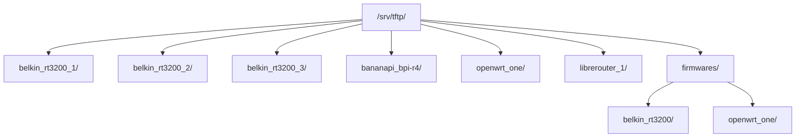

# TFTP server and dnsmasq, HIL testbed

The orchestration host runs **dnsmasq** as **DHCP** and **TFTP** server on each VLAN. DUTs download firmware during boot (recovery mode); WAN can get an IP when connected.

**Paths:** `/etc/dnsmasq.conf`, `/srv/tftp/`.

**Index:** 1. dnsmasq | 2. configuration | 3. TFTP directories | 4. Labgrid | 5. firmware | 6. verification | 7. retention | 8. references (numbered headings below; MkDocs TOC links each section).

---

## 1. What dnsmasq is for

dnsmasq provides DNS, DHCP, and TFTP. Here only **DHCP** and **TFTP** are used (DNS disabled with `port=0`).

**Recovery flow:** DUT boots, requests DHCP, gets IP and TFTP server, downloads firmware over TFTP, flashes, and reboots.


The host must have DHCP and TFTP enabled on **every VLAN** with a DUT. If a VLAN is missing from dnsmasq, the DUT gets no IP and cannot download. The testbed gateway also does not serve DHCP on test VLANs; the host does via dnsmasq. Context: [gateway.md](./gateway.md).

| Component | Relationship |
|------------|--------------|
| Netplan / VLANs | Each `vlanXXX` must exist (192.168.X.1/24). dnsmasq listens there. |
| exporter.yaml | `TFTPProvider.external_ip` is the host IP on that VLAN. |
| /srv/tftp/ | TFTP root. Per-DUT subfolders match TFTPProvider `external`. |

---

## 2. Configuration

- **File on host:** `/etc/dnsmasq.conf`
- **Source when deploying with Ansible:** `ansible/files/exporter/<inventory_hostname>/dnsmasq.conf` in the repo from which `playbook_labgrid.yml` runs (copied to host). Route table: [ansible-labgrid](ansible-labgrid.md).

For FCEFyN: VLANs 100-108, one per DUT. Example:

```
port=0
interface=vlan100
dhcp-range=vlan100,192.168.100.100,192.168.100.200,24h
# ... vlan101 through vlan108 ...
enable-tftp
tftp-root=/srv/tftp/
```

VLAN and DUT mapping: [rack-cheatsheets.md](../operar/rack-cheatsheets.md).

---

## 3. TFTP directory layout

| Type | Path | Purpose |
|------|------|---------|
| Per-DUT folder | `/srv/tftp/<place>/` (e.g. `belkin_rt3200_1/`, `openwrt_one/`) | Symlinks to firmware. Symlink name = U-Boot TFTP filename. |
| Real firmware | `/srv/tftp/firmwares/<device>/` | Downloaded `.itb`/`.bin`. One file can serve several DUTs of the same type. |



DUT folder names must match `external` in exporter.yaml.

---

## 4. How it works with Labgrid

Each place in exporter.yaml has a TFTPProvider:

```yaml
TFTPProvider:
  internal: "/srv/tftp/belkin_rt3200_1/"
  external: "belkin_rt3200_1/"
  external_ip: "192.168.100.1"
```

- **internal**: Directory where Labgrid creates/updates firmware symlinks.
- **external**: Subpath the DUT requests over TFTP.
- **external_ip**: TFTP server IP on that VLAN (via DHCP).

The user running tests needs **write permission** on each DUT folder so Labgrid can create symlinks.

---

## 5. Adding firmware

### 5.1 Permissions (once)

The **host user** running Labgrid/pytest must create and modify files in DUT folders (replace `USER`):

```bash
sudo chown -R USER:USER /srv/tftp/belkin_rt3200_1/ /srv/tftp/belkin_rt3200_2/ /srv/tftp/belkin_rt3200_3/ \
  /srv/tftp/bananapi_bpi-r4/ /srv/tftp/openwrt_one/ /srv/tftp/librerouter_1/
# Add more DUT folders per lab; see rack-cheatsheets mapping
```

### 5.2 Procedure

1. **Download** under firmwares by device type:

   ```bash
   sudo mkdir -p /srv/tftp/firmwares/openwrt_one
   sudo wget -O /srv/tftp/firmwares/openwrt_one/openwrt_one_initramfs.itb \
     https://downloads.openwrt.org/snapshots/targets/mediatek/filogic/openwrt-24.10.0-rc2-mediatek-filogic-openwrt_one-initramfs.itb
   ```

2. **Create symlink** in the DUT folder. The symlink name must match **exactly** what U-Boot requests over TFTP:

   ```bash
   ln -sf /srv/tftp/firmwares/openwrt_one/openwrt_one_initramfs.itb \
     /srv/tftp/openwrt_one/openwrt-24.10.0-rc2-mediatek-filogic-openwrt_one-initramfs.itb
   ```

   For several DUTs of the same type (Belkin 1, 2, 3): one symlink per DUT folder pointing at the same file.

3. **LG_IMAGE** with path to the symlink in the DUT folder:

   ```bash
   export LG_IMAGE=/srv/tftp/openwrt_one/openwrt-24.10.0-rc2-mediatek-filogic-openwrt_one-initramfs.itb
   ```

### 5.3 Quick rules

- Real files → always under `firmwares/<device>/`. Never in DUT folders.
- Symlinks → only in DUT folders. Use absolute paths.
- Verify: `readlink -f /srv/tftp/<dut>/<symlink>` must resolve to an existing file.
- `tree -L 3 /srv/tftp`: blue symlinks = ok, red = broken.

### 5.4 Remove broken symlinks

Symlinks break when the target firmware is removed (e.g. obsolete `.itb` that brick devices). To list and delete:

```bash
cd /srv/tftp

# List broken symlinks (review before delete)
find . -type l ! -exec test -e {} \; -print

# Delete all broken symlinks
find . -type l ! -exec test -e {} \; -delete
```

Belkin folders only (e.g. after removing obsolete `.itb` firmwares):

```bash
cd /srv/tftp

find belkin_rt3200_1 belkin_rt3200_2 belkin_rt3200_3 -maxdepth 1 -type l ! -exec test -e {} \; -name "*.itb" -delete
```

---

## 6. Verification

```bash
systemctl status dnsmasq
grep -E "vlan104|192.168.104" /etc/dnsmasq.conf
tree -L 3 /srv/tftp
ls -la /srv/tftp/openwrt_one/
readlink -f /srv/tftp/openwrt_one/openwrt-24.10.0-rc2-mediatek-filogic-openwrt_one-initramfs.itb

# Test TFTP (tftp-hpa)
tftp 192.168.104.1 -c get openwrt_one/openwrt-24.10.0-rc2-mediatek-filogic-openwrt_one-initramfs.itb /tmp/test.itb
```

---

## 7. Retention and cleanup

Policies to keep `/srv/tftp/firmwares/` from growing forever. Initial values; refine with ops experience.

| Policy | Rule |
|--------|------|
| Max images per device | 3 (current + 2 previous) |
| Max age | 90 days since last CI use |
| Disk alert | Warn if `/srv/tftp/firmwares/` exceeds 10 GB |
| Cleanup mechanism | Manual (admin review); future: cron script |

### Manual cleanup procedure

```bash
# Disk usage
du -sh /srv/tftp/firmwares/*/

# List images by age (oldest first)
find /srv/tftp/firmwares/ -type f -printf '%T+ %p\n' | sort

# Delete obsolete image (check no symlinks point to it)
# 1. Find symlinks to the file
find /srv/tftp/ -type l -lname '*<filename>' -print
# 2. If none, delete
sudo rm /srv/tftp/firmwares/<device>/<filename>
# 3. Clean resulting broken symlinks (section 5.4)
```

See also [CI use cases](../diseno/ci-use-cases.md) section 4.5 for design context.

---

## 8. References

- [ansible-labgrid.md](./ansible-labgrid.md) - Deploy `dnsmasq.conf` and exporter
- [SOM.md](../operar/SOM.md) - Run tests
- [host-config.md](./host-config.md) - Host and PDUDaemon
- [rack-cheatsheets.md](../operar/rack-cheatsheets.md) - DUT ↔ TFTP folder mapping
