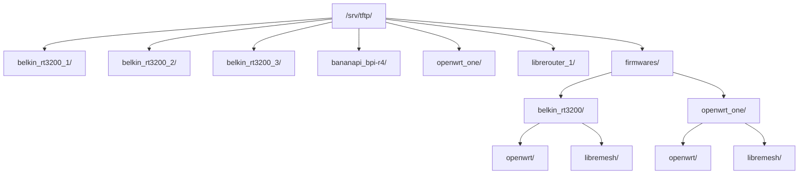
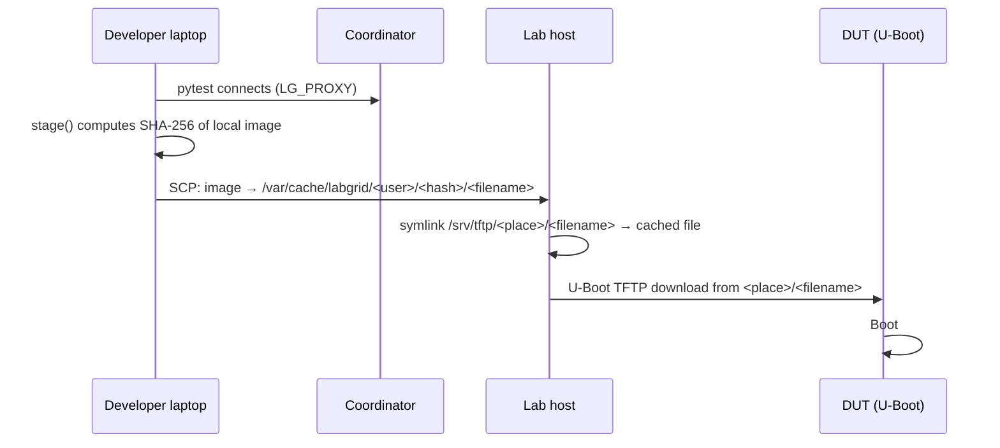

# TFTP server with dnsmasq

The orchestration host runs **dnsmasq** as **DHCP** and **TFTP** server on each VLAN. DUTs download firmware during boot (recovery mode); WAN can get an IP when connected.

**Paths:** `/etc/dnsmasq.conf`, `/srv/tftp/`.

**Sections:** 1. dnsmasq | 2. configuration | 3. TFTP directories | 4. Labgrid | 5. firmware | 6. verification | 7. retention | 8. references.

---

## 1. What dnsmasq is for

dnsmasq provides DNS, DHCP, and TFTP. Here only **DHCP** and **TFTP** are used (DNS disabled with `port=0`).

**Recovery flow:** DUT boots, requests DHCP, gets IP and TFTP server, downloads firmware over TFTP, flashes, and reboots.


The host must have DHCP and TFTP enabled on **every VLAN** with a DUT. If a VLAN is missing from dnsmasq, the DUT gets no IP and cannot download. The testbed gateway also does not serve DHCP on test VLANs; the host does via dnsmasq. Context: [gateway.md](./gateway.md).

| Component | Relationship |
|------------|--------------|
| Netplan / VLANs | Each `vlanXXX` must exist (192.168.X.1/24). dnsmasq listens there. |
| exporter.yaml | `TFTPProvider.external_ip` is the host IP on that VLAN. |
| /srv/tftp/ | TFTP root. Per-DUT subfolders match TFTPProvider `external`. |

---

## 2. Configuration

- **File on host:** `/etc/dnsmasq.conf`
- **Source when deploying with Ansible:** `ansible/files/exporter/<inventory_hostname>/dnsmasq.conf` in the repo from which `playbook_labgrid.yml` runs (copied to host). Route table: [ansible-labgrid](ansible-labgrid.md).

For FCEFyN: VLANs 100-108, one per DUT. Example:

```
port=0
interface=vlan100
dhcp-range=vlan100,192.168.100.100,192.168.100.200,24h
# ... vlan101 through vlan108 ...
enable-tftp
tftp-root=/srv/tftp/
```

VLAN and DUT mapping: [rack-cheatsheets.md](../operar/rack-cheatsheets.md).

---

## 3. TFTP directory layout

| Type | Path | Purpose |
|------|------|---------|
| Per-DUT folder | `/srv/tftp/<place>/` (e.g. `belkin_rt3200_1/`, `openwrt_one/`) | Symlinks to firmware. Symlink name = U-Boot TFTP filename. |
| Real firmware | `/srv/tftp/firmwares/<device>/{openwrt,libremesh}/` | Firmware files organized by build origin. One file can serve several DUTs of the same type. |
| Labgrid cache | `/var/cache/labgrid/<user>/<sha256>/` | Auto-uploaded images from remote developers or CI (see [section 4.2](#42-remote-image-staging)). |



Each device folder under `firmwares/` contains two subdirectories:

- **`openwrt/`** — Official OpenWrt from downloads.openwrt.org or local build without LibreMesh feeds. Filenames keep the `openwrt-*` prefix (e.g. `openwrt-vanilla-24.10.5-...`).
- **`libremesh/`** — Images built with LiMe/LibreMesh feeds. Filenames use `lime-*` prefix (e.g. `lime-24.10.5-mediatek-filogic-openwrt_one-initramfs.itb`).

DUT folder names must match `external` in exporter.yaml.

---

## 4. How it works with Labgrid

Each place in exporter.yaml has a TFTPProvider:

```yaml
TFTPProvider:
  internal: "/srv/tftp/belkin_rt3200_1/"
  external: "belkin_rt3200_1/"
  external_ip: "192.168.100.1"
```

- **internal**: Directory where Labgrid creates/updates firmware symlinks.
- **external**: Subpath the DUT requests over TFTP.
- **external_ip**: TFTP server IP on that VLAN (via DHCP).

The user running tests needs **write permission** on each DUT folder so Labgrid can create symlinks.

### 4.2 Remote image staging (developer laptops and CI) {: #42-remote-image-staging }

When a developer runs tests **from a laptop** (not the lab host), `LG_IMAGE` points to a **local file on the laptop**:

```bash
# On the developer's laptop
export LG_IMAGE=$HOME/builds/lime-24.10.5-mediatek-filogic-openwrt_one-initramfs.itb
export LG_PLACE=labgrid-fcefyn-openwrt_one
export LG_PROXY=labgrid-fcefyn
uv run pytest tests/test_base.py -v
```

The image does not exist on the lab server, but the DUT needs to download it via TFTP. Labgrid handles this transparently through `TFTPProviderDriver.stage()`:



| Step | What happens |
|------|--------------|
| 1. `get_image_path("root")` | Resolves `$LG_IMAGE` to the local path on the laptop. |
| 2. `stage(local_path)` | Hashes the file (SHA-256). If the hash already exists in `/var/cache/labgrid/` on the lab host, skips the upload. Otherwise copies it via SCP. |
| 3. Symlink | Creates a symlink in the DUT's `internal` directory (e.g. `/srv/tftp/openwrt_one/<filename>`) pointing at the cached file. |
| 4. `setenv bootfile` | Sets the U-Boot bootfile to `<external>/<filename>` so the DUT can TFTP-download it. |

**This enables developers to test custom-built images** without manually copying files to the server. Build your image locally, point `LG_IMAGE` at it, and Labgrid handles the rest.

!!! note "Cache location"
    Uploaded images land in `/var/cache/labgrid/<ssh_user>/<sha256>/<original_filename>`. The cache grows over time; see [section 7](#7-retention-and-cleanup) for cleanup.

!!! note "Pre-positioned vs staged images"
    Images under `/srv/tftp/firmwares/` are **pre-positioned**: they live permanently on the server and `LG_IMAGE` points directly at them. Staged images under `/var/cache/labgrid/` are **uploaded on demand** by Labgrid when the path in `LG_IMAGE` is local to the machine running pytest. Both end up as symlinks in the per-DUT folder; the DUT does not know the difference.

---

## 5. Adding firmware

### 5.1 Permissions (once)

The **host user** running Labgrid/pytest must create and modify files in DUT folders (replace `USER`):

```bash
sudo chown -R USER:USER /srv/tftp/belkin_rt3200_1/ /srv/tftp/belkin_rt3200_2/ /srv/tftp/belkin_rt3200_3/ \
  /srv/tftp/bananapi_bpi-r4/ /srv/tftp/openwrt_one/ /srv/tftp/librerouter_1/
# Add more DUT folders per lab; see rack-cheatsheets mapping
```

### 5.2 Procedure

1. **Download** under `firmwares/<device>/openwrt/` or `firmwares/<device>/libremesh/`:

   ```bash
   # Vanilla OpenWrt
   sudo mkdir -p /srv/tftp/firmwares/openwrt_one/openwrt
   sudo wget -O /srv/tftp/firmwares/openwrt_one/openwrt/openwrt-vanilla-24.10.5-mediatek-filogic-openwrt_one-initramfs.itb \
     https://downloads.openwrt.org/releases/24.10.5/targets/mediatek/filogic/openwrt-24.10.5-mediatek-filogic-openwrt_one-initramfs.itb

   # LibreMesh (rename openwrt-* to lime-* for clarity)
   sudo mkdir -p /srv/tftp/firmwares/openwrt_one/libremesh
   sudo cp /path/to/build/openwrt-24.10.5-mediatek-filogic-openwrt_one-initramfs.itb \
     /srv/tftp/firmwares/openwrt_one/libremesh/lime-24.10.5-mediatek-filogic-openwrt_one-initramfs.itb
   ```

2. **Create symlink** in the DUT folder. The symlink name must match **exactly** what U-Boot requests over TFTP:

   ```bash
   ln -sf /srv/tftp/firmwares/openwrt_one/libremesh/lime-24.10.5-mediatek-filogic-openwrt_one-initramfs.itb \
     /srv/tftp/openwrt_one/lime-24.10.5-mediatek-filogic-openwrt_one-initramfs.itb
   ```

   For several DUTs of the same type (Belkin 1, 2, 3): one symlink per DUT folder pointing at the same file.

3. **LG_IMAGE** with path to the firmware file (Labgrid creates the symlink automatically via `stage()`):

   ```bash
   export LG_IMAGE=/srv/tftp/firmwares/openwrt_one/libremesh/lime-24.10.5-mediatek-filogic-openwrt_one-initramfs.itb
   ```

### 5.3 Quick rules

- Real files → always under `firmwares/<device>/openwrt/` or `firmwares/<device>/libremesh/`. Never in DUT folders.
- LibreMesh images → use `lime-*` prefix. Vanilla OpenWrt → keep `openwrt-*` or `openwrt-vanilla-*` prefix.
- Symlinks → only in DUT folders. Use absolute paths.
- Verify: `readlink -f /srv/tftp/<dut>/<symlink>` must resolve to an existing file.
- `tree -L 4 /srv/tftp/firmwares`: check structure; `tree -L 3 /srv/tftp`: blue symlinks = ok, red = broken.

### 5.4 Remove broken symlinks

Symlinks break when the target firmware is removed (e.g. obsolete `.itb` that brick devices). To list and delete:

```bash
cd /srv/tftp

# List broken symlinks (review before delete)
find . -type l ! -exec test -e {} \; -print

# Delete all broken symlinks
find . -type l ! -exec test -e {} \; -delete
```

Belkin folders only (e.g. after removing obsolete `.itb` firmwares):

```bash
cd /srv/tftp

find belkin_rt3200_1 belkin_rt3200_2 belkin_rt3200_3 -maxdepth 1 -type l ! -exec test -e {} \; -name "*.itb" -delete
```

---

## 6. Verification

```bash
systemctl status dnsmasq
grep -E "vlan104|192.168.104" /etc/dnsmasq.conf
tree -L 3 /srv/tftp
ls -la /srv/tftp/openwrt_one/
readlink -f /srv/tftp/openwrt_one/openwrt-24.10.0-rc2-mediatek-filogic-openwrt_one-initramfs.itb

# Test TFTP (tftp-hpa)
tftp 192.168.104.1 -c get openwrt_one/openwrt-24.10.0-rc2-mediatek-filogic-openwrt_one-initramfs.itb /tmp/test.itb
```

---

## 7. Retention and cleanup

Policies to keep `/srv/tftp/firmwares/` and `/var/cache/labgrid/` from growing forever. Initial values; refine with ops experience.

| Policy | Rule |
|--------|------|
| Max images per device | 3 (current + 2 previous) |
| Max age | 90 days since last CI use |
| Disk alert | Warn if `/srv/tftp/firmwares/` exceeds 10 GB |
| Labgrid cache alert | Warn if `/var/cache/labgrid/` exceeds 20 GB |
| Cleanup mechanism | Manual (admin review); future: cron script |

### Manual cleanup procedure

```bash
# Disk usage (pre-positioned firmwares)
du -sh /srv/tftp/firmwares/*/

# Disk usage (Labgrid auto-uploaded cache)
du -sh /var/cache/labgrid/*/

# List images by age (oldest first)
find /srv/tftp/firmwares/ -type f -printf '%T+ %p\n' | sort

# Delete obsolete image (check no symlinks point to it)
# 1. Find symlinks to the file
find /srv/tftp/ -type l -lname '*<filename>' -print
# 2. If none, delete
sudo rm /srv/tftp/firmwares/<device>/<subdir>/<filename>
# 3. Clean resulting broken symlinks (section 5.4)

# Clean old Labgrid cache entries (no active symlinks should point here)
find /var/cache/labgrid/ -maxdepth 2 -type d -mtime +90 -exec rm -rf {} +
```

See also [Lab architecture](../diseno/lab-architecture.md) for lab and CI design context.

---