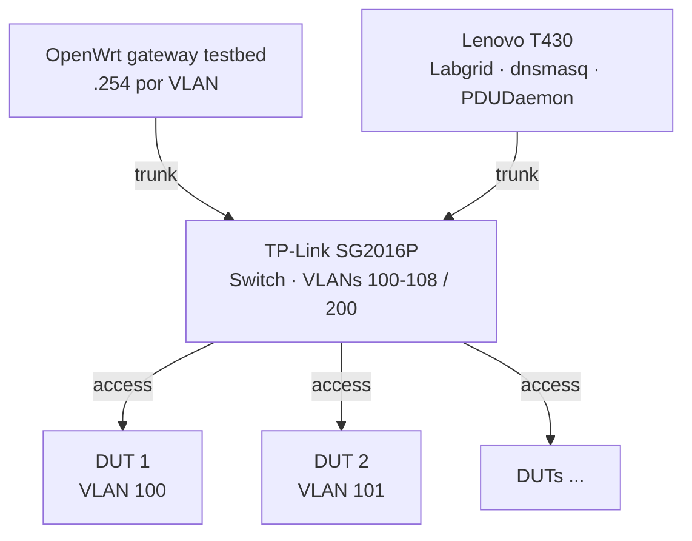
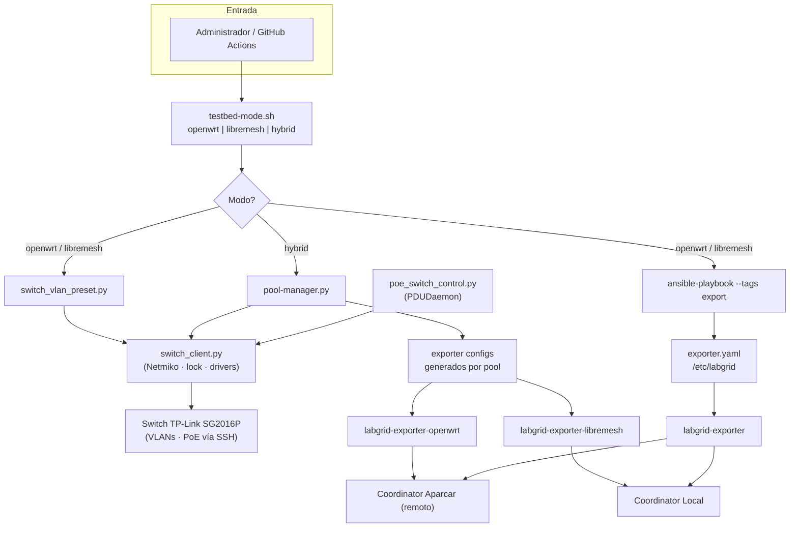

# Propuesta: Lab Híbrido OpenWrt/LibreMesh

**Documento de diseño técnico** para un lab capaz de contribuir tanto a [openwrt-tests](https://github.com/openwrt/openwrt-tests) como a [LibreMesh](https://libremesh.org/), sobre el mismo conjunto físico de DUTs.

El lab FCEFyN se presenta como caso de uso inicial. Esta propuesta define el alcance, la arquitectura y algunas decisiones técnicas necesarias para implementarlo.

---

## 1. Contexto y Objetivo

### 1.1 Escenario

Un laboratorio HIL (Hardware-in-the-Loop) que dispone de varios DUTs ( routers OpenWrt/LibreMesh) conectados a un switch gestionable y a un host de orquestación.

### 1.2 Objetivo

Permitir que un mismo lab contribuya a:

- **openwrt-tests** — CI de OpenWrt vanilla (coordinator remoto, ej. Aparcar)
- **libremesh-tests** — Fork para testing de LibreMesh (coordinator local en nuestro caso)

con **conmutación entre modos** mediante un único comando CLI, o bien un **reparto simultáneo** de DUTs entre ambos proyectos en modo híbrido.

---

## 2. Fundamentos Técnicos: VLANs Aisladas vs VLAN Compartida

### 2.1 Por qué openwrt-tests requiere VLANs aisladas

En openwrt-tests, cada DUT debe estar en su propia VLAN (100–108). La razón es que **OpenWrt vanilla asigna la misma IP a todos los dispositivos**:

- **IP por defecto**: `192.168.1.1` en `br-lan`
- **Servidor DHCP**: `odhcpd` activo en cada DUT ofreciendo IPs en 192.168.1.x

Si varios DUTs compartieran el mismo segmento L2, aparecerían problemas como:

| Problema | Descripción |
|----------|-------------|
| **SSH imposible** | `ssh root@192.168.1.1` no distingue entre dispositivos |
| **Conflictos ARP** | Múltiples MACs respondiendo para la misma IP degradan la red |
| **DHCP wars** | Varios servidores DHCP compitiendo; el host podría recibir IP de un DUT en lugar del dnsmasq del lab |
| **Tests no deterministas** | Un test podría ejecutarse contra el dispositivo incorrecto |
| **TFTP boot fallido** | Durante U-Boot, el DUT hace `dhcp`; podría recibir respuesta de un DUT vecino en lugar del servidor TFTP del host |

Por ello, **el aislamiento por VLAN es técnicamente necesario** para openwrt-tests cuando hay múltiples DUTs.

### 2.2 Por qué LibreMesh puede usar VLAN compartida

LibreMesh **no comparte** la premisa de OpenWrt vanilla. Está pensado para redes mesh con múltiples nodos:

| Aspecto | OpenWrt vanilla | LibreMesh |
|---------|-----------------|-----------|
| **IP de br-lan** | Fija `192.168.1.1` (igual en todos) | Dinámica `10.13.<MAC[4]>.<MAC[5]>` (única por dispositivo) |
| **Conflicto IP** | Sí | No; cada nodo tiene IP derivada de su MAC |
| **Servidor DHCP** | `odhcpd` activo en 192.168.1.x | Desactivado o en rango no conflictivo en modo mesh |
| **Suposición de diseño** | "Soy el único router en la red" | "Hay múltiples nodos en la malla" |

#### Cómo se evitan o mitigan los problemas en LibreMesh

| Problema (OpenWrt) | En LibreMesh |
|-------------------|--------------|
| **SSH imposible** | Cada DUT tiene IP única (10.13.x.x). El framework añade una IP fija determinista (`10.13.200.x`) vía serial antes de SSH para garantizar conectividad independiente de la versión de LibreMesh |
| **Conflictos ARP** | No existen; cada dispositivo tiene MAC única e IP única |
| **DHCP wars** | LibreMesh no corre servidor DHCP tradicional en el puerto LAN por defecto; el host usa dnsmasq en 192.168.200.x para VLAN 200 |
| **Tests no deterministas** | Labgrid adquiere el place exclusivamente; el exporter conoce la IP del DUT; SSH va al dispositivo correcto |
| **TFTP boot** | Los DUTs LibreMesh no ofrecen DHCP en LAN por defecto; dnsmasq del host responde |

**Conclusión**: LibreMesh puede operar con todos los DUTs en una VLAN compartida (VLAN 200) porque asigna IPs únicas por diseño. La propuesta contempla:

- **Modo isolated** (VLANs 100–108): para tests OpenWrt
- **Modo mesh** (VLAN 200): para tests LibreMesh (single-node y multi-nodo)

---

## 3. Roles del Lab

| Modo | Coordinator | Exporter del lab | Otros labs |
|------|-------------|------------------|------------|
| **OpenWrt** | Aparcar (remoto) | DUTs → Aparcar | Exporters remotos → Aparcar |
| **LibreMesh** | FCEFyN (local) | DUTs → coordinator local | Exporters remotos → nuestro coordinator |

- En modos openwrt-only o libremesh-only, solo un exporter está activo a la vez.
- En **modo híbrido**, dos exporters correrían simultáneamente: uno por pool, cada uno conectado a su coordinator (remoto y local), con un subconjunto de DUTs predefinido por pool.

---

## 4. Topología de Red Propuesta

| Tipo test | Topología | Uso |
|-----------|-----------|-----|
| **OpenWrt** | 1 DUT por VLAN (100–108) | Tests aislados |
| **LibreMesh** | DUTs en VLAN 200 compartida | Tests single-node y multi-nodo |

### 4.1 Topología de red física

El switch es el elemento central que conecta gateway, host y DUTs. Gateway y host usan puertos trunk (802.1Q); cada DUT en puerto access.

### 4.2 Esquema de VLANs

- **VLANs 100–108**: OpenWrt (una por DUT).
- **VLAN 200**: LibreMesh mesh compartida.

### 4.3 Direccionamiento IP

| Contexto | Rango IP | Origen |
|----------|----------|--------|
| **OpenWrt (modo isolated)** | 192.168.1.1 por DUT | Cada DUT en su VLAN; dnsmasq según VLAN |
| **LibreMesh (modo mesh)** | 10.13.x.x dinámico + 10.13.200.x fijo | LibreMesh asigna 10.13.x.x; el framework configura 10.13.200.x vía serial para SSH estable |

Para que el host labgrid alcance DUTs LibreMesh, se añadiría la ruta `10.13.0.0/16` a la interfaz `vlan200`.

### 4.4 IP fija para SSH (LibreMesh)

Para no depender de la IP dinámica de LibreMesh (que puede variar entre versiones), el framework propuesto:

1. Genera una IP determinista: `MD5(place_name) % 253 + 1` → `10.13.200.x`
2. La configura vía consola serial como dirección secundaria en `br-lan`
3. El exporter usa esta IP en `NetworkService`

---

## 5. Decisión de Arquitectura: Modo Mesh para LibreMesh

**Criterio**: Todos los tests LibreMesh (single-node y multi-node) correrían con el switch en **modo mesh (VLAN 200)**.

| Pregunta | Decisión propuesta | Justificación |
|----------|--------------------|---------------|
| ¿Single-node en isolated o mesh? | **Mesh** | En isolated, la ruta 10.13.0.0/16 solo existe en vlan200. Si el DUT está en vlan101, LibreMesh le asigna 10.13.x.x pero el host no puede alcanzarlo. |
| ¿Cuándo cambiar de modo? | **Solo al cambiar entre openwrt-tests y libremesh-tests** | Un comando CLI (`testbed-mode openwrt` o `testbed-mode libremesh`). Sin switching interno dentro de un mismo test suite. |
| ¿Interferencia entre DUTs en VLAN 200? | **Mínima y aceptable** | Labgrid bloquea el place exclusivamente. Que los DUTs formen malla es comportamiento esperado y no interfiere con tests single-node. |

---

## 6. Arquitectura Propuesta

### 6.1 Componentes

| Componente | Función |
|------------|---------|
| **testbed-mode (CLI)** | Comando único para cambiar entre openwrt \| libremesh \| hybrid |
| **switch_client** | Cliente SSH central (Netmiko): lock, credenciales, operaciones. Driver seleccionable por config (`POE_SWITCH_DRIVER`); delegación a `switch_drivers/<name>.py`. Para cambiar de switch: crear driver nuevo y actualizar config. Usado por switch_vlan_preset, pool-manager y poe_switch_control. Ubicación: `scripts/switch/`. |
| **switch_vlan_preset** | Aplica presets isolated/mesh al switch vía switch_client. Ubicación: `scripts/switch/`. |
| **pool-manager** | En modo hybrid: define reparto de DUTs por pool, genera configuraciones de exporter, aplica VLANs al switch vía switch_client. Ubicación: `scripts/switch/`. |
| **poe_switch_control** | Control PoE on/off por puerto; invocado por PDUDaemon en power cycle; usa switch_client. Ubicación: `scripts/switch/`. |
| **Ansible** | Despliega exporter, dnsmasq, netplan, coordinator en modos openwrt/libremesh |

### 6.2 Flujo propuesto

- El **Switch** se configura vía SSH por `switch_vlan_preset` (modos openwrt/libremesh) o `pool-manager` (modo hybrid). Todos usan `switch_client.py` (Netmiko, lock, drivers pluggables). El driver se selecciona con `POE_SWITCH_DRIVER` en `~/.config/poe_switch_control.conf`; ver `scripts/switch/switch_drivers/DRIVER_INTERFACE.md`. `poe_switch_control.py` (invocado por PDUDaemon) también usa `switch_client`. No depende de los coordinators.
- Los **exporters** corren en el host y envían lugares (places) a los coordinators correspondientes.

### 6.3 Aplicación diferencial del switch

Para reducir tiempos y evitar reconfiguraciones innecesarias, el pool-manager podría mantener un estado de la última configuración aplicada y aplicar solo los cambios de puerto (differential apply). El switch se configuraría completamente solo en la primera ejecución o cuando el estado no sea válido.
Ya se validó que esto sería posible mediante POCs que consistieron en scripts simples que se conectan por SSH al switch y aplican los comandos válidos (cambio de asignación de puertos a cada vlan, enable/disable de PoE en puertos) para el modelo SG2016P de TPLink.
El componente ocupado de aplicar configuraciones del switch idealmente deberia ser agnostico al fabricante del switch/comandos validos evitando una solución ad-hoc que se vuelva inutil ante un cambio de switch. Para esto explorariamos soluciones ya existentes como https://github.com/ktbyers/netmiko.
---