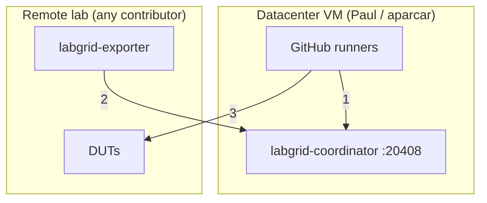
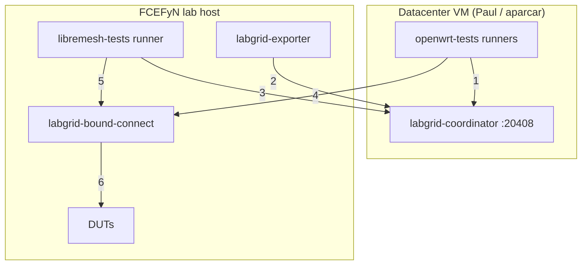
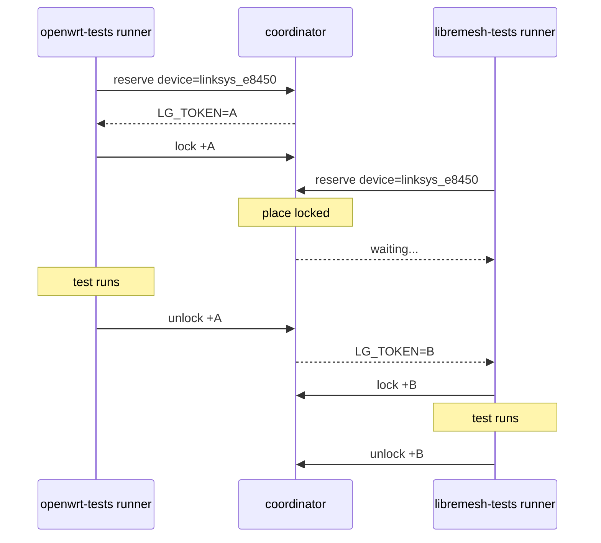

# Integration overview

How the FCEFyN testbed integrates with the existing openwrt-tests ecosystem. Intended as the entry point for the Design section: read this first, then follow the links to the detailed docs.

---

## 1. Starting point: openwrt-tests ecosystem

Before the FCEFyN lab existed, [openwrt-tests](https://github.com/aparcar/openwrt-tests) already operated a global testing infrastructure:

- A **VM in a datacenter** (public IP) runs a `labgrid-coordinator` and a pool of GitHub Actions **self-hosted runners**.
- **Remote labs** contributed by developers around the world each run a `labgrid-exporter`. They register their physical DUTs with the global coordinator over a **WireGuard** tunnel.
- When CI triggers (daily, PR, or manual), runners on the VM reserve and lock a device via the coordinator, then flash and test it by SSHing to the lab host over WireGuard.



| # | Connection | Detail |
|---|---|---|
| 1 | Runner → Coordinator | gRPC localhost:20408 (reserve / lock / unlock) |
| 2 | Exporter → Coordinator | gRPC via WireGuard (register resources) |
| 3 | Runner → DUTs | SSH via WireGuard (LG_PROXY=labgrid-X) |

See [openwrt-tests CI flow](openwrt-tests-ci-flow.md) for the detailed sequence of how a single job runs end-to-end.

---

## 2. Our hardware contribution to openwrt-tests

The FCEFyN lab contributes physical devices to the openwrt-tests pool. This means:

- `labgrid-fcefyn` is added as a lab entry in `labnet.yaml` (the upstream registry).
- A **`labgrid-exporter`** on the FCEFyN host registers all DUTs with the global coordinator over WireGuard.
- Runners on Paul's VM can then run openwrt-tests jobs on our hardware, exactly as they do with any other lab.

From the coordinator's perspective, our lab is indistinguishable from any other contributor. The process to set this up is documented in [openwrt-tests onboarding](openwrt-tests-onboarding.md).

---

## 3. Our own CI: libremesh-tests runner

For LibreMesh-specific tests, we run our **own GitHub Actions self-hosted runner** on the FCEFyN lab host (not on Paul's VM). This is the key architectural difference from openwrt-tests.



| # | Connection | Detail |
|---|---|---|
| 1 | openwrt-tests runner → Coordinator | gRPC localhost:20408 (reserve / lock) |
| 2 | Exporter → Coordinator | gRPC via WireGuard (register resources) |
| 3 | libremesh-tests runner → Coordinator | gRPC via WireGuard (LG_COORDINATOR=WG_IP:20408) |
| 4 | openwrt-tests runner → bound-connect | SSH via WireGuard (LG_PROXY=labgrid-fcefyn) |
| 5 | libremesh-tests runner → bound-connect | SSH local (LG_PROXY=labgrid-fcefyn → 127.0.1.1) |
| 6 | bound-connect → DUTs | socat bindtodevice → vlanXXX |

### Key differences vs openwrt-tests runner

| | openwrt-tests runner | libremesh-tests runner |
|---|---|---|
| **Location** | Paul's VM (datacenter) | FCEFyN lab host |
| **Runner label** | `global-coordinator` | `[self-hosted, testbed-fcefyn]` |
| **`LG_COORDINATOR`** | `localhost:20408` (default, same VM) | `vars.LG_COORDINATOR` = WireGuard IP of Paul's VM |
| **`LG_PROXY`** | SSH via WireGuard to lab host | SSH to `127.0.1.1` (localhost, same machine) |
| **SSH to DUT** | WireGuard + `labgrid-bound-connect` | Local `labgrid-bound-connect` |
| **VLAN per test** | Isolated VLANs 100-108 (no change needed) | Switches to VLAN 200 for mesh, restores on teardown |

### `LG_PROXY` in the local case

Both runners set `LG_PROXY=labgrid-fcefyn`. The difference is in how that hostname resolves:

- From Paul's VM: `labgrid-fcefyn` is a WireGuard peer - SSH traverses the tunnel.
- From the lab host itself: Ansible sets `127.0.1.1 labgrid-fcefyn` in `/etc/hosts` - SSH goes to localhost. The `labgrid-bound-connect` proxy command still runs, but entirely on the same machine.

### VLAN difference between test suites

openwrt-tests runs single-node tests. Each DUT stays on its **isolated VLAN** (100-108) for the entire test - no switch reconfiguration needed.

libremesh-tests runs multi-node mesh tests. Participating DUTs must all be on **VLAN 200** to form a mesh. The test fixture switches each port to VLAN 200 at start and restores it on teardown. This is the only test suite that modifies VLAN state.

See [Lab architecture](lab-architecture.md) for the full VLAN design and the `switch-vlan` CLI from [labgrid-switch-abstraction](https://github.com/fcefyn-testbed/labgrid-switch-abstraction).

### `LG_COORDINATOR` configuration

`LG_COORDINATOR` is set as a **GitHub Actions repository variable** in the libremesh-tests repo (`Settings > Secrets and variables > Actions > Variables`):

```
LG_COORDINATOR = <WireGuard IP of Paul's VM>:20408
```

The workflows use `vars.LG_COORDINATOR || 'localhost:20408'`, so if the variable is unset they fall back to localhost (useful for local development against a local coordinator).

---

## 4. Shared coordinator, no conflicts

Both runners - Paul's (openwrt-tests) and ours (libremesh-tests) - talk to the **same `labgrid-coordinator`** on Paul's VM. They share the same pool of places (DUTs).

The coordinator serializes access via **Labgrid locks**: only one runner can hold a lock on a place at a time. A runner that wants a busy device waits (`reserve --wait`) until the lock is released.



---

## 5. Reading guide for the Design section

| Goal | Start here |
|------|-----------|
| Understand how openwrt-tests CI runs step by step | [openwrt-tests CI flow](openwrt-tests-ci-flow.md) |
| Set up the WireGuard tunnel and contribute hardware to openwrt-tests | [openwrt-tests onboarding](openwrt-tests-onboarding.md) |
| VLAN design, `switch-vlan` CLI, switch configuration | [Lab architecture](lab-architecture.md) |
| Virtual mesh tests with QEMU and vwifi | [Virtual mesh](virtual-mesh.md) |
| Build and test lime-packages from a PR via CI | [CI: Build & Test](../operar/ci-build-and-test.md) |
| Understand the lime-packages fork CI build pipeline | [lime-packages CI build](lime-packages-ci-flow.md) |
| Understand the lime-packages fork CI test pipeline | [lime-packages CI tests](lime-packages-test-flow.md) |
