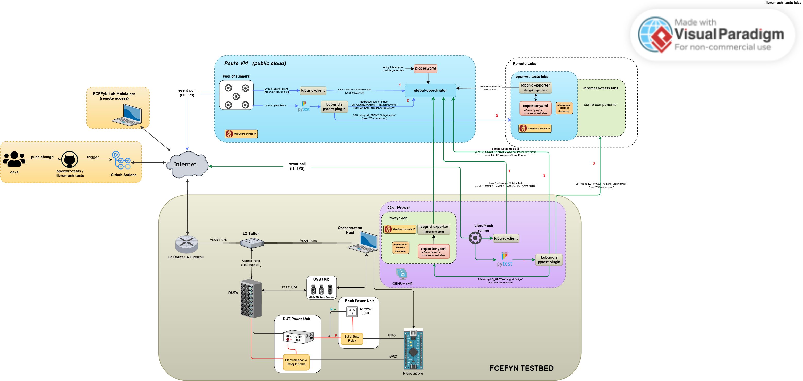
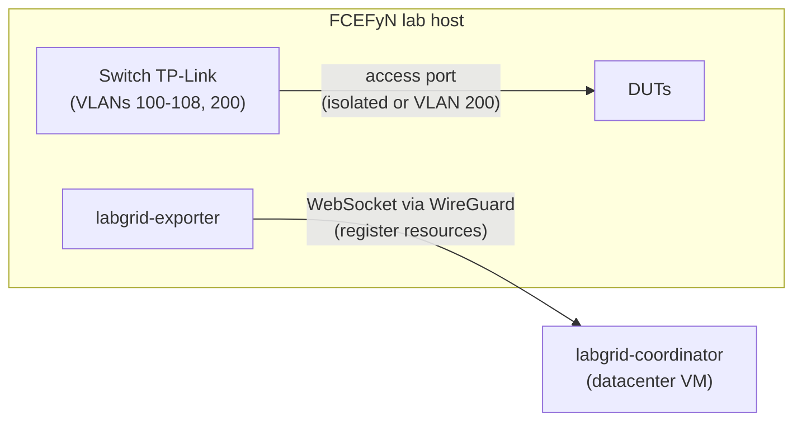
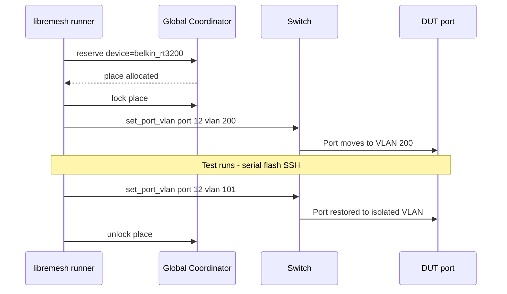
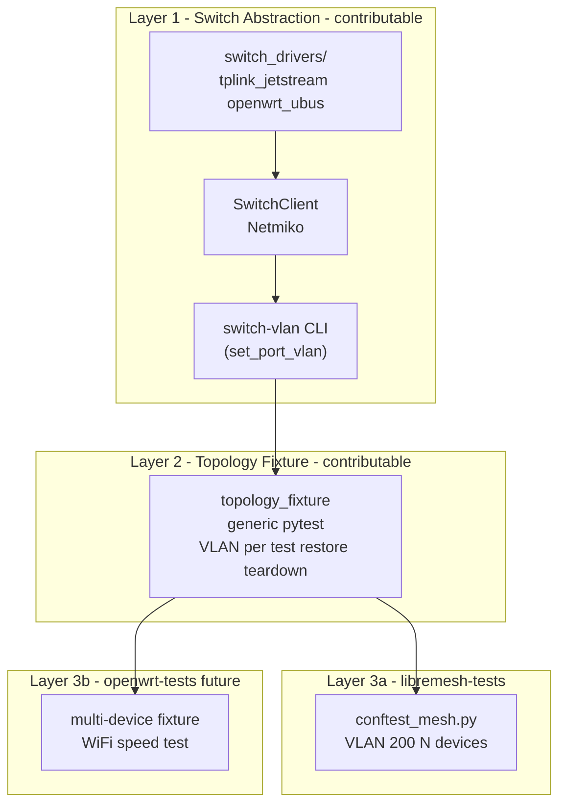

# Lab architecture {: #lab-architecture }

Technical design of the FCEFyN HIL testbed: one global coordinator shared with the openwrt-tests ecosystem, DUTs available for both [openwrt-tests](https://github.com/aparcar/openwrt-tests) and [libremesh-tests](https://github.com/fcefyn-testbed/libremesh-tests), and dynamic VLAN as a per-test attribute.



---

## 1. Overall design

The diagram above shows the complete system. Key elements:

| Element | Description |
|---|---|
| **Paul's VM (public cloud)** | Datacenter VM with the `labgrid-coordinator`, a pool of GitHub Actions self-hosted runners for openwrt-tests, and `labgrid-client` / pytest plugin. |
| **FCEFyN Testbed (on-prem)** | Orchestration host running `labgrid-exporter`, `pdudaemon`, dnsmasq/TFTP, and the libremesh-tests self-hosted runner. DUTs connect via managed switch. |
| **Remote Labs** | Other contributors' labs. Each runs an exporter that registers devices with the global coordinator. A lab may serve openwrt-tests, libremesh-tests, or both. |
| **GitHub Actions** | Push/PR events trigger CI workflows. openwrt-tests jobs run on Paul's runners; libremesh-tests jobs run on the FCEFyN runner. |

### Single coordinator, two test suites

All labs share one `labgrid-coordinator`. Both openwrt-tests runners (on Paul's VM) and the libremesh-tests runner (on the FCEFyN host) connect to it. Labgrid locks serialize device access - only one runner holds a device at a time, regardless of which project triggered the job.

For the full connection topology (WireGuard, `LG_PROXY`, `LG_COORDINATOR`) see [Integration overview](integration-overview.md).

---

## 2. Per-project device opt-in

The coordinator sees **all** devices from **all** labs. It does not distinguish between projects. The filtering happens at the **CI configuration** level:

| Project | Device registry | Who decides which labs participate |
|---|---|---|
| **openwrt-tests** | `labnet.yaml` in the openwrt-tests repo | Lab maintainer submits a PR adding their lab to `labnet.yaml` |
| **libremesh-tests** | Own configuration (env vars, device list) | Lab maintainer adds their lab to the libremesh-tests config |

This means a lab can contribute devices to **one project, the other, or both**:

- A lab listed only in openwrt-tests' `labnet.yaml` will never receive libremesh-tests jobs.
- A lab listed only in the libremesh-tests config will never receive openwrt-tests jobs.
- The FCEFyN lab appears in both, so its DUTs serve both projects (serialized by coordinator locks).

The coordinator itself is "project-agnostic" - it only manages locks and resource registration. The decision of which devices to test on which project belongs to each repository's CI configuration.

---

## 3. VLAN architecture

### 3.1 Design principle

The VLAN on a DUT port follows the **test run that holds the Labgrid lock**: the test applies the VLAN it needs at start and restores the port on teardown. Labgrid locking serializes access so two jobs do not reconfigure the same port at once.

### 3.2 Components

| Component | Role |
|---|---|
| Coordinator | One global (datacenter VM, via WireGuard) |
| Exporter | One `labgrid-exporter` process for all DUTs |
| DUT inventory | `dut-config.yaml` (hardware database for Labgrid and switch port mapping) |
| VLAN scheduling | Per-test VLAN where needed; Labgrid lock serializes access |



### 3.3 Default state: isolated (fail-safe)

All switch ports start on their **isolated VLAN** (100-108):

- openwrt-tests needs no VLAN changes
- If a test fails or the runner crashes, the DUT stays isolated (no cross-talk)

### 3.4 Exporter SSH model (single config, two access modes)

The exporter declares `NetworkService.address: "192.168.1.1%vlanXXX"` - the default OpenWrt `br-lan` IP reachable via `socat` + `SO_BINDTODEVICE`. This is the **only** exporter config; it does not change between projects.

| Project | SSH access | VLAN state |
|---|---|---|
| **openwrt-tests** | Labgrid `SSHDriver` -> `192.168.1.1%vlanXXX` | Isolated (default) |
| **libremesh-tests** (single-node) | Same as openwrt-tests | Isolated (default) |
| **libremesh-tests** (mesh) | Serial for setup, then direct SSH to per-DUT mesh SSH/control IPs (`10.13.200.x`) on vlan200 | Shared (fixture switches VLAN) |

Mesh tests bypass `SSHDriver` after the VLAN switch because isolated-mode `192.168.1.1%vlanXXX` is no longer unique once multiple DUTs share VLAN 200. The host connects to each node through its per-DUT mesh SSH/control IP in `10.13.200.x`, while the actual LibreMesh assertions use the node's real `10.13.x.x` address on `br-lan`. The `mesh_vlan` fixture (section 4) handles the switch and restore.

### 3.5 Dynamic VLAN: the test that needs it changes it

Multi-node tests (libremesh-tests mesh, openwrt-tests multi-node) switch DUTs to a shared VLAN. Flow:



Switching overhead: 2-5 s (SSH to switch + CLI). Negligible vs flash + boot (minutes).

### 3.6 Static infrastructure (all VLANs always on)

Configured once and left alone:

| Component | Permanent configuration |
|-----------|-------------------------|
| Switch uplinks (ports 9, 10) | Trunk of ALL VLANs (100-108 + 200) |
| Host netplan | vlan100-108 AND vlan200 up |
| dnsmasq | Instances for all VLANs (DHCP + TFTP) |
| Gateway | Interfaces for all VLANs |

## 4. `switch-vlan` CLI (labgrid-switch-abstraction)

Implementation lives in **[labgrid-switch-abstraction](https://github.com/fcefyn-testbed/labgrid-switch-abstraction)**: a `SwitchClient` + per-vendor driver, exposed as the `switch-vlan` CLI (with a `set_port_vlan(dut_name, vlan_id)` Python entry point underneath). DUT-to-port resolution comes from `dut-config.yaml` on the lab host.

```bash
switch-vlan belkin_rt3200_1 200       # move to mesh
switch-vlan belkin_rt3200_1 --restore  # restore isolated
switch-vlan --restore-all              # restore all DUTs
```

The primitive already exists on the driver interface (`assign_port_vlan_commands(port, vlan_id, mode, remove_vlans)`); the CLI adds DUT-name resolution and an `flock` to serialize concurrent runs (`/tmp/switch.lock`).

### Pytest fixture (libremesh-tests)

`tests/conftest_vlan.py` shells out to `switch-vlan` (not the Python API directly): when `LG_PROXY` is set, the command runs on the lab host via SSH, so a remote developer never needs the switch driver or credentials locally. The fixture switches each DUT to VLAN 200 at setup and always restores the isolated VLAN at teardown.

## 5. Repository split

| Repo | Responsibility |
|---|---|
| **openwrt-tests** (upstream) | Vanilla OpenWrt tests, single and multi-node |
| **libremesh-tests** (fork) | LibreMesh-specific tests, mesh multi-node |
| **fcefyn_testbed_utils** | Lab infrastructure, Ansible, scripts |
| **labgrid-switch-abstraction** | Vendor-agnostic switch management (VLAN, PoE) |

## 6. Layers and upstream contribution



**Layer 1** supports an abstract layer for switches or network topologies.

**Layer 2** enables multi-device tests for openwrt-tests (WiFi speed, golden-device pattern).

## 7. Switch Topology Daemon (future)

The library inside **[labgrid-switch-abstraction](https://github.com/fcefyn-testbed/labgrid-switch-abstraction)** is the base for a daemon. If an HTTP API is needed (like PDUDaemon), add an HTTP server on top of `set_port_vlan()`. Internal logic stays the same.

## 8. Trade-offs

| Aspect | Value | Mitigation |
|---|---|---|
| WireGuard dependency | All testing depends on the tunnel | Stable WireGuard with keepalive; temporary local coordinator fallback |
| Coordinator API latency | Lock/unlock via WireGuard | Light messages; SSH to DUTs is local |
| dnsmasq complexity | 9+ VLANs at once | One-time config; independent instances |
| VLAN switching overhead | 2-5 s per multi-node test | Negligible vs flash + boot (minutes) |
