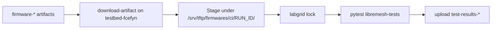
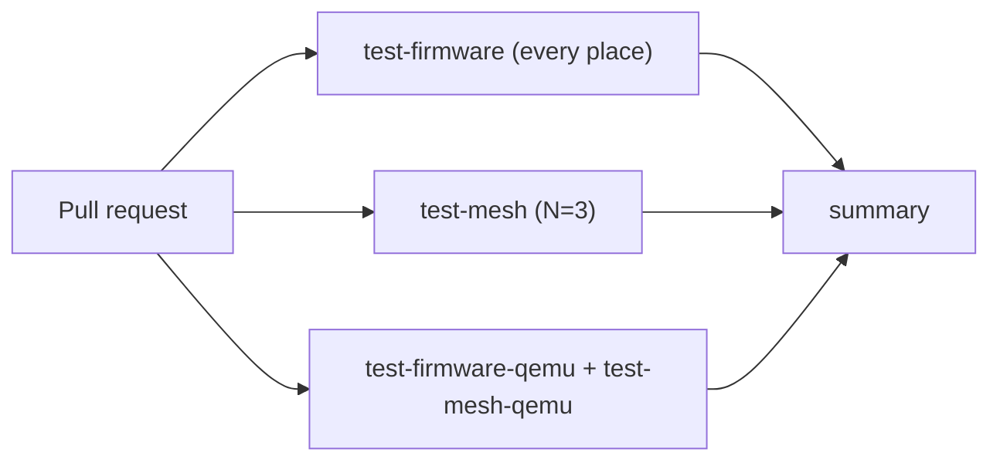
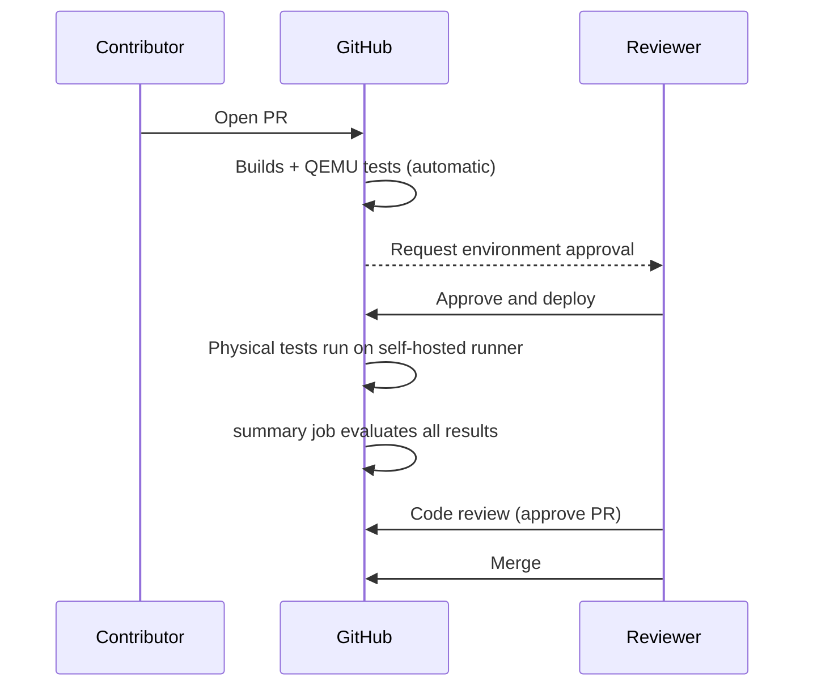

# lime-packages CI: hardware test stage

How **libremesh/lime-packages** consumes the firmware artifacts
produced by `build-image` and exercises them on the self-hosted lab
runner (`testbed-fcefyn`) and on QEMU. Single source of truth:
[build-firmware.yml][wf].

Build pipeline overview:
[lime-packages CI: firmware build](lime-packages-ci-flow.md).

[wf]: https://github.com/libremesh/lime-packages/blob/master/.github/workflows/build-firmware.yml

---

## 0. Two-repo model: workflow vs. tests

The test infrastructure is deliberately split across two repositories:

| Repo | What it owns |
|------|-------------|
| `libremesh/lime-packages` | The CI workflow (`.github/workflows/build-firmware.yml`), the build scripts, and the matrix config. |
| `libremesh/libremesh-tests` | The pytest test suite (`tests/test_libremesh.py`, `test_mesh.py`, etc.), labgrid environment files (`targets/<device>.yaml`), and the `uv` project that pins test dependencies. |

The workflow checks out `libremesh-tests@main` during each test
job and calls `uv run pytest` from there. No test code lives inside
`lime-packages` itself.

### Why the split?

`libremesh-tests` can be used independently:

- Local runs against any firmware (pre-built or downloaded) without
  going through the CI workflow.
- Future reuse by other forks of `lime-packages` (or the upstream
  `libremesh/lime-packages`) with zero changes to the test code.
- Allows separate versioning - test improvements land in
  `libremesh-tests` without touching `lime-packages`.

### Repo ownership requirements

For the CI workflow in `lime-packages` to access `libremesh-tests`,
the self-hosted runner must be able to check out both repos. Two
layouts work:

Both repos and the CI workflow live in the `libremesh` organisation.
The self-hosted runner (`fcefyn-runner`) is registered at the org level
(`Settings > Actions > Runners`) so it services workflows from any
repo in the org.

```
libremesh/lime-packages   <- workflow here
libremesh/libremesh-tests <- checked out by the workflow
```

The `actions/checkout` step uses
`repository: libremesh/libremesh-tests` - a public repo, so no
`token:` override is needed.

The runner group's `allows_public_repositories` setting must be
enabled for the runner to pick up jobs from public repos like
`lime-packages`.

### Pinned branch (`main`)

The workflow always checks out `libremesh-tests@main`, the production
branch. Test fixes are merged to `main` via PR (branch protection
requires it) and, because the workflow tracks a named branch rather
than a SHA, propagate automatically to the next CI run without a
`lime-packages` PR.

---

## 1. Trigger matrix

| Trigger                  | `test-firmware` | `test-mesh` | `test-mesh-pairs` | `test-firmware-qemu` | `test-mesh-qemu` |
|--------------------------|-----------------|-------------|-------------------|----------------------|-------------------|
| `pull_request`           | every place     | forced N=3  | skipped           | run                  | run               |
| `workflow_dispatch` (`physical_single=true`) | every place    | per `physical_mesh_count` (0/2/3) | skipped | run                  | run               |
| `schedule` (cron 06:00 UTC) | every place  | skipped     | 3 walking pairs   | run                  | run               |

Notes:

- QEMU tests run automatically on every PR without approval.
- Physical tests (`test-firmware`, `test-mesh`) require approval from
  a `physical-lab` environment reviewer before execution on the
  self-hosted runner. See [CI governance](#11-ci-governance-and-merge-policy).
- The workflow concurrency group `physical-lab-shared` makes sure that
  no two lab-bound triggers run at once.
- The `summary` job is a required status check for merging; it fails
  if any upstream job failed or was cancelled.

---

## 2. End-to-end flow



| Step      | What happens                                                      |
|-----------|-------------------------------------------------------------------|
| Artifacts | `build-image` uploads `firmware-<device>-<release>` per matrix.   |
| Checkout  | `libremesh-tests@main`, `aparcar/openwrt-tests@main`.             |
| Staging   | Firmware copied to `/srv/tftp/firmwares/ci/<run_id>/<place>/<release>/` (single-node), `.../mesh/<release>/`, or `.../mesh-pairs/<pair>/<release>/`. Per-job staging dirs avoid races. |
| Single    | Per place: lock `labgrid-fcefyn-<place>`, set `LG_IMAGE`, run `pytest tests/test_libremesh.py`. |
| Mesh      | `test-mesh`: stage every device the mesh shape needs, set `LG_MESH_PLACES` + `LG_IMAGE_MAP`, run `pytest tests/test_mesh.py`. |
| Pairs     | `test-mesh-pairs` (cron only): three sequential 2-node pairs, `max-parallel: 1`. Covers every active lab device twice per day. |

Each step is implemented in [tools/ci/lab_stage_firmware.sh][stage-fw]
and [tools/ci/lab_stage_mesh.sh][stage-mesh]; the workflow steps
themselves are 2-3 lines plus env vars.

[stage-fw]: https://github.com/libremesh/lime-packages/blob/master/tools/ci/lab_stage_firmware.sh
[stage-mesh]: https://github.com/libremesh/lime-packages/blob/master/tools/ci/lab_stage_mesh.sh

---

## 3. Mesh-after-firmware serialisation

`test-mesh` and `test-mesh-pairs` declare `needs: [..., test-firmware]`
so they cannot start while a `test-firmware` job is holding a labgrid
lock on the same place. Without this, both jobs race for the same lock
and one fails with `You have already acquired this place`.

The QEMU jobs run in parallel with the lab jobs since they do not
share lab resources.

---

## 4. PR strategy



- Every physical place runs single-node `test-firmware` (after
  `physical-lab` environment approval).
- `test-mesh` is forced to `physical_mesh_count=3` on PRs because
  `pull_request` cannot pass workflow inputs and N=3 is the most
  representative shape (3 different SoC families).
- The `summary` job is a required status check; merge is blocked
  until all jobs succeed.
- Merge requires at least one approving review (branch protection
  on `master`). See [CI governance](#11-ci-governance-and-merge-policy).

---

## 5. Walking-chain mesh (cron only)

Three sequential pairs run in `test-mesh-pairs` with `max-parallel: 1`:

| Pair | A                 | B                 |
|------|-------------------|-------------------|
| 1    | belkin_rt3200_2   | openwrt_one       |
| 2    | openwrt_one       | bananapi_bpi-r4   |
| 3    | bananapi_bpi-r4   | belkin_rt3200_3   |

Every active device is exercised twice per day with a different mesh
peer. `belkin_rt3200_1` is excluded (in repair) - re-include it by
adding it back to `mesh_pairs:` in `prepare_matrix.sh`.

---

## 6. QEMU coverage

| Job                  | Purpose                                                             |
|----------------------|---------------------------------------------------------------------|
| `test-firmware-qemu` | Single-node `qemu_x86_64` boot: `test_libremesh.py`, `test_base.py`, `test_lan.py`. |
| `test-mesh-qemu`     | Multi-node mesh on QEMU using `vwifi` (kmod-mac80211-hwsim with USR1 broadcast). |

Both run on GitHub-hosted runners with KVM. The
[tools/ci/enable_kvm.sh][kvm] step installs a udev rule that grants the
runner user `rw` on `/dev/kvm` (default permissions deny non-root
access). `udevadm trigger --name-match=kvm` is used so the rule applies
to the existing device node, not just future hot-plugs.

[kvm]: https://github.com/libremesh/lime-packages/blob/master/tools/ci/enable_kvm.sh

---

## 7. Labgrid reservation contract

### Single-node

- **Lock:** `uv run labgrid-client -v -p labgrid-fcefyn-<place> lock`.
- **Unlock + power-off:** in an `if: always()` step,
  `labgrid-client -p $LG_PLACE power off` then `... unlock`. The `-p`
  flag is required: without it labgrid falls back to its empty default
  and refuses to act.
- **Teardown:** remove `/srv/tftp/firmwares/ci/<run_id>/<place>/<release>/`.

The three Belkin RT3200 units (`belkin_rt3200_1`/`_2`/`_3`) all run
the `linksys_e8450` artefact under per-place TFTP staging and per-place
labgrid locks - the lock keys on the place name, not the device.

Environment for pytest: `LG_PROXY=labgrid-fcefyn`,
`LG_PLACE=labgrid-fcefyn-<place>`, `LG_ENV=targets/<device>.yaml`,
`OPENWRT_TESTS_DIR=<aparcar/openwrt-tests checkout>`.

### Mesh

Mesh fixtures (`tests/conftest_mesh.py` in libremesh-tests) require:

- `LG_MESH_PLACES`: comma-separated place names.
- `LG_IMAGE_MAP`: `place1=/abs/path1,place2=/abs/path2`.

VLAN 200 / switch configuration is handled by `conftest_vlan` (lab host
SSH); set `VLAN_SWITCH_DISABLED=1` to skip it.

---

## 8. Automatic issues on failure (healthcheck)

On **schedule** runs (daily cron), `test-firmware` automatically
manages GitHub issues for failing devices:

| Outcome | Action |
|---------|--------|
| Test fails, no issue exists | Creates `CI healthcheck: <place> (<release>)` with label `healthcheck`. |
| Test fails, issue already open | Adds a comment with the latest failure details. |
| Test fails, issue closed | Reopens the issue and updates its body. |
| Test passes, issue open | Comments "passed" and closes the issue. |

Each issue body contains a metadata table (place, device, release, run
link, date) and the output of `lime-report -m` (markdown sections with
`### FILE` / `### CMD` headers) inside a collapsible `<details>` block.

`lime-report` is collected from the DUT **before** poweroff/unlock via
`labgrid-client ssh -- lime-report -m` with `LG_PROXY` and `LG_ENV` set.
If SSH fails or the command is missing, a fallback message plus
`labgrid-client` stderr is stored instead.

This only triggers on `schedule` so that PRs and manual dispatches do
not create noise in the issue tracker.

---

## 9. Debugging a failed run

1. Open the run on GitHub, find the failed `test-firmware*` or
   `test-mesh*` job.
2. Download `test-results-<device>` / `test-results-mesh-*`. Each
   bundle has `--lg-log` console output and `report.xml` (JUnit).
3. Check the auto-created healthcheck issue for the device - it
   contains the `lime-report` output.
4. On the lab host, check coordinator/exporter, TFTP permissions under
   `/srv/tftp/firmwares/ci/`, and stale locks via `labgrid-client who`.
5. For QEMU jobs, the `qemu-*-logs` artifact contains the QEMU console
   plus pytest's `--lg-log`.

Once published, the same `report.xml` files are also visible from the
[CI Test Dashboard](../ci-results/index.md): `collect-lime-results.yml`
in `fcefyn_testbed_utils` pulls these artifacts every 6h and the
dashboard's "Report ↗" link points straight to the file on Pages.
See [Publishing results](../ci-results/publishing.md) for the
collection details.

---

## 10. Runner prerequisites

The `testbed-fcefyn` runner must already run libremesh-tests
workflows: `uv` and `labgrid-client` on `PATH` (via `uv run`), write
access to `/srv/tftp/firmwares/`, reachability of `LG_PROXY`.
See [CI runner](../configuracion/ci-runner.md) and
[Running tests](../operar/lab-running-tests.md).

For a brand-new device that has not been onboarded yet, follow
[Adding a device](lime-packages-add-device.md).

---

## 11. CI governance and merge policy

Access control for `libremesh/lime-packages` uses GitHub's built-in
environment and branch protection - no custom teams are required.

### Environment protection (`physical-lab`)

The `physical-lab` environment has individual **required reviewers**:

| Reviewer | Role |
|----------|------|
| francoriba | Lab maintainer, environment reviewer |
| ilario | LibreMesh maintainer, environment reviewer |
| javierbrk | LibreMesh maintainer, environment reviewer |

When a PR or `workflow_dispatch` triggers a job that uses
`environment: physical-lab`, GitHub Actions pauses the job until one
of the reviewers clicks **Approve and deploy** in the Actions UI.

The `schedule` trigger skips the gate (empty environment name) so the
daily cron runs unattended.

### Branch protection (`master`)

Branch protection on `master` enforces:

| Rule | Effect |
|------|--------|
| `required_status_checks` (`summary`) | PR cannot merge until `summary` passes |
| `required_pull_request_reviews` (1 approval) | PR needs at least one approving review |
| `enforce_admins` | Admins also follow the rules |

### Summary job as CI gate

The `summary` job depends on all other jobs (`if: always()`). The
[build_summary.sh][summary-sh] script checks every upstream job result:

- `success` or `skipped` (job condition not met) -> pass
- `failure` or `cancelled` -> fail and exit non-zero

Since `summary` is the required status check, and it waits for all
jobs (including `test-firmware` which is pending environment approval),
the PR stays unmergeable until every test completes successfully.

[summary-sh]: https://github.com/libremesh/lime-packages/blob/master/tools/ci/build_summary.sh

### Complete PR lifecycle



### Portability

The workflow only references `environment: physical-lab` by name. All
governance (environment reviewers, branch protection) lives in GitHub
repository/org settings, not in the YAML. Any organisation adopting
this workflow creates its own `physical-lab` environment and adds
reviewers without modifying the workflow file.