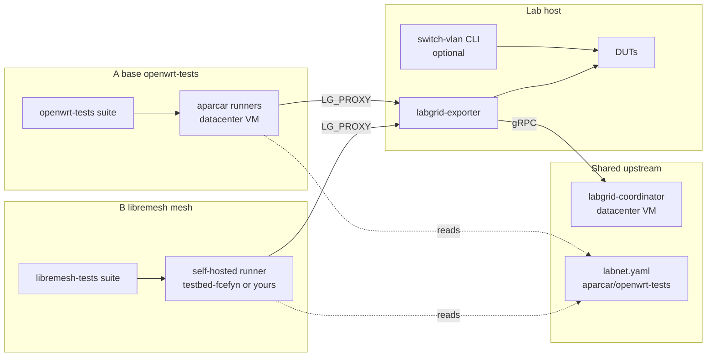

# Contributing a new lab

Two contribution paths share the same global coordinator but differ in what the lab must support and which runners execute CI. This page summarizes both so a new contributor picks the minimum setup for the target workflow.

---

## 1. Shared foundation

Every contributed lab uses:

- The global [labgrid-coordinator](openwrt-tests-onboarding.md#1-global-coordinator-architecture) hosted by the openwrt-tests maintainer (Paul / aparcar). Its address and SSH key are already wired into upstream Ansible.
- A **WireGuard** tunnel between the lab host and the coordinator VM (outbound from the lab).
- A **single inventory** in [openwrt-tests `labnet.yaml`](https://github.com/aparcar/openwrt-tests/blob/main/labnet.yaml) listing labs, devices, developer SSH keys.
- The [openwrt-tests `playbook_labgrid.yml`](https://github.com/aparcar/openwrt-tests/blob/main/ansible/playbook_labgrid.yml) applied to the lab host: user `labgrid-dev`, coordinator key in `authorized_keys`, `labgrid` and `labgrid-switch-abstraction` via pipx, exporter, TFTP, PDUDaemon, netplan, dnsmasq.

The infrastructure is the same; what changes between paths is **which CI runner** executes tests and **which suite** expects which resources.

---

## 2. Scenario A: base openwrt-tests lab

Goal: contribute DUTs so upstream [aparcar/openwrt-tests](https://github.com/aparcar/openwrt-tests) CI can flash OpenWrt and run vanilla healthchecks on them. Single-node tests. Managed switch and VLAN switching are **optional**: if the lab has no managed switch, everything still works on a static topology.

**Audience:** lab owners who want upstream openwrt-tests coverage on their hardware.

**Runners:** the GitHub Actions runners hosted by aparcar (same datacenter VM as the coordinator). No self-hosted runner required.

**Steps:**

1. Follow [openwrt-tests onboarding](openwrt-tests-onboarding.md): WireGuard, SSH keys, PR against `aparcar/openwrt-tests` with `labnet.yaml` entry, `ansible/files/exporter/<lab>/*`, lab doc.
2. Apply `playbook_labgrid.yml` on the lab host (coordinator key, exporter, TFTP, PDUDaemon, dnsmasq, netplan). The playbook now also installs `labgrid-switch-abstraction` via pipx; labs without a managed switch can ignore the CLI.
3. Optional: if the lab has a managed switch and wants dynamic VLAN switching in upstream tests, configure `switch.conf` and `dut-config.yaml` on the host and opt in per test run with `VLAN_SWITCH_ENABLED=1` + `LG_MULTI_PLACES`. See [switch-abstraction.md on the PR branch](https://github.com/aparcar/openwrt-tests/blob/main/docs/switch-abstraction.md) once PR [#218](https://github.com/aparcar/openwrt-tests/pull/218) is merged.

Nothing else is required on the lab side. Upstream CI will start scheduling jobs when `labnet.yaml` lists the lab.

---

## 3. Scenario B: libremesh-capable lab

Goal: run the [libremesh-tests](https://github.com/fcefyn-testbed/libremesh-tests) suite (single-node LibreMesh, multi-node mesh, virtual mesh) against DUTs in the lab. Requires a managed switch that can move DUT ports between isolated VLANs and the mesh VLAN (200 by default).

**Audience:** labs that want their DUTs covered by LibreMesh test matrices.

**Runners:** a **self-hosted GitHub runner** under the lab's control (not the aparcar runners). The FCEFyN lab uses `testbed-fcefyn`; other labs should register their own runner so tests run physically close to the DUTs.

**Steps:**

1. Complete Scenario A (same upstream onboarding; the inventory, exporter, coordinator, `playbook_labgrid.yml` are shared).
2. Managed switch **must be configured**. On the lab host:
   - Credentials in `/etc/switch.conf` (system-wide, group-readable so any SSH user can run `switch-vlan`; see [switch-config.md#multi-user-setup](../configuracion/switch-config.md#multi-user-setup-recommended-for-labs-with-remote-devs)).
   - DUT-to-port map in `/etc/testbed/dut-config.yaml` (or set `SWITCH_DUT_CONFIG`). DUT names in that file must match the suffix of labgrid place names (see place-to-DUT mapping below).
   - Confirm `switch-vlan --help` works as the SSH user.
3. Register a **self-hosted GitHub Actions runner** on the lab host (or on another machine with lab access) and label it for libremesh-tests workflows. See the fork's CI workflows (`.github/workflows/daily.yml`, `pull_requests.yml`) and [CI runner config](../configuracion/ci-runner.md) for details.
4. In `libremesh-tests/.github/workflows/*`, the matrix defaults to `labgrid-fcefyn`. To extend to another lab, set `LIBREMESH_CI_ALLOW_PROXY` (comma-separated proxy names) in the workflow env and make sure the self-hosted runner can reach the lab proxy.
5. Local development against the lab: `LG_PROXY=labgrid-<lab>`, `LG_MESH_PLACES=labgrid-<lab>-<dut1>,labgrid-<lab>-<dut2>`, `PLACE_PREFIX=labgrid-<lab>-` (or leave empty for the second-hyphen fallback). See [libremesh-tests CONTRIBUTING_LAB.md](https://github.com/fcefyn-testbed/libremesh-tests/blob/main/docs/CONTRIBUTING_LAB.md).

### Place-to-DUT mapping

Both suites derive DUT names from labgrid place names by stripping a prefix. Defaults differ:

| Suite | Default | Override |
|-------|---------|----------|
| openwrt-tests (PR #218) | up to the second hyphen | `PLACE_PREFIX` |
| libremesh-tests | `labgrid-fcefyn-` | `PLACE_PREFIX` |

Set `PLACE_PREFIX=labgrid-mylab-` when contributing a lab named `mylab`; `PLACE_PREFIX=""` disables the default and reverts to the second-hyphen strip.

---

## 4. Decision matrix

| Requirement | Scenario A | Scenario B |
|---|---|---|
| WireGuard tunnel to coordinator | required | required |
| `labnet.yaml` entry in openwrt-tests | required | required |
| `playbook_labgrid.yml` applied | required | required |
| Self-hosted GitHub runner | **not needed** | **required** |
| Managed switch | optional | **required** |
| `switch.conf` and `dut-config.yaml` on lab host | optional | **required** |
| Target YAML in libremesh-tests | no | per board that runs LibreMesh |
| Test suite | openwrt-tests | libremesh-tests (+ optional openwrt-tests) |

A lab can contribute to both paths at once: the infrastructure is shared. Scenario A is a prerequisite for Scenario B.

---

## 5. Related pages

- [openwrt-tests onboarding](openwrt-tests-onboarding.md) - full walkthrough of Scenario A (WireGuard, SSH, Ansible, sequence diagram).
- [Ansible and Labgrid](../configuracion/ansible-labgrid.md) - what upstream vs FCEFyN playbooks deploy.
- [Switch](../configuracion/switch-config.md) - VLAN layout, `switch.conf` multi-user setup, `switch-vlan` invocation.
- [Lab architecture](lab-architecture.md) - shared coordinator, VLAN scheduling, locking.
- [CI runner](../configuracion/ci-runner.md) - self-hosted runner setup (Scenario B).
- [CI: Build & Test](../operar/ci-build-and-test.md) - automated firmware build and test workflow using the self-hosted runner.
