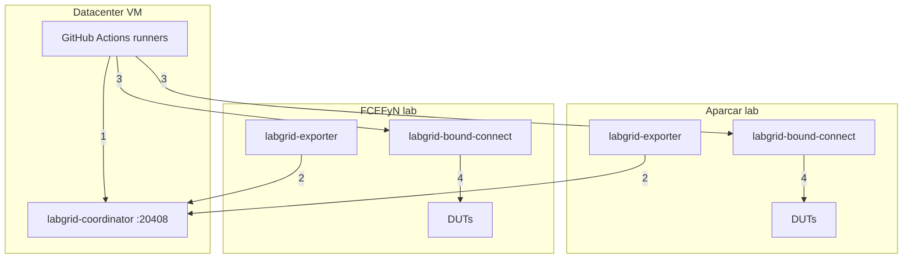
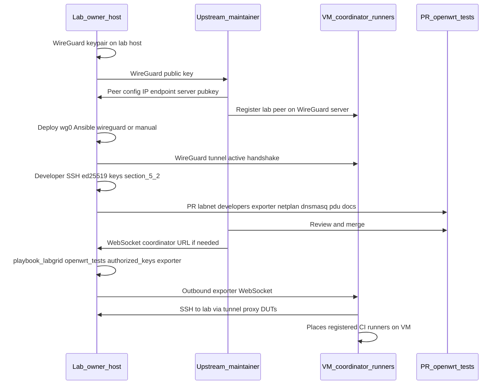

# Onboarding to openwrt-tests

Process for contributing hardware from a local lab to the [openwrt-tests](https://github.com/aparcar/openwrt-tests) ecosystem. Covers architecture, exporter connection, SSH keys, Ansible, and the step sequence to integrate DUTs with the upstream coordinator.

---

## 1. Global-coordinator architecture

The openwrt-tests **global-coordinator** is a **VM in a datacenter** with a public IP, maintained by Paul (aparcar). All remote labs connect to it over **WireGuard**. **GitHub Actions self-hosted runners** also run on that VM and reach labs through the WireGuard tunnel to run tests.



| # | Connection | Detail |
|---|---|---|
| 1 | Runners → Coordinator | WebSocket localhost:20408 (reserve / lock / unlock) |
| 2 | Exporter → Coordinator | WebSocket via WireGuard (register resources) |
| 3 | Runners → bound-connect | SSH via WireGuard (LG_PROXY=labgrid-X) |
| 4 | bound-connect → DUTs | socat with so-bindtodevice on correct VLAN interface |

All connections between labs and the VM traverse a **WireGuard** tunnel (point-to-point VPN).

| Component | Location | Role |
|-----------|----------|------|
| **Coordinator** | Datacenter VM (public IP) | WebSocket server. Registers places (`places.yaml`), coordinates reservations and locks. Does **not** proxy SSH. |
| **GitHub runners** | Same VM | Self-hosted runners executing CI workflow jobs against remote DUTs via `LG_PROXY`. |
| **WireGuard** | Between each lab and the VM | Tunnel so runners can SSH to lab hosts and lab exporters can reach the coordinator. |
| **Exporter** | Lab host | Registers local DUT resources (serial, power, network) with the coordinator over WebSocket. |
| **`labgrid-bound-connect`** | Lab host | SSH ProxyCommand invoked by the runner. Uses `socat` with `so-bindtodevice` to connect to a DUT IP on the correct VLAN interface. |
| **Place** | Configuration | Abstraction of one DUT: resources (serial, power, SSH target), boot strategy, firmware. |

See [CI execution flow](openwrt-tests-ci-flow.md) for the full sequence of how a workflow job runs end-to-end.

!!! note "WireGuard latency"
    If the WireGuard link between the datacenter and the lab is poor (high latency), tests may fail on timeout. The maintainer cited this as a known issue with labs in Eastern Europe.

---

## 2. Exporter connection to the coordinator

The exporter initiates the connection *toward* the coordinator.

```bash
labgrid-exporter --coordinator ws://<coordinator_host>:<port> /etc/labgrid/exporter.yaml
```

In practice the exporter runs as a systemd service (`labgrid-exporter.service`) and the coordinator is set in config or environment (`LG_COORDINATOR`).

**What you need from the upstream maintainer:**

- Coordinator URL (host and WebSocket port).
- Coordinator SSH public key to add to `authorized_keys` for user `labgrid-dev` on the lab (already included in the openwrt-tests Ansible playbook).

**Firewalls / NAT:** The lab must be able to connect *outbound* to the coordinator (outgoing WebSocket). The coordinator then uses SSH proxy over the same path to reach DUTs.

---

## 3. SSH access and proxy

When a developer or CI runs `labgrid-client console` or `labgrid-client ssh`, the flow is:

```
client → SSH to coordinator (jump host) → SSH to exporter → serial/SSH to DUT
```

The coordinator must SSH to the lab host. That is done with the coordinator public key in `authorized_keys` for user `labgrid-dev`.

### 3.1 Keys involved

| Key | Where it is configured | Purpose |
|-----|------------------------|---------|
| **Coordinator** public key | `~labgrid-dev/.ssh/authorized_keys` on the lab | Lets the coordinator SSH to the lab (proxy to DUTs). Deployed by Ansible. |
| Each **developer** public key | `labnet.yaml → developers.<github_user>.sshkey` | Lets the developer reach lab DUTs via `LG_PROXY`. |
| Lab **WireGuard** public key | Manual exchange with maintainer | Establishes VPN tunnel between lab and coordinator. |

The coordinator key is already in the openwrt-tests Ansible playbook; it deploys when you run the playbook.

#### Developer keys in `labnet.yaml`

Each developer who needs remote DUT access needs:

1. Their **personal SSH public key** (ed25519) in the `developers:` section of `labnet.yaml`.
2. Their **GitHub username** as identifier.
3. To be listed in `labs.<lab>.developers` for the target lab.

The openwrt-tests Ansible playbook iterates `labs.<lab>.developers`, looks up each `sshkey` in `developers:`, and appends to `~labgrid-dev/.ssh/authorized_keys` on the lab host. Each developer can then SSH as `labgrid-dev` to use `labgrid-client`.

---

## 4. Ansible: control node and managed node

| Role | In upstream openwrt-tests |
|------|---------------------------|
| **Control node** | Maintainer machine (Paul/Aparcar) that runs `ansible-playbook`. |
| **Managed node** | The lab host (the Lenovo in our case). |

For the upstream maintainer to apply the playbook to the FCEFyN lab:

1. **SSH to the lab host** (access as `labgrid-dev` or inventory user).
2. **Control node public key** in `authorized_keys` on the managed node.

This is coordinated manually: the maintainer shares their public key and the lab owner adds it to `authorized_keys`, or the lab owner runs the playbook locally (if they have inventory access).

---

## 5. PR contents to contribute hardware

A PR to openwrt-tests to add a new lab includes:

| File | Description |
|------|-------------|
| `labnet.yaml` | Lab entry under `labs:`, devices, instances, developer SSH keys. |
| `ansible/files/exporter/<lab>/exporter.yaml` | Exporter config: places with resources (serial, power, SSH target). |
| `ansible/files/exporter/<lab>/netplan.yaml` | Host network config (VLANs). |
| `ansible/files/exporter/<lab>/dnsmasq.conf` | DHCP/TFTP for lab VLANs. |
| `ansible/files/exporter/<lab>/pdudaemon.conf` | PDUDaemon config (power control). |
| `docs/labs/<lab>.md` | Lab documentation: hardware, DUTs, maintainers. |

### 5.1 Developers in labnet.yaml

Each developer registers with their **GitHub username** and **personal SSH public key** (ed25519). Include the upstream maintainer (`aparcar`) so they can debug.

```yaml
labs:
  labgrid-fcefyn:
    developers:
      - francoriba     # GitHub username
      - aparcar         # upstream maintainer (debugging)

developers:
  francoriba:
    sshkey: ssh-ed25519 AAAA...  # developer personal key
```

### 5.2 Generate SSH key for a new developer {: #52-generate-ssh-key-for-new-developer }

```bash
ssh-keygen -t ed25519 -C "github_username" -f ~/.ssh/id_ed25519
cat ~/.ssh/id_ed25519.pub
```

Add the public key (`cat` output) to `labnet.yaml` under `developers.<github_user>.sshkey`. The private key stays on the developer PC.

To use another PC, copy the key pair (`id_ed25519` + `id_ed25519.pub`) to `~/.ssh/` on the new machine with `chmod 600` on the private key. One `labnet.yaml` entry covers all PCs for the same developer.

!!! warning "Do not confuse with host keys"
    Orchestration host keys (`/etc/wireguard/public.key`, keys in `~labgrid-dev/.ssh/`) serve other purposes. Under `labnet.yaml → developers` only put **personal** keys for people who will run `labgrid-client` from laptops.

---

## 6. Onboarding sequence

Suggested order: first the **WireGuard** tunnel (the coordinator VM must register the lab peer; without the tunnel there is no return SSH from the VM). In parallel prepare the **PR** with inventory, exporter, and developers' **personal** SSH keys ([5.2](#52-generate-ssh-key-for-new-developer)). After merge, the openwrt-tests **playbook_labgrid** deploys `authorized_keys` and services on the host.



### 6.1 Checklist

* ~~Generate WireGuard keypair on the lab host and send the public key to the maintainer (Matrix)~~ **Done**
* ~~Receive WireGuard config from the maintainer (assigned IP, endpoint, server public key)~~ **Done** - IP `10.0.0.10/24`, endpoint `195.37.88.188:51820`
* ~~Apply tunnel on the host: Ansible role `wireguard` in `fcefyn_testbed_utils`~~ **Done** - see [section 9](#wireguard-ansible-fcefyn)
* ~~Verify tunnel: `sudo wg show wg0` (recent handshake)~~ **Done**
* Per developer: generate personal ed25519 key ([5.2](#52-generate-ssh-key-for-new-developer)) and list `labs.<lab>.developers` + `developers.<github_user>.sshkey` in `labnet.yaml`
* Prepare lab files: `exporter.yaml`, `netplan.yaml`, `dnsmasq.conf`, `pdudaemon.conf`
* Document the lab in `docs/labs/<lab>.md` (upstream)
* Open PR to openwrt-tests with the above
* After merge: run `playbook_labgrid.yml` from openwrt-tests on the host (or have the maintainer run it): coordinator SSH key ends up in `~labgrid-dev/.ssh/authorized_keys` and exporter is configured
* Confirm `labgrid-exporter` points at the coordinator WebSocket
* Verify places: `labgrid-client places` (with `LG_PROXY` per upstream README)

---

## 7. Maintainer coordination

| What you need | How to get it |
|---------------|---------------|
| WireGuard config (IP, endpoint, peer key) | Send lab WireGuard public key to the maintainer; receive data back. |
| Coordinator URL | Ask the maintainer or see project docs. |
| Coordinator SSH key | Already in Ansible playbook; deploys when applied. Alternatively the maintainer provides it. |
| Ansible access to lab | Lab owner gives SSH to the maintainer (Ansible control node public key), or runs the playbook locally. |
| VLAN configuration | Defined by the lab owner for their hardware; files go in the PR. |

---

## 8. Differences from libremesh-tests

| Aspect | openwrt-tests (upstream) | libremesh-tests (fork) |
|--------|--------------------------|------------------------|
| Coordinator | Global (datacenter VM) | Same global coordinator |
| Ansible control node | Aparcar infrastructure | The lab itself (self-setup) |
| VLANs | Dynamic per test (isolated default, 192.168.1.x) | Dynamic per test (mesh VLAN 200, 10.13.x.x for multi-node) |
| Multi-node tests | Not supported | Implemented in `conftest_mesh.py` |

Both projects use the **same Labgrid inventory** ([Lab architecture](lab-architecture.md)): each test locks DUTs via Labgrid and sets the VLAN it needs at runtime.

---

## 9. WireGuard in Ansible (fcefyn_testbed_utils) {: #wireguard-ansible-fcefyn }

Role in `fcefyn_testbed_utils` to bring up the lab host tunnel toward the **global-coordinator**. It does not replace key exchange with the upstream maintainer: it only automates install, `wg0.conf`, and systemd on Debian/Ubuntu.

| Item | Location |
|------|----------|
| Role | `ansible/roles/wireguard/` |
| Playbook that uses it | `ansible/playbook_testbed.yml` (comments and tag `wireguard`) |
| Variables | `ansible/roles/wireguard/defaults/main.yml` |
| Template | `ansible/roles/wireguard/templates/wg0.conf.j2` |
| Service | `wg-quick@wg0` (enabled and started by the role) |

Variables in `defaults/main.yml` hold the coordinator peer values (public key, endpoint, assigned IP `10.0.0.10/24`). The **private** key does not go in the repo: the role generates it on the host if missing (`/etc/wireguard/private.key`) and prints the public key in Ansible output to share with the maintainer.

**Run** (from `ansible/` directory):

```bash
ansible-playbook playbook_testbed.yml --tags wireguard -K
```

---
