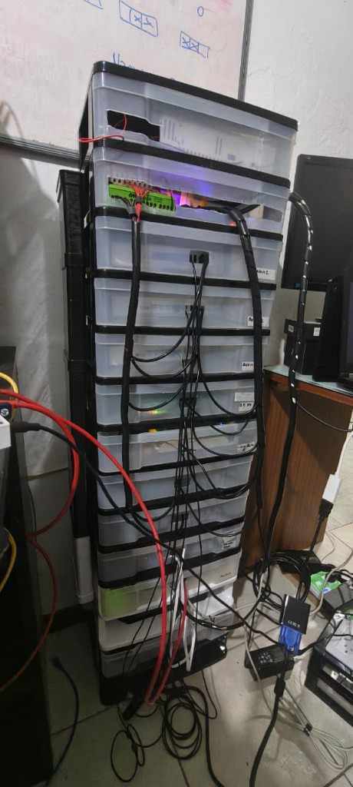
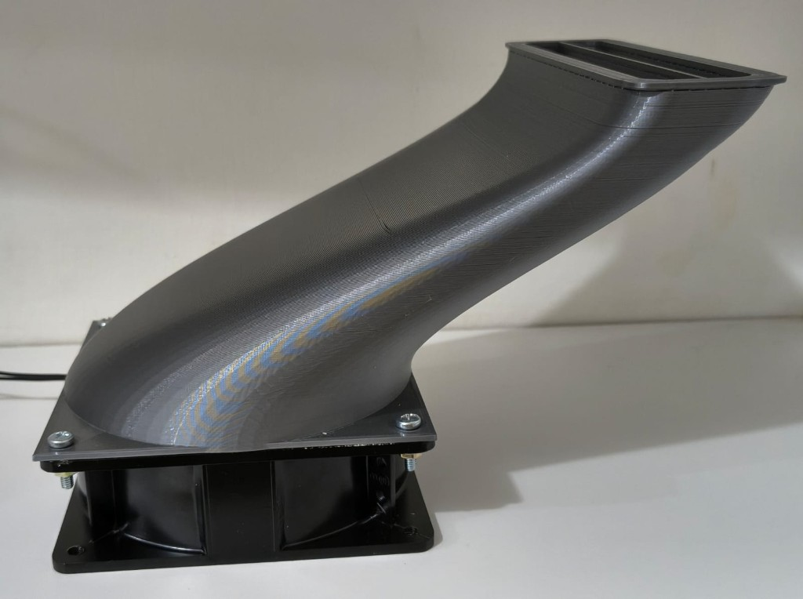
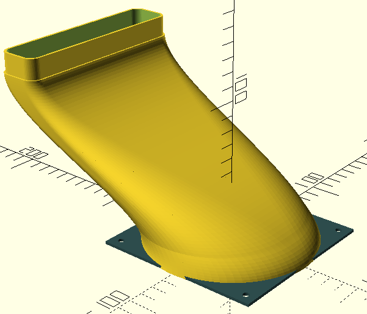
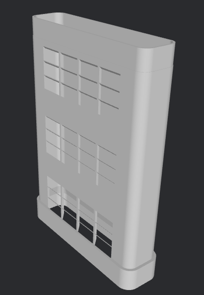
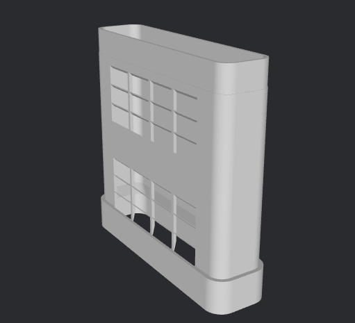
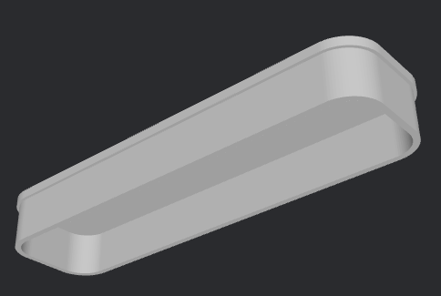
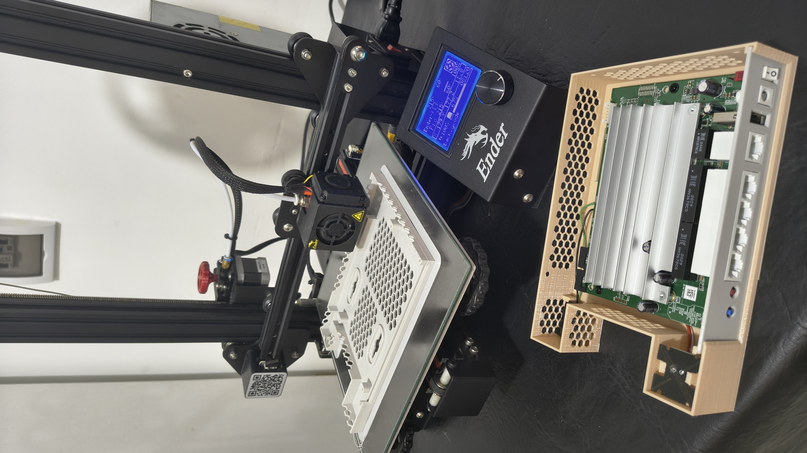
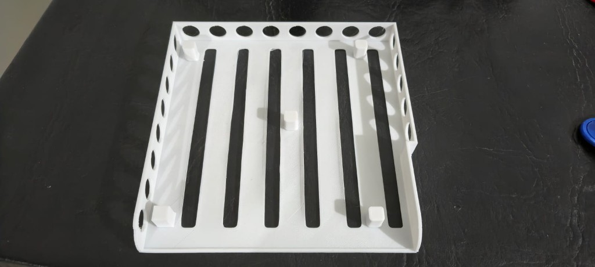
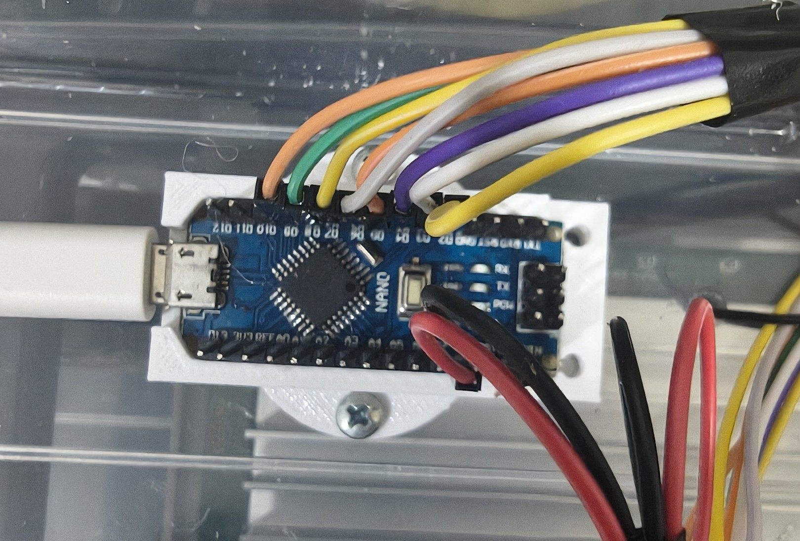
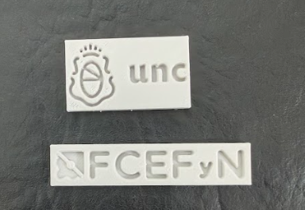

# Rack del banco de pruebas

Sí, construimos un rack custom para nuestro banco de pruebas :sunglasses:. 

Queríamos poder operar el hardware de forma cómoda y, al mismo tiempo, cuidar el hardware que tenemos, por eso armamos un rack en **torre**, con los DUTs apilados. Para el chasis no fuimos a un rack de datacenter:
usamos **cajoneras plásticas**, que salieron **mucho más baratas** y alcanzaron para lo que necesitábamos.

*Rack armado en el lab: torre de cajoneras, distribución de cables y DUTs visibles por cajón.*

El problema era que, con todo apilado, el aire caliente de abajo **sube** y se estanca arriba; los equipos de los niveles superiores
la pasan peor y el riesgo de dañarlos por sobre calentamiento aumenta. La salida que se nos ocurrió fue sumar un **ventilador abajo** y empujar aire **frío de abajo hacia arriba**,
como una chimenea al revés, con **conductos que diseñamos e imprimimos en 3D** para que el flujo **esté bien dirigido**.

Lo que sigue documenta ese diseño en **OpenSCAD / STL**: conducto tipo chimenea, ventilador de 120 mm y piezas auxiliares usadas en el rack, como **carcasas abiertas** para los routers.

Los **archivos CAD** viven en la raíz del repo, carpeta **`3d_parts/`**.

---

## Resumen de piezas impresas

| Cantidad | Archivo STL | Uso |
|----------|-------------|-----|
| 1 | `curved_intake_duct.stl` | Conducto curvo: ventilador 120 mm → chimenea |
| 4 | `airflow_chimney_duct_3levels.stl` | Segmentos verticales con rejillas (3 niveles c/u) |
| 1 | `airflow_chimney_duct_2levels.stl` | Segmento con 2 niveles |
| 1 | `chimney_duct_cover.stl` | Tapa superior de la chimenea |
| 3 | `belkin_rt3200_base.stl` | Base compacta Belkin RT3200 |
| 1 | `CE3PRO_librerouter_rack.stl` | Carcasa abierta LibreRouter: base ventilada, standoffs; [detalle](#5-carcasa-abierta-librerouter) |
| 1 | `NanoHolderA.stl` | Soporte Arduino Nano |
| (var.) | `logo fcefyn.stl`, `logo unc.stl` | Logos decorativos |

En `3d_parts/`, las piezas con fuente OpenSCAD llevan un `.scad` homónimo del STL para parametrizar y exportar

---

## Ventilador 120 mm (Bosser) y ensamble con conducto

Abajo usamos un **axial de marco 120 mm** a **220 V** de red (no los 12 V del Arduino): va en la base del rack y empuja aire hacia el conducto curvo impreso.

| Característica | Valor |
|----------------|-------|
| Marca | Bosser |
| Línea | Coolers 220 V |
| Modelo | **CBO-12038B-220** |
| Alimentación | AC **220 V** |
| Corriente | 0,09 A |
| Frecuencia | 50 / 60 Hz |
| Rodamiento | Ruleman (bola) |
| Formato | Marco **120 × 120 mm** (serie 12038), altura típica ~38 mm |

El **conducto de admisión curvado** (`curved_intake_duct`) se atornilla a la brida del ventilador (cuatro tornillos) y encaja con la chimenea vertical.

---

## Detalle por pieza

### 1. Conducto de admisión curvado (`curved_intake_duct.scad` / `.stl`)

Conducto loft tipo «saxofón» desde la base circular del ventilador de 120 mm hasta el conector rectangular de la chimenea. Flujo suave, sin esquinas internas pronunciadas.

**Parámetros (OpenSCAD):**

- `ancho_placa_base`: ancho de la placa del ventilador (120 mm en ventiladores Bosser).
- `altura_saxofon`: altura vertical de la transición.
- `desplazamiento_y`: desplazamiento lateral entre ventilador y chimenea.
- `rect_x` / `rect_y`: salida rectangular hacia la chimenea.

### 2. Conducto de chimenea (`airflow_chimney_duct.scad`, `_2levels.stl`, `_3levels.stl`)

Módulo vertical apilable; rejillas («branquias») a ~45° hacia los routers, sin soportes de impresión.

 

**Parámetros:**

- `niveles_por_modulo`: 2 o 3 según STL.
- `dist_niveles`: 60 mm entre niveles.
- `tolerancia`: holgura conectores macho/hembra.
- `grosor_pared`: rigidez.

### 3. Tapa de chimenea (`chimney_duct_cover.scad` / `.stl`)

Tapa con conector hembra para el último segmento.

### 4. Base Belkin RT3200 (`belkin_rt3200_base.stl`)

Carcasas originales demasiado voluminosas para el rack; base impresa para ahorrar espacio y fijar cables. Basado en [RT3200/E8450 Wall Mount Case](https://www.thingiverse.com/thing:5864938) (**TuxInvader**): solo la base, parte superior abierta para refrigeración.

### 5. Carcasa abierta LibreRouter

Base / bandeja **abierta por delante** para el LibreRouter en el rack: fondo ranurado para paso de aire, laterales con ventilación y **standoffs** para la PCB. Encaja con la idea de no tapar el equipo y dejar que la chimenea alimente flujo en el cajón.

**Archivo:** `3d_parts/CE3PRO_librerouter_rack.stl`. El nombre refleja que la orientación y soportes se probaron en **Creality Ender 3 Pro**; en otra impresora conviene revisar adherencia y orientación antes de tirar una pieza larga.

### 6. Auxiliares y estética

- **NanoHolderA.stl**: bracket Arduino Nano.

- **Logos** FCEFyN y UNC.

---