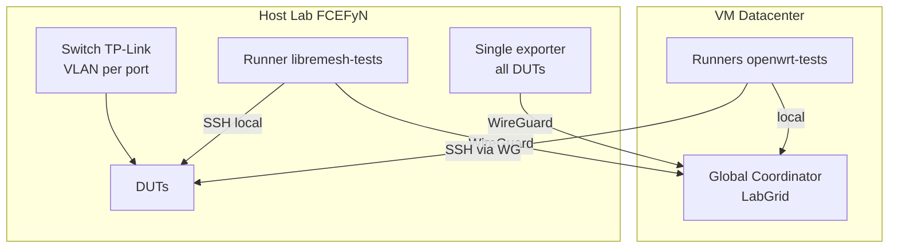
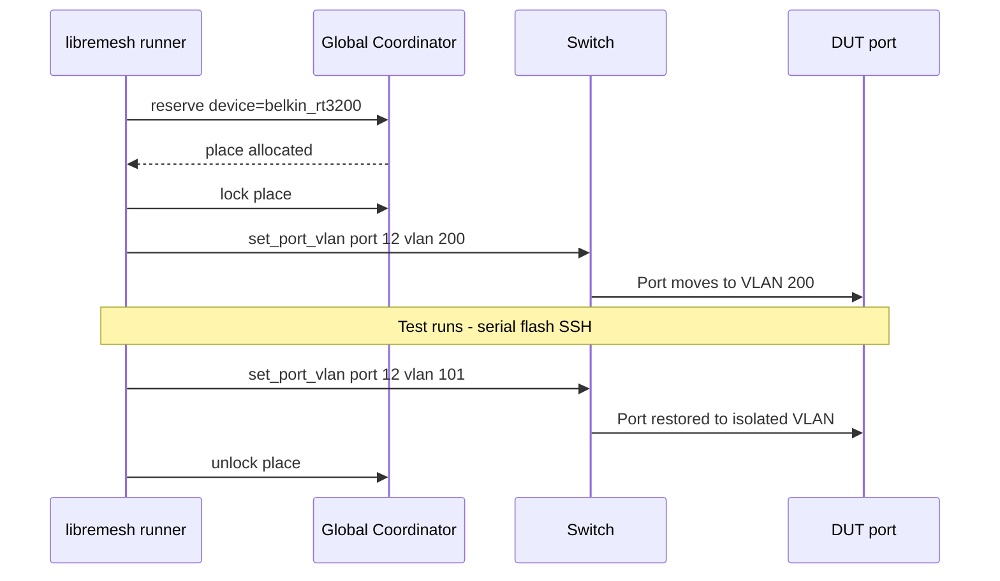
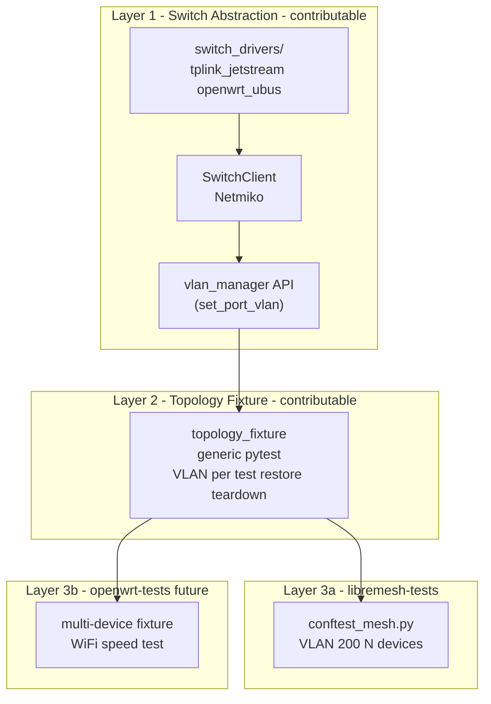

# Unified pool architecture (dynamic VLAN per test)

**Technical design document** - current lab architecture; the [fixed-pool approach](hybrid-lab-proposal.md) remains as historical reference. Context: labs contributing simultaneously to [openwrt-tests](https://github.com/openwrt/openwrt-tests) and [LibreMesh](https://libremesh.org/).

---

## 1. Problem

The previous approach splits DUTs into fixed pools (`dut-config.yaml`) with manual rebalancing. If openwrt-tests is busy, it cannot use DUTs assigned to libremesh and vice versa. That underuses hardware and requires admin intervention.

## 2. Design principle

A switch port VLAN **is not owned by a pool**: it is a **transient attribute of the test** that holds the lock. Each test sets the VLAN it needs at start and restores it on teardown. Labgrid locking provides mutual exclusion.

## 3. Architecture

### 3.1 One coordinator, one exporter

| Component | Before (fixed pools) | Now (unified pool) |
|-----------|------------------------|---------------------|
| Coordinator | 2 (global + local) | 1 (Paul's global, datacenter VM) |
| Exporter | 2 systemd services | 1 `labgrid-exporter` process |
| Pool config | `pools.openwrt` + `pools.libremesh` | No pools; only `duts` (hardware DB) |
| Mode change | Global mode + pool scripts (historical; see [hybrid-lab-proposal](hybrid-lab-proposal.md)) | No global mode; VLAN changes per test |

The global coordinator is the single source of locks. libremesh-tests points `LG_COORDINATOR` at the coordinator WireGuard IP instead of `localhost:20408`.



### 3.2 Default state: isolated (fail-safe)

All switch ports start on their **isolated VLAN** (100-108):

- openwrt-tests needs no VLAN changes
- If a test fails or the runner crashes, the DUT stays isolated (no cross-talk)

### 3.3 Dynamic VLAN: the test that needs it changes it

Only libremesh-tests needs VLAN 200. Flow:



Switching overhead: 2-5 s (SSH to switch + CLI). Negligible vs flash + boot (minutes).

### 3.4 Static infrastructure (all VLANs always on)

Configured once and left alone:

| Component | Permanent configuration |
|-----------|-------------------------|
| Switch uplinks (ports 9, 10) | Trunk of ALL VLANs (100-108 + 200) |
| Host netplan | vlan100-108 AND vlan200 up |
| dnsmasq | Instances for all VLANs (DHCP + TFTP) |
| Gateway | Interfaces for all VLANs |

## 4. Key component: `vlan_manager` API (labgrid-switch-abstraction)

Implementation lives in the **labgrid-switch-abstraction** package (`switch_abstraction.vlan_manager`). It uses `SwitchClient` + the existing driver:

```python
def set_port_vlan(dut_name, vlan_id, *, config_path=None):
    """Switch a DUT port to the target VLAN. Thread-safe via flock."""
```

The primitive already exists on the driver interface: `assign_port_vlan_commands(port, vlan_id, mode, remove_vlans)`. Expose it as a high-level function with DUT-to-port resolution from `dut-config.yaml`.

### Pytest fixture (libremesh-tests)

```python
@pytest.fixture
def mesh_vlan(request):
    """Switch DUT port to VLAN 200 before test, restore on teardown."""
    set_port_vlan(dut_name, VLAN_MESH)
    yield
    set_port_vlan(dut_name, isolated_vlan)
```

## 5. Repository split

The split between openwrt-tests and libremesh-tests **does not change**:

| Repo | Responsibility | What changes |
|------|----------------|--------------|
| **openwrt-tests** (upstream) | Vanilla OpenWrt tests, single-node | Nothing |
| **libremesh-tests** (ours) | LibreMesh single and multi-node | VLAN fixture; `LG_COORDINATOR` to global |
| **fcefyn_testbed_utils** (ours) | Lab infra, switch drivers, scripts | Static config; host: `switch-vlan` CLI |

## 6. Layers and upstream contribution



**Layer 1** addresses Paul's ask: "I wonder if we can come up with an abstract layer for switches or for network topologies."

**Layer 2** enables multi-device tests for openwrt-tests (WiFi speed, golden-device pattern).

## 7. Relation to Switch Topology Daemon (future)

The `vlan_manager` module in **labgrid-switch-abstraction** is the library base for a daemon. If an HTTP API is needed (like PDUDaemon), add an HTTP server on top of `set_port_vlan()`. Internal logic stays the same.

## 8. Trade-offs

| Aspect | Value | Mitigation |
|--------|-------|------------|
| WireGuard dependency | All testing depends on the tunnel | Stable WireGuard with keepalive; temporary local coordinator fallback |
| Coordinator API latency | Lock/unlock via WireGuard | Light messages; SSH to DUTs is local |
| dnsmasq complexity | 9+ VLANs at once | One-time config; independent instances |
| VLAN switching overhead | 2-5 s per test (libremesh only) | Negligible vs flash+boot |

## 9. What the previous approach removed

Compared to **fixed pools** and global mode (detail in [hybrid-lab-proposal](hybrid-lab-proposal.md) and [hybrid-lab-tracking](hybrid-lab-tracking.md)):

- `pools` section in `dut-config.yaml` (only `duts` remains as hardware DB)
- Two exporters and local coordinator replaced by one global coordinator and one exporter
- Manual whole-testbed "mode" switching (replaced by per-test VLAN with Labgrid lock)

## 10. What is reused

- `SwitchClient` + `tplink_jetstream.py` driver
- `assign_port_vlan_commands()` (driver interface)
- `dut-config.yaml` `duts` section (DUT to switch port map)
- PDUDaemon and `poe_switch_control.py`
- Serial, TFTP, SSH proxy infra

## References

- [Original proposal (historical)](hybrid-lab-proposal.md)
- [Original tracking (historical)](hybrid-lab-tracking.md)
- [openwrt-tests onboarding](openwrt-tests-onboarding.md)
