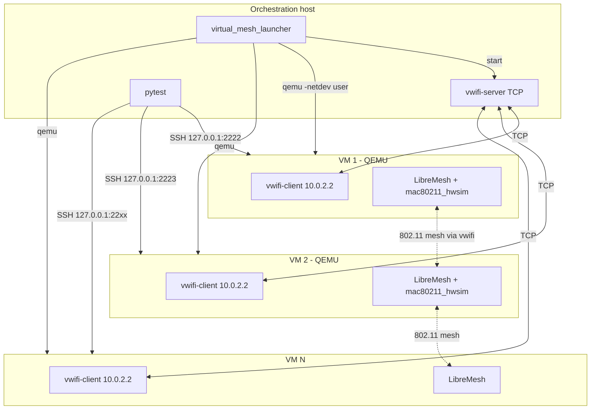

# Proposal: Virtual LibreMesh Tests with QEMU and vwifi

**Technical design document** for integrating multi-node LibreMesh tests running on QEMU VMs with simulated WiFi using vwifi and mac80211_hwsim. Complements the physical lab (documented in [hybrid-lab-proposal](hybrid-lab-proposal.md)), enabling CI without dedicated hardware and local development without real devices.

The FCEFyN lab and libremesh-tests are the initial use cases. This proposal defines the scope, architecture, and key technical decisions required for implementation.

---

## 1. Context and Objective

### 1.1 Scenario

A set of multi-node tests that currently require physical DUTs (LibreMesh on real routers) connected to a switch in mesh mode. The tests validate L2/L3 connectivity, batman-adv, babeld, and LibreMesh configuration.

### 1.2 Objective

Allow the same multi-node tests to run in a **virtual environment**:

- **QEMU**: x86_64 VMs running LibreMesh
- **mac80211_hwsim**: Virtual WiFi radios inside each VM
- **vwifi**: Retransmission of 802.11 frames between VMs to form a real mesh over simulated WiFi

Concrete goals:

- CI on GitHub-hosted runners (ubuntu-latest) without physical hardware
- Local development without real DUTs
- Reuse of the same test suite (`test_mesh.py`) for both physical and virtual nodes
- Parametrizable number of nodes (2–5 depending on available resources)

### 1.3 Relationship with physical tests

| Aspect | Physical tests | Virtual tests |
|--------|----------------|---------------|
| **DUTs** | Real routers (Belkin RT3200, BananaPi, etc.) | QEMU x86_64 VMs |
| **WiFi/Mesh** | Physical 802.11 network | vwifi + mac80211_hwsim |
| **Orchestration** | Labgrid (coordinator, exporter, places) | Custom launcher (no Labgrid) |
| **Host→DUT control** | SSH via VLAN 200 (labgrid-bound-connect) | SSH via port-forward (user-mode) |
| **Fixture** | `mesh_nodes` (mesh_boot_node.py subprocesses) | `mesh_nodes_virtual` (virtual_mesh_launcher) |

---

## 2. Technical Foundations

### 2.1 mac80211_hwsim

- Linux kernel module that creates virtual WiFi radios (`wlan0`, `wlan1`, …).
- Radios are software-only; no physical hardware involved.
- By default, hwsim radios on the **same machine** can see each other; radios on **different machines** (VMs) cannot.
- **vwifi** solves this: it retransmits frames between radios on different machines.

### 2.2 vwifi

- **vwifi-server**: runs on the host, listens for TCP (or VHOST) connections.
- **vwifi-client**: runs inside each VM, connects mac80211_hwsim radios to the server.
- 802.11 frames are encapsulated and retransmitted; VMs "see" a shared WiFi medium.
- Reference: [vwifi on OpenWrt](https://github.com/Raizo62/vwifi/wiki/Install-on-OpenWRT-X86_64).

### 2.3 QEMU user-mode networking

- `-netdev user,id=net0,hostfwd=tcp:127.0.0.1:PORT-:22`
- From the VM: the host is `10.0.2.2`, the default gateway is `10.0.2.2`.
- From the host: SSH to `127.0.0.1:PORT` → forwarded to port 22 of the VM.
- Does not require TAP, bridge, or network permissions; works in CI without `sudo`.

### 2.4 Why user-mode instead of TAP for control

TAP and user-mode are **equivalent** for the control channel (SSH host→VM):

| Method | Advantages | Disadvantages |
|--------|------------|---------------|
| **TAP** | Flexible topology, consistent with `libremesh_node.sh` | Requires `sudo`, bridge setup; problematic on GitHub-hosted runners |
| **user** | No extra permissions, standard QEMU approach for CI | Port-forward per VM (2222, 2223, …) |

**Decision**: user-mode for CI and portability; TAP remains a future option for advanced local development.

---

## 3. Architecture Decisions

| Question | Decision | Justification |
|----------|----------|---------------|
| Host→VM control network | **user-mode** | No TAP/sudo; works on GitHub-hosted runners |
| vwifi protocol | **TCP** | More portable than VHOST; host = 10.0.2.2 from the VM |
| Use Labgrid for VMs | **No** | VMs are not places; custom launcher avoids the coordinator |
| ubuntu-latest limit | **3 nodes** | 2-core, 7GB RAM; 5 nodes failed in prior testing |
| Self-hosted limit | **5 nodes** | More CPU/RAM available |
| Tests on pull_requests | **No** | Lint only; physical tests require self-hosted |
| Tests in dedicated workflow | **Yes** | virtual-mesh.yml with matrix [2, 3] on ubuntu-latest |
| Job in daily.yml | **Yes** | virtual-mesh-smoke (2 nodes) on self-hosted |

---

## 4. Network Topology

### 4.1 Conceptual diagram



### 4.2 Addressing

| Context | Address | Source |
|---------|---------|--------|
| Host (from VM) | 10.0.2.2 | QEMU user-mode (default gateway) |
| VM SSH (from host) | 127.0.0.1:2222, 2223, … | hostfwd per VM |
| Mesh br-lan (inside VM) | 10.13.x.x | LibreMesh dynamic assignment |

### 4.3 SSH ports

Each VM uses a different port on the host:
- VM 1: 2222
- VM 2: 2223
- VM N: 2221 + N

---

## 5. Components

### 5.1 virtual_mesh_launcher.py

| Attribute | Value |
|-----------|-------|
| Location | fork-openwrt-tests/scripts/ |
| Function | Starts vwifi-server, launches N QEMUs in parallel, waits for SSH on each |
| Input | N nodes, image path, base SSH port |
| Output | JSON file `[{host, port, place_id}, …]` consumed by the fixture |

Flow:

1. Verify `VIRTUAL_MESH_NODES <= VIRTUAL_MESH_MAX_NODES`
2. Start vwifi-server in the background
3. For each i in 1..N: launch QEMU with `-netdev user,hostfwd=tcp:127.0.0.1:PORT-:22`
4. Wait for SSH to become available on each port (configurable timeout)
5. Write state and return list of nodes

### 5.2 LibreMesh vwifi image

| Attribute | Value |
|-----------|-------|
| Base | x86_64 ext4 with LibreMesh |
| Packages | kmod-mac80211-hwsim (radios=0), vwifi-client, libstdcpp6, **wpad-basic-mbedtls** |
| Boot | vwifi-client connects to 10.0.2.2 at startup |
| Reference location | pi-hil-testing-utils/firmwares/qemu/libremesh/ or equivalent |

**wpad-basic-mbedtls** (mandatory): Without this package, hostapd cannot bring up the mesh interface on mac80211_hwsim — `wlan0-mesh` remains NO-CARRIER and batman-adv sees no active interfaces. Must be included in the image or installed via opkg before running tests.

### 5.3 mesh_nodes_virtual fixture

| Attribute | Value |
|-----------|-------|
| Location | fork-openwrt-tests/tests/conftest_mesh.py |
| Activation | `LG_VIRTUAL_MESH=1` |
| Variables | `VIRTUAL_MESH_NODES` (default 3), `VIRTUAL_MESH_IMAGE`, `VIRTUAL_MESH_MAX_NODES` |
| Returns | List of `MeshNode` objects with `.ssh` (direct SSH to 127.0.0.1:port, no ProxyCommand) |

The conftest selects the physical or virtual fixture based on `LG_VIRTUAL_MESH`.

### 5.4 SSHProxy for virtual mode

In virtual mode, SSHProxy does not use `labgrid-bound-connect`. It uses direct SSH:

```
ssh -o StrictHostKeyChecking=no -o UserKnownHostsFile=/dev/null root@127.0.0.1 -p PORT <cmd>
```

### 5.5 Environment variables

| Variable | Description | Default |
|----------|-------------|---------|
| LG_VIRTUAL_MESH | 1 = use virtual fixture | (not set) |
| VIRTUAL_MESH_NODES | Number of nodes | 3 |
| VIRTUAL_MESH_IMAGE | Path to the LibreMesh vwifi image | (required in virtual mode) |
| VIRTUAL_MESH_MAX_NODES | Limit (depends on runner) | 3 (CI), 5 (self-hosted) |
| VIRTUAL_MESH_SSH_BASE_PORT | Base SSH port | 2222 |

---

## 6. Resource Limits

| Runner | VIRTUAL_MESH_MAX_NODES | Justification |
|--------|------------------------|---------------|
| ubuntu-latest (GitHub) | 3 | 2-core, 7GB RAM; 5 nodes failed in testing |
| self-hosted (Lenovo T430) | 5 | More CPU/RAM available |

If `VIRTUAL_MESH_NODES > VIRTUAL_MESH_MAX_NODES`: error at startup with a message indicating the limit.

---

## 7. CI Workflows

| Workflow | Virtual tests | Runner | Nodes |
|----------|---------------|--------|-------|
| pull_requests.yml | No | - | - |
| virtual-mesh.yml | Yes | ubuntu-latest | matrix [2, 3] |
| daily.yml | virtual-mesh-smoke job | self-hosted | 2 fixed |

### 7.1 virtual-mesh.yml (new)

- **Triggers**: workflow_dispatch, push to main/develop, schedule
- **Steps**: install vwifi, qemu, kmod-mac80211-hwsim; download/obtain image; start vwifi-server; run pytest with `LG_VIRTUAL_MESH=1 VIRTUAL_MESH_NODES=N`

### 7.2 daily.yml

- Keep existing physical jobs unchanged.
- Add `virtual-mesh-smoke` job: 2 nodes, self-hosted, quick regression without physical hardware.

---
