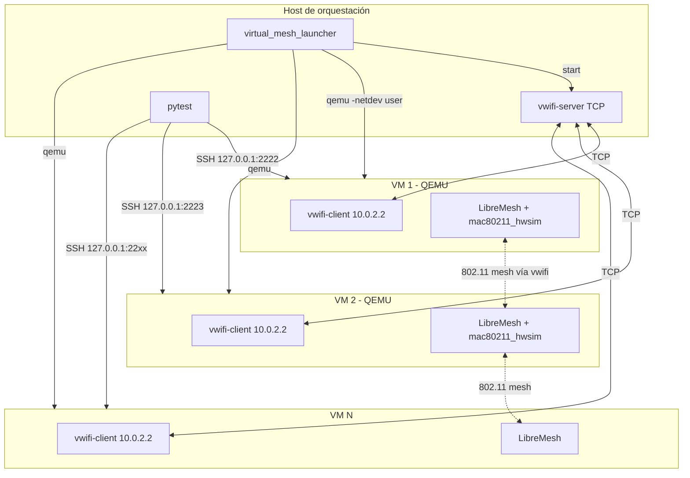

# Propuesta: Tests LibreMesh virtuales con QEMU y vwifi

**Documento de diseño técnico** para integrar tests multi-nodo LibreMesh ejecutados en VMs QEMU con WiFi simulado mediante vwifi y mac80211_hwsim. Complementa el lab físico (documentado en [hybrid-lab-proposal](hybrid-lab-proposal.md)) permitiendo CI sin hardware dedicado y desarrollo local sin dispositivos reales.

El lab FCEFyN y libremesh-tests son los casos de uso iniciales. Esta propuesta define el alcance, la arquitectura y las decisiones técnicas necesarias para implementarlo.

---

## 1. Contexto y Objetivo

### 1.1 Escenario

Un conjunto de tests multi-nodo que hoy requiere DUTs físicos (LibreMesh sobre routers reales) conectados a un switch en modo mesh. Los tests validan conectividad L2/L3, batman-adv, babeld y configuración LibreMesh.

### 1.2 Objetivo

Permitir que los mismos tests multi-nodo corran en **entorno virtual**:

- **QEMU**: VMs x86_64 ejecutando LibreMesh
- **mac80211_hwsim**: Radios WiFi virtuales en cada VM
- **vwifi**: Retransmisión de tramas 802.11 entre VMs para formar malla real sobre WiFi simulado

Objetivos concretos:

- CI en GitHub-hosted (ubuntu-latest) sin acceso a hardware físico
- Desarrollo local sin DUTs reales
- Reutilización de la misma suite de tests (`test_mesh.py`) para físicos y virtuales
- Número de nodos parametrizable (2-5 según recursos)

### 1.3 Relación con tests físicos

| Aspecto | Tests físicos | Tests virtuales |
|---------|---------------|-----------------|
| **DUTs** | Routers reales (Belkin RT3200, BananaPi, etc.) | VMs QEMU x86_64 |
| **WiFi/Mesh** | Red física 802.11 | vwifi + mac80211_hwsim |
| **Orquestación** | Labgrid (coordinator, exporter, places) | Launcher propio (sin Labgrid) |
| **Control host→DUT** | SSH vía VLAN 200 (labgrid-bound-connect) | SSH vía port-forward (user-mode) |
| **Fixture** | `mesh_nodes` (mesh_boot_node.py subprocesos) | `mesh_nodes_virtual` (virtual_mesh_launcher) |

---

## 2. Fundamentos Técnicos

### 2.1 mac80211_hwsim

- Módulo del kernel Linux que crea radios WiFi virtuales (`wlan0`, `wlan1`, …).
- Las radios son software; no hay hardware físico.
- Por defecto, las radios hwsim de la **misma máquina** se ven entre sí; las de **máquinas distintas** (VMs) no.
- **vwifi** resuelve esto: retransmite tramas entre radios de distintas máquinas.

### 2.2 vwifi

- **vwifi-server**: corre en el host, escucha conexiones TCP (o VHOST).
- **vwifi-client**: corre en cada VM, conecta las radios mac80211_hwsim al servidor.
- Tramas 802.11 se encapsulan y se retransmiten; las VMs "ven" WiFi compartido.
- Referencia: [vwifi en OpenWrt](https://github.com/Raizo62/vwifi/wiki/Install-on-OpenWRT-X86_64).

### 2.3 QEMU user-mode networking

- `-netdev user,id=net0,hostfwd=tcp:127.0.0.1:PORT-:22`
- Desde la VM: el host es `10.0.2.2`, la puerta por defecto es `10.0.2.2`.
- Desde el host: SSH a `127.0.0.1:PORT` → redirigido al puerto 22 de la VM.
- No requiere TAP, bridge ni permisos de red; funciona en CI sin `sudo`.

### 2.4 Por qué user y no TAP para control

TAP y user son **equivalentes** para el canal de control (SSH host→VM):

| Método | Ventajas | Desventajas |
|--------|----------|-------------|
| **TAP** | Topología flexible, consistente con `libremesh_node.sh` | Requiere `sudo`, configuración de bridge; problemático en GitHub-hosted |
| **user** | Sin permisos extra, estándar en QEMU para CI | Port-forward por VM (2222, 2223, …) |

**Decisión**: user-mode para CI y portabilidad; TAP queda como opción futura para desarrollo local avanzado.

---

## 3. Decisiones de Arquitectura

| Pregunta | Decisión | Justificación |
|----------|----------|---------------|
| Red de control host→VM | **user-mode** | Sin TAP/sudo; funciona en GitHub-hosted |
| Protocolo vwifi | **TCP** | Más portable que VHOST; host = 10.0.2.2 desde VM |
| Uso de Labgrid para VMs | **No** | Las VMs no son places; launcher propio evita coordinator |
| Límite ubuntu-latest | **3 nodos** | 2-core, 7GB RAM; 5 nodos falló en experiencias previas |
| Límite self-hosted | **5 nodos** | Más CPU/RAM disponibles |
| Tests en pull_requests | **No** | Solo lint; tests físicos requieren self-hosted |
| Tests en workflow dedicado | **Sí** | virtual-mesh.yml con matrix [2, 3] en ubuntu-latest |
| Job en daily.yml | **Sí** | virtual-mesh-smoke (2 nodos) en self-hosted |

---

## 4. Topología de Red

### 4.1 Esquema conceptual



### 4.2 Direccionamiento

| Contexto | Dirección | Origen |
|----------|-----------|--------|
| Host (desde VM) | 10.0.2.2 | QEMU user-mode (gateway por defecto) |
| VM SSH (desde host) | 127.0.0.1:2222, 2223, … | hostfwd por VM |
| Mesh br-lan (dentro de VM) | 10.13.x.x | LibreMesh dinámico |

### 4.3 Puertos SSH

Cada VM usa un puerto distinto en el host:
- VM 1: 2222
- VM 2: 2223
- VM N: 2221 + N

---

## 5. Componentes

### 5.1 virtual_mesh_launcher.py

| Atributo | Valor |
|----------|-------|
| Ubicación | fork-openwrt-tests/scripts/ |
| Función | Arranca vwifi-server, lanza N QEMUs en paralelo, espera SSH en cada uno |
| Entrada | N nodos, ruta imagen, puerto base SSH |
| Salida | Archivo JSON `[{host, port, place_id}, …]` para que el fixture consuma |

Flujo:

1. Verificar `VIRTUAL_MESH_NODES <= VIRTUAL_MESH_MAX_NODES`
2. Iniciar vwifi-server en background
3. Para cada i in 1..N: lanzar QEMU con `-netdev user,hostfwd=tcp:127.0.0.1:PORT-:22`
4. Esperar SSH disponible en cada puerto (timeout configurable)
5. Escribir estado y devolver lista de nodos

### 5.2 Imagen LibreMesh vwifi

| Atributo | Valor |
|----------|-------|
| Base | x86_64 ext4 con LibreMesh |
| Paquetes | kmod-mac80211-hwsim (radios=0), vwifi-client, libstdcpp6, **wpad-basic-mbedtls** |
| Boot | vwifi-client conecta a 10.0.2.2 al arranque |
| Ubicación referencia | pi-hil-testing-utils/firmwares/qemu/libremesh/ o equivalente |

**wpad-basic-mbedtls** (obligatorio): Sin este paquete, hostapd no puede establecer la interfaz mesh sobre mac80211_hwsim, wlan0-mesh queda NO-CARRIER y batman-adv no ve interfaces activas. Debe incluirse en la imagen o instalarse vía opkg antes de los tests.

### 5.3 Fixture mesh_nodes_virtual

| Atributo | Valor |
|----------|-------|
| Ubicación | fork-openwrt-tests/tests/conftest_mesh.py |
| Activación | `LG_VIRTUAL_MESH=1` |
| Variables | `VIRTUAL_MESH_NODES` (default 3), `VIRTUAL_MESH_IMAGE`, `VIRTUAL_MESH_MAX_NODES` |
| Devuelve | Lista de `MeshNode` con `.ssh` (SSH directo a 127.0.0.1:port, sin ProxyCommand) |

El conftest elige fixture físico o virtual según `LG_VIRTUAL_MESH`.

### 5.4 SSHProxy para modo virtual

En modo virtual, el SSHProxy no usa `labgrid-bound-connect`. Usa SSH directo:

```
ssh -o StrictHostKeyChecking=no -o UserKnownHostsFile=/dev/null root@127.0.0.1 -p PORT <cmd>
```

### 5.5 Variables de entorno

| Variable | Descripción | Default |
|----------|-------------|---------|
| LG_VIRTUAL_MESH | 1 = usar fixture virtual | (no set) |
| VIRTUAL_MESH_NODES | Número de nodos | 3 |
| VIRTUAL_MESH_IMAGE | Ruta a imagen LibreMesh vwifi | (requerido en virtual) |
| VIRTUAL_MESH_MAX_NODES | Límite (depende del runner) | 3 (CI), 5 (self-hosted) |
| VIRTUAL_MESH_SSH_BASE_PORT | Puerto base SSH | 2222 |

---

## 6. Límites de Recursos

| Runner | VIRTUAL_MESH_MAX_NODES | Justificación |
|-------|------------------------|---------------|
| ubuntu-latest (GitHub) | 3 | 2-core, 7GB RAM; 5 nodos falló en pruebas |
| self-hosted (Lenovo T430) | 5 | Más CPU/RAM |

Si `VIRTUAL_MESH_NODES > VIRTUAL_MESH_MAX_NODES`: error al inicio con mensaje indicando el límite.

---

## 7. Workflows CI

| Workflow | Tests virtuales | Runner | Nodos |
|----------|-----------------|--------|-------|
| pull_requests.yml | No | - | - |
| virtual-mesh.yml | Sí | ubuntu-latest | matrix [2, 3] |
| daily.yml | Job virtual-mesh-smoke | self-hosted | 2 fijos |

### 7.1 virtual-mesh.yml (nuevo)

- **Triggers**: workflow_dispatch, push a main/develop, schedule
- **Steps**: instalar vwifi, qemu, kmod-mac80211-hwsim; descargar/obtener imagen; levantar vwifi-server; pytest con `LG_VIRTUAL_MESH=1 VIRTUAL_MESH_NODES=N`

### 7.2 daily.yml

- Conservar jobs físicos existentes.
- Añadir job `virtual-mesh-smoke`: 2 nodos, self-hosted, regresión rápida sin hardware físico.

---
