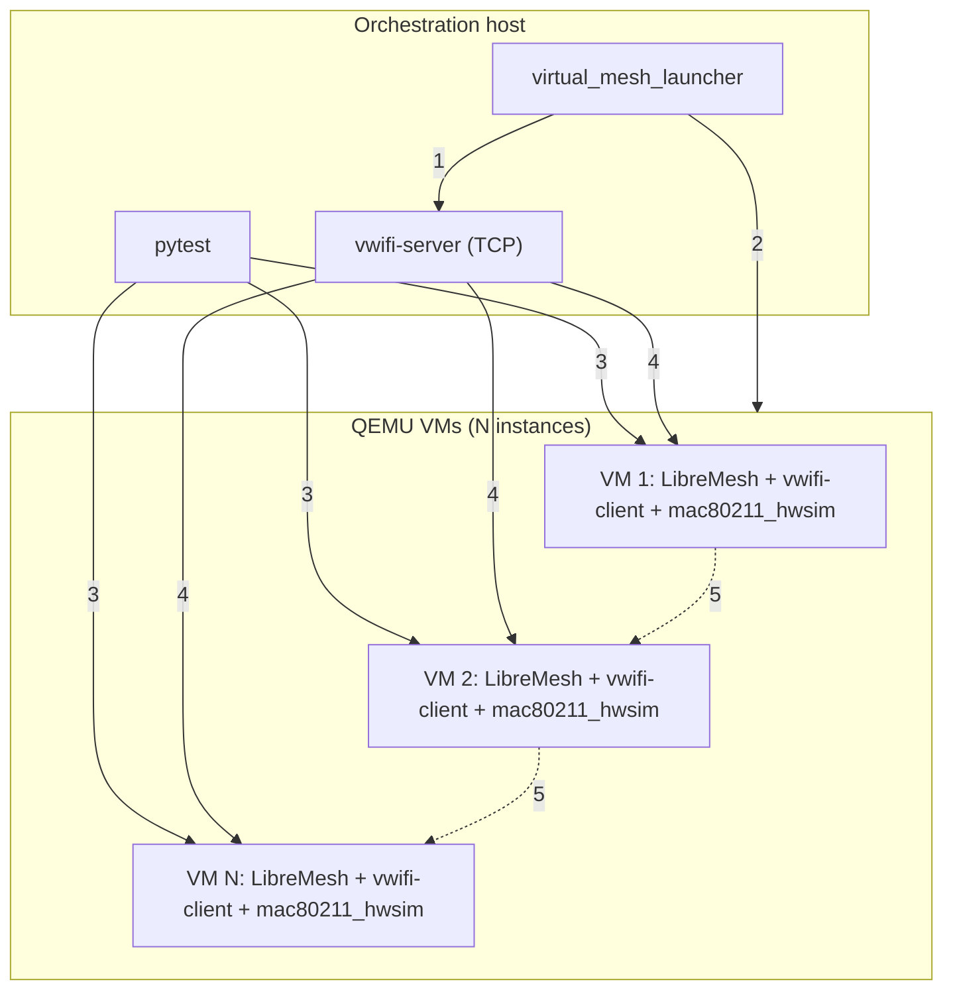

# Virtual LibreMesh tests with QEMU and vwifi

Multi-node LibreMesh tests on QEMU VMs with simulated WiFi via vwifi and mac80211_hwsim. Complements the physical lab ([Lab architecture](lab-architecture.md)) by enabling CI without dedicated hardware and local development without real devices.

---

## 1. Context and goal

### 1.1 Scenario

A set of multi-node tests that today requires physical DUTs (LibreMesh on real routers) connected to a switch in mesh mode. Tests validate L2/L3 connectivity, batman-adv, babeld, and LibreMesh configuration.

### 1.2 Goal

Run the same multi-node tests in a **virtual** environment:

- **QEMU**: x86_64 VMs running LibreMesh
- **mac80211_hwsim**: Virtual WiFi radios per VM
- **vwifi**: Retransmits 802.11 frames between VMs to form a real mesh over simulated WiFi

Concrete goals:

- CI on GitHub-hosted (ubuntu-latest) without physical hardware access
- Local development without real DUTs
- Reuse the same test suite (`test_mesh.py`) for physical and virtual
- Parameterizable node count (2-5 depending on resources)

### 1.3 Relationship to physical tests

| Aspect | Physical tests | Virtual tests |
|--------|----------------|---------------|
| **DUTs** | Real routers (Belkin RT3200, Banana Pi, etc.) | QEMU x86_64 VMs |
| **WiFi/Mesh** | Physical 802.11 network | vwifi + mac80211_hwsim |
| **Orchestration** | Labgrid (coordinator, exporter, places) | Custom launcher (no Labgrid) |
| **Control host→DUT** | SSH via VLAN 200 (labgrid-bound-connect) | SSH via port-forward (user-mode) |
| **Fixture** | `mesh_nodes` (mesh_boot_node.py subprocesses) | `mesh_nodes_virtual` (virtual_mesh_launcher) |

---

## 2. Technical foundations

### 2.1 mac80211_hwsim

- Linux kernel module that creates virtual WiFi radios (`wlan0`, `wlan1`, …).
- Radios are software; no physical hardware.
- By default, hwsim radios on the **same machine** see each other; radios on **different machines** (VMs) do not.
- **vwifi** fixes this: retransmits frames between radios on different machines.

### 2.2 vwifi

- **vwifi-server**: runs on the host, listens for TCP (or VHOST) connections.
- **vwifi-client**: runs in each VM, connects mac80211_hwsim radios to the server.
- 802.11 frames are encapsulated and forwarded; VMs "see" shared WiFi.
- Reference: [vwifi on OpenWrt](https://github.com/Raizo62/vwifi/wiki/Install-on-OpenWRT-X86_64).

### 2.3 QEMU user-mode networking

- `-netdev user,id=net0,hostfwd=tcp:127.0.0.1:PORT-:22`
- From the VM: the host is `10.0.2.2`, default gateway is `10.0.2.2`.
- From the host: SSH to `127.0.0.1:PORT` → forwarded to VM port 22.
- No TAP, bridge, or network privileges; works in CI without `sudo`.

### 2.4 Why user mode and not TAP for control

TAP and user mode are **equivalent** for the control channel (SSH host→VM):

| Method | Pros | Cons |
|--------|------|------|
| **TAP** | Flexible topology, consistent with `libremesh_node.sh` | Needs `sudo`, bridge setup; awkward on GitHub-hosted |
| **user** | No extra privileges, standard QEMU for CI | Per-VM port-forward (2222, 2223, …) |

**Decision:** user-mode for CI and portability; TAP remains a future option for advanced local dev.

---

## 3. Architecture decisions

| Question | Decision | Rationale |
|----------|------------|-----------|
| Control network host→VM | **user-mode** | No TAP/sudo; works on GitHub-hosted |
| vwifi protocol | **TCP** | More portable than VHOST; host = 10.0.2.2 from VM |
| Labgrid for VMs | **No** | VMs are not places; custom launcher avoids coordinator |
| ubuntu-latest limit | **3 nodes** | 2-core, 7GB RAM; 5 nodes failed in prior experiments |
| self-hosted limit | **5 nodes** | More CPU/RAM available |
| Tests in pull_requests | **No** | Lint only; physical tests need self-hosted |
| Tests in dedicated workflow | **Yes** | virtual-mesh.yml with matrix [2, 3] on ubuntu-latest |
| Job in daily.yml | **Yes** | virtual-mesh-smoke (2 nodes) on self-hosted |

---

## 4. Network topology

### 4.1 Conceptual diagram



| # | Connection | Detail |
|---|---|---|
| 1 | launcher → vwifi-server | Starts the frame relay server |
| 2 | launcher → VMs | Starts N QEMUs with `-netdev user,hostfwd=tcp:127.0.0.1:PORT-:22` |
| 3 | pytest → VMs | SSH to 127.0.0.1:2222, :2223, ..., :222N |
| 4 | vwifi-server ↔ VMs | TCP (vwifi-client in each VM connects to host 10.0.2.2) |
| 5 | VM ↔ VM | 802.11 mesh via vwifi frame relay |

### 4.2 Addressing

| Context | Address | Source |
|---------|---------|--------|
| Host (from VM) | 10.0.2.2 | QEMU user-mode (default gateway) |
| VM SSH (from host) | 127.0.0.1:2222, 2223, … | hostfwd per VM |
| Mesh br-lan (inside VM) | 10.13.x.x | Dynamic LibreMesh |

### 4.3 SSH ports

Each VM uses a distinct host port:
- VM 1: 2222
- VM 2: 2223
- VM N: 2221 + N

---

## 5. Components

### 5.1 virtual_mesh_launcher.py

| Attribute | Value |
|-----------|-------|
| Location | fork-openwrt-tests/scripts/ |
| Role | Start vwifi-server, launch N QEMUs in parallel, wait for SSH on each |
| Input | N nodes, image path, base SSH port |
| Output | JSON file `[{host, port, place_id}, …]` for the fixture |

Flow:

1. Check `VIRTUAL_MESH_NODES <= VIRTUAL_MESH_MAX_NODES`
2. Start vwifi-server in background
3. For each i in 1..N: launch QEMU with `-netdev user,hostfwd=tcp:127.0.0.1:PORT-:22`
4. Wait for SSH on each port (configurable timeout)
5. Write state and return node list

### 5.2 LibreMesh vwifi image

| Attribute | Value |
|-----------|-------|
| Base | x86_64 ext4 with LibreMesh |
| Packages | kmod-mac80211-hwsim (radios=0), vwifi-client, libstdcpp6, **wpad-basic-mbedtls** |
| Boot | vwifi-client connects to 10.0.2.2 at boot |
| Reference location | pi-hil-testing-utils/firmwares/qemu/libremesh/ or equivalent |

**wpad-basic-mbedtls** (required): Without it, hostapd cannot bring up the mesh iface on mac80211_hwsim; wlan0-mesh stays NO-CARRIER and batman-adv sees no active interfaces. Include in the image or install via opkg before tests.

### 5.3 mesh_nodes_virtual fixture

| Attribute | Value |
|-----------|-------|
| Location | fork-openwrt-tests/tests/conftest_mesh.py |
| Enable | `LG_VIRTUAL_MESH=1` |
| Variables | `VIRTUAL_MESH_NODES` (default 3), `VIRTUAL_MESH_IMAGE`, `VIRTUAL_MESH_MAX_NODES` |
| Returns | List of `MeshNode` with `.ssh` (direct SSH to 127.0.0.1:port, no ProxyCommand) |

conftest selects physical or virtual fixture based on `LG_VIRTUAL_MESH`.

### 5.4 SSHProxy in virtual mode

In virtual mode, SSHProxy does not use `labgrid-bound-connect`. It uses direct SSH:

```
ssh -o StrictHostKeyChecking=no -o UserKnownHostsFile=/dev/null root@127.0.0.1 -p PORT <cmd>
```

### 5.5 Environment variables

| Variable | Description | Default |
|----------|-------------|---------|
| LG_VIRTUAL_MESH | 1 = use virtual fixture | (unset) |
| VIRTUAL_MESH_NODES | Number of nodes | 3 |
| VIRTUAL_MESH_IMAGE | Path to LibreMesh vwifi image | (required in virtual mode) |
| VIRTUAL_MESH_MAX_NODES | Limit (runner-dependent) | 3 (CI), 5 (self-hosted) |
| VIRTUAL_MESH_SSH_BASE_PORT | Base SSH port | 2222 |

---

## 6. Resource limits

| Runner | VIRTUAL_MESH_MAX_NODES | Rationale |
|--------|------------------------|-----------|
| ubuntu-latest (GitHub) | 3 | 2-core, 7GB RAM; 5 nodes failed in tests |
| self-hosted (Lenovo T430) | 5 | More CPU/RAM |

If `VIRTUAL_MESH_NODES > VIRTUAL_MESH_MAX_NODES`: fail at startup with a message stating the limit.

---

## 7. CI workflows

| Workflow | Virtual tests | Runner | Nodes |
|----------|---------------|--------|-------|
| pull_requests.yml | No | - | - |
| virtual-mesh.yml | Yes | ubuntu-latest | matrix [2, 3] |
| daily.yml | virtual-mesh-smoke job | self-hosted | 2 fixed |

### 7.1 virtual-mesh.yml (new)

- **Triggers:** workflow_dispatch, push to main/develop, schedule
- **Steps:** install vwifi, qemu, kmod-mac80211-hwsim; download/obtain image; start vwifi-server; pytest with `LG_VIRTUAL_MESH=1 VIRTUAL_MESH_NODES=N`

### 7.2 daily.yml

- Keep existing physical jobs.
- Add `virtual-mesh-smoke` job: 2 nodes, self-hosted, fast regression without physical hardware.

---
