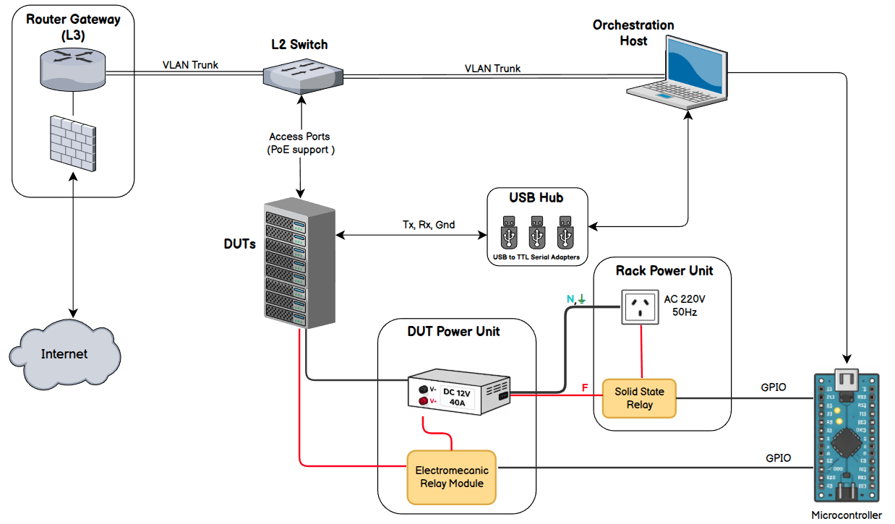

# FCEFyN HIL testbed documentation

This documentation describes the [fcefyn_testbed_utils](https://github.com/ccasanueva7/fcefyn_testbed_utils) repository, where components of the **hardware-in-the-loop testbed** for [OpenWrt](https://openwrt.org/) and [LibreMesh](https://libremesh.org/) at the [Facultad de Ciencias Exactas, Físicas y Naturales](https://fcefyn.unc.edu.ar/), [Universidad Nacional de Córdoba](https://www.unc.edu.ar/), are centralized.

The documentation covers:

* Lab operation
* Design and infrastructure
* Hardware and software components and their configurations
* Network topology
* Integrations with the test suites and test infrastructure of [openwrt-tests](https://github.com/aparcar/openwrt-tests) and its fork [libremesh-tests](https://github.com/francoriba/libremesh-tests)
* [Video demos](demos.md) of the lab (embedded YouTube)

---

## Before you start

**Testbed goal** and scope, in brief:

- **Validate firmware** for *OpenWrt*- and *LibreMesh*-based routers in an **automated, repeatable** way using the [Labgrid](https://labgrid.readthedocs.io/en/latest/) + [pytest](https://docs.pytest.org/en/stable/) ecosystem, following *openwrt-tests* and *libremesh-tests*.
- **Cover physical and emulated targets**: tests on **physical devices** in a rack over physical links and on [QEMU](https://www.qemu.org/) instances with WiFi simulated via [vwifi](https://github.com/sysprog21/vwifi).
- **Operate a shared lab**: with a [unified pool architecture](diseno/unified-pool.md) of devices for both projects, and remote access for administrators.

### Testbed overview

Relationship between orchestration host, switch, gateway, DUTs, power, and serial access:

The design builds on the **remote lab** model from [openwrt-tests](https://github.com/aparcar/openwrt-tests), but scope is not limited to **adding devices** to that network. It also **reuses and extends** the approach with **local infrastructure**, along the same axes (orchestration, network, power, serial) with a focus on **LibreMesh** testing.

The diagram above summarizes the topology: host, switch, gateway, and rack.

---

## Where to go next

| Profile | Start with | Then |
|--------|------------|------|
| **Lab admin** | [SOM](operar/SOM.md) | [Lab procedures](operar/lab-procedures.md), [Rack cheatsheets](operar/rack-cheatsheets.md), [Adding a DUT](operar/adding-dut-guide.md), [Build firmware](operar/build-firmware-manual.md) |
| **Test developer** | [SSH access to DUTs](operar/dut-ssh-access.md), [Labgrid troubleshooting](operar/labgrid-troubleshooting.md) | [Lab procedures](operar/lab-procedures.md), [Manual firmware build](operar/build-firmware-manual.md); LibreMesh suite docs in-repo: [LibreMesh testing approach](https://github.com/francoriba/libremesh-tests/blob/main/docs/libremesh-testing-approach.md), [CI firmware catalog](https://github.com/francoriba/libremesh-tests/blob/main/docs/ci-firmware-catalog.md) |
| **Reviewer or contributor** | [Unified pool architecture](diseno/unified-pool.md) | [openwrt-tests onboarding](diseno/openwrt-tests-onboarding.md), [CI use cases](diseno/ci-use-cases.md) |
| **Metrics (Grafana HTTPS)** | [URL and access](configuracion/grafana-public-access.md#url-and-access) | Invitation required; contacts in [SOM - Ownership and support](operar/SOM.md#ownership-and-support). Tunnel details: [public Grafana](configuracion/grafana-public-access.md). |
| **Demos (video)** | [Demos](demos.md) | Remote HIL access and other recordings |
