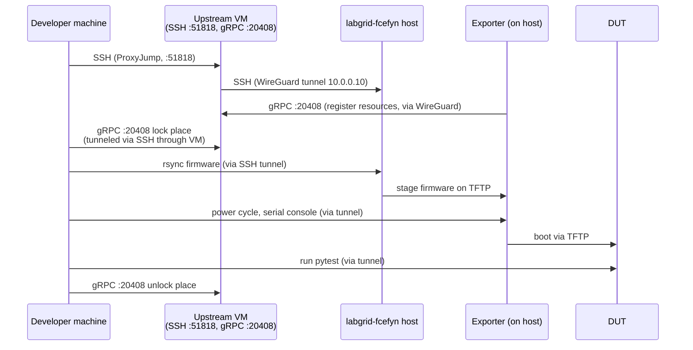

# Developer remote access - quickstart

Step-by-step guide for developers who want to run OpenWrt or LibreMesh tests on FCEFyN lab hardware from a personal machine. No VPN needed.

---

## 1. Request access

### 1.1 Generate SSH key

```bash
ssh-keygen -t ed25519 -f ~/.ssh/id_ed25519 -C "your@email" -N ""
cat ~/.ssh/id_ed25519.pub
```

### 1.2 Add the key to labnet.yaml

In [aparcar/openwrt-tests](https://github.com/aparcar/openwrt-tests), create a branch and edit `labnet.yaml`:

```yaml
developers:
  your_github_user:
    sshkey: ssh-ed25519 AAAAC3Nza... your@email

labs:
  labgrid-fcefyn:
    developers:
      - your_github_user
```

Open a PR. A maintainer merges it.

### 1.3 Deploy the key to the lab host

After merge, a lab admin runs the Ansible playbook:

```bash
cd openwrt-tests
ansible-playbook -i ansible/inventory.ini ansible/playbook_labgrid.yml --limit labgrid-fcefyn -K
```

Alternative (manual):

```bash
ssh admin_user@<HOST_IP>
echo "ssh-ed25519 AAAAC3Nza... your@email" | sudo tee -a /home/labgrid-dev/.ssh/authorized_keys
sudo chown labgrid-dev:labgrid-dev /home/labgrid-dev/.ssh/authorized_keys
sudo chmod 600 /home/labgrid-dev/.ssh/authorized_keys
```

### 1.4 Register the key on the upstream coordinator

The upstream Ansible playbook deploys keys to `[labs]` hosts only, **not** to `[coordinator]`. The developer key must be added manually to `~labgrid-dev/.ssh/authorized_keys` on `labgrid-coordinator`.

After 1.2 is merged, ping the upstream maintainer ([@aparcar](https://github.com/aparcar)) with the public key fingerprint and username. Without this, SSH to the coordinator fails with `Permission denied (publickey)`.

---

## 2. Configure SSH

Add to `~/.ssh/config`:

```
Host labgrid-coordinator
    User labgrid-dev
    HostName 195.37.88.188
    Port 51818
    IdentityFile ~/.ssh/id_ed25519

Host labgrid-* !labgrid-coordinator
    User labgrid-dev
    ProxyJump labgrid-coordinator
    IdentityFile ~/.ssh/id_ed25519
```

!!! warning "Avoid proxy loops"
    The `!labgrid-coordinator` negation prevents the coordinator from matching the wildcard and creating a `ProxyJump` to itself (manifests as `banner exchange` timeouts or `UNKNOWN port 65535`).

Notes:

- The coordinator endpoint (`195.37.88.188:51818`) is maintained by the upstream project. If connection is refused, ask upstream for the current IP/port.
- The lab alias `labgrid-fcefyn` is resolved to its WireGuard IP by `/etc/hosts` on the coordinator. No `HostName` is needed in the wildcard block.

---

## 3. Verify SSH access

Run in order:

```bash
nc -zv -w 5 195.37.88.188 51818                     # TCP reachable
ssh -o ConnectTimeout=8 labgrid-coordinator whoami   # hop 1 -> labgrid-dev
ssh -o ConnectTimeout=15 labgrid-fcefyn whoami       # hop 2 -> labgrid-dev
```

| Failure | Cause | Fix |
|---------|-------|-----|
| `Connection refused` on port 51818 | Upstream moved the endpoint | Ask upstream maintainer |
| `Permission denied` on hop 1 | Key not on coordinator | Step 1.4 |
| `Permission denied` on hop 2 | Key not on lab host | Step 1.3 |
| `Could not resolve hostname labgrid-fcefyn` | Coordinator `/etc/hosts` missing alias | Add `HostName 10.0.0.10` in a specific `Host labgrid-fcefyn` block above the wildcard |

---

## 4. Clone repositories

```bash
mkdir -p ~/pi && cd ~/pi

# 1. Clone libremesh-tests (LibreMesh single-node, multi-node, QEMU)
git clone https://github.com/fcefyn-testbed/libremesh-tests.git

# 2. Clone openwrt-tests as sibling (provides labnet.yaml)
git clone https://github.com/aparcar/openwrt-tests.git
```

!!! info "Why both repos?"
    **openwrt-tests** contains the shared `labnet.yaml` (device inventory, SSH keys) and vanilla OpenWrt tests. **libremesh-tests** contains LibreMesh-specific tests, FCEFyN target YAML, and mesh strategies. The test suite locates `labnet.yaml` automatically when both repos are siblings (`../openwrt-tests/labnet.yaml`).

    Alternatively, set `LABNET_PATH=/path/to/labnet.yaml` or `OPENWRT_TESTS_DIR=/path/to/openwrt-tests` if using a different directory layout.

### 4.1 Install dependencies

`uv` resolves dependencies from `pyproject.toml` on first `uv run`. No separate install step is needed.

Prerequisites: **Linux**, **Python 3.13+**, [uv](https://docs.astral.sh/uv/), **git**.

```bash
# Optional: verify uv and Python are available
uv --version
python3 --version   # >= 3.13
```

---

## 5. Download firmware

`LG_IMAGE` must point to a **local file** on the developer machine. Labgrid uploads it to the lab host via rsync automatically.

```bash
mkdir -p ~/firmwares

# OpenWrt vanilla (example: BPi-R4)
scp admin_user@<HOST_IP>:/srv/tftp/firmwares/bananapi_bpi-r4/openwrt/openwrt-24.10.5-mediatek-filogic-bananapi_bpi-r4-initramfs-recovery.itb ~/firmwares/

# LibreMesh (example: BPi-R4)
scp admin_user@<HOST_IP>:/srv/tftp/firmwares/bananapi_bpi-r4/libremesh/lime-24.10.5-mediatek-filogic-bananapi_bpi-r4-initramfs-recovery.itb ~/firmwares/
```

Firmware naming convention: [TFTP - naming rules](../configuracion/tftp-server.md#53-quick-rules).

!!! tip "First run is slow"
    The initial rsync over the SSH tunnel transfers the full firmware (~5-20 MB per device). Subsequent runs with the same image skip the upload (hash match).

---

## 6. Run tests

### 6.1 Verify labgrid connectivity

```bash
cd ~/pi/libremesh-tests
export LG_PROXY=labgrid-fcefyn

uv run labgrid-client who       # connected users
uv run labgrid-client places    # available DUTs
```

### 6.2 Available DUTs

| Place | Device | Target YAML |
|-------|--------|-------------|
| `labgrid-fcefyn-belkin_rt3200_1` | Belkin RT3200 / Linksys E8450 | `targets/linksys_e8450.yaml` |
| `labgrid-fcefyn-belkin_rt3200_2` | Belkin RT3200 / Linksys E8450 | `targets/linksys_e8450.yaml` |
| `labgrid-fcefyn-belkin_rt3200_3` | Belkin RT3200 / Linksys E8450 | `targets/linksys_e8450.yaml` |
| `labgrid-fcefyn-bananapi_bpi-r4` | BananaPi BPi-R4 | `targets/bananapi_bpi-r4.yaml` |
| `labgrid-fcefyn-openwrt_one` | OpenWrt One | `targets/openwrt_one.yaml` |
| `labgrid-fcefyn-librerouter_1` | LibreRouter v1 | `targets/librerouter_librerouter-v1.yaml` |

### 6.3 OpenWrt vanilla (single-node)

```bash
cd ~/pi/libremesh-tests

export LG_PROXY=labgrid-fcefyn
export LG_PLACE=labgrid-fcefyn-bananapi_bpi-r4
export LG_ENV=targets/bananapi_bpi-r4.yaml
export LG_IMAGE=$HOME/firmwares/openwrt-24.10.5-mediatek-filogic-bananapi_bpi-r4-initramfs-recovery.itb

uv run labgrid-client lock
uv run pytest tests/test_base.py -v --log-cli-level=INFO
uv run labgrid-client unlock
```

### 6.4 LibreMesh (single-node)

Same flow, different firmware and test file:

```bash
export LG_IMAGE=$HOME/firmwares/lime-24.10.5-mediatek-filogic-bananapi_bpi-r4-initramfs-recovery.itb

uv run labgrid-client lock
uv run pytest tests/test_libremesh.py -v --log-cli-level=INFO
uv run labgrid-client unlock
```

### 6.5 LibreMesh mesh (multi-node)

Mesh tests boot N DUTs in parallel on VLAN 200 and assert connectivity (batman-adv, babeld).

```bash
export LG_PROXY=labgrid-fcefyn
export LG_MESH_PLACES="labgrid-fcefyn-openwrt_one,labgrid-fcefyn-librerouter_1"
export LG_IMAGE_MAP="labgrid-fcefyn-openwrt_one=$HOME/firmwares/lime-24.10.5-mediatek-filogic-openwrt_one-initramfs.itb,labgrid-fcefyn-librerouter_1=$HOME/firmwares/lime-24.10.5-ath79-generic-librerouter_librerouter-v1-initramfs-kernel.bin"

uv run pytest tests/test_mesh.py -v --log-cli-level=INFO
```

Environment variables:

| Variable | Purpose |
|----------|---------|
| `LG_PROXY` | Lab host alias for SSH tunneling |
| `LG_MESH_PLACES` | Comma-separated place names for the mesh |
| `LG_IMAGE_MAP` | `place=local_firmware_path` pairs, comma-separated |
| `LG_MESH_KEEP_POWERED` | Set to `1` to keep DUTs powered after test (VLANs are still restored) |

!!! note "Automatic VLAN and SSH handling"
    - **VLAN switching**: `conftest_vlan.py` detects `LG_PROXY` and invokes `switch-vlan` via SSH to the lab host (which owns switch SNMP credentials and `dut-config.yaml`). No local `switch-vlan` install or switch config needed on the developer machine.
    - **SSH to mesh DUTs**: `conftest_mesh.py` wraps `labgrid-bound-connect` via `ssh ${LG_PROXY}` automatically. The `Host dut-*` SSH aliases do **not** reach DUTs on VLAN 200; for interactive access during a mesh test use the nested `ProxyCommand` from [SSH access to DUTs](dut-ssh-access.md#remote-developer-lg_proxy).
    - **Why does it work?** The `LG_PROXY` environment variable tells the test suite to delegate all host-side operations (VLAN switching, VLAN-bound SSH) through SSH. See [VLAN switching: local vs remote](dut-ssh-access.md#vlan-switching-local-vs-remote) for details.

### 6.6 Other labgrid-client commands

```bash
uv run labgrid-client power cycle     # power cycle DUT
uv run labgrid-client console         # interactive serial console
uv run labgrid-client --state shell console   # boot to shell + console
```

Always unlock when done: `uv run labgrid-client unlock`.

---

## 7. Cheat sheet

Complete copy-paste block for a 2-node mesh test from scratch:

```bash
cd ~/pi/libremesh-tests

export LG_PROXY=labgrid-fcefyn
export LG_MESH_PLACES="labgrid-fcefyn-openwrt_one,labgrid-fcefyn-librerouter_1"
export LG_IMAGE_MAP="\
labgrid-fcefyn-openwrt_one=$HOME/firmwares/lime-24.10.5-mediatek-filogic-openwrt_one-initramfs.itb,\
labgrid-fcefyn-librerouter_1=$HOME/firmwares/lime-24.10.5-ath79-generic-librerouter_librerouter-v1-initramfs-kernel.bin"

uv run pytest tests/test_mesh.py -v --log-cli-level=INFO
```

---

## 8. How it works (overview)



| Component | Where | What |
|-----------|-------|------|
| `labgrid-coordinator` (SSH jump) | Upstream VM, port 51818 | SSH jump host to every lab (`ProxyJump`) |
| `labgrid-coordinator` (gRPC) | Same VM, port 20408 | Place reservations (lock/unlock) over gRPC (Labgrid 25.0+, May 2025; earlier versions used WebSocket/WAMP) |
| Exporter | Lab host | Publishes DUTs (serial, power, TFTP, SSH); connects outbound to the coordinator gRPC via WireGuard |
| `LG_PROXY` | Developer env var | Tells labgrid-client to tunnel gRPC and SSH through the ProxyJump chain |
| `labgrid-dev` | Host user | Unprivileged account for developers |
| `labnet.yaml` | [openwrt-tests](https://github.com/aparcar/openwrt-tests/blob/main/labnet.yaml) | Shared device inventory and SSH keys |

ZeroTier is **not** required for developer access. It is used only by lab admins (see [ZeroTier (admin-only)](zerotier-remote-access.md)).

---

## 9. Troubleshooting

| Problem | Cause | Fix |
|---------|-------|-----|
| `Connection timed out during banner exchange` / `UNKNOWN port 65535` | Wildcard `Host labgrid-*` matching the coordinator (proxy loop) | Add `!labgrid-coordinator` to the wildcard (step 2) |
| `Connection refused` on port 51818 | Upstream moved the endpoint | Ask upstream maintainer |
| `Permission denied (publickey)` on hop 1 | Key not on coordinator | Step 1.4 |
| `Permission denied` on hop 2 | Key not on lab host | Step 1.3 |
| `Could not resolve hostname labgrid-fcefyn` | Coordinator `/etc/hosts` missing alias | Add `HostName 10.0.0.10` for `labgrid-fcefyn` (step 2) |
| `no such identity: ...id_ed25519_fcefyn_lab` | Wrong `IdentityFile` in SSH config | Use the developer's own key (step 2) |
| `RemoteTFTPProviderAttributes has no attribute external_ip` | Wrong labgrid version (PyPI instead of fork) | Run from `libremesh-tests/` with `uv run` (step 4) |
| `Local file ... not found` | `LG_IMAGE` path does not exist locally | Download firmware first (step 5) |
| `Wrong Image Type for bootm command` | Firmware file is a Git LFS pointer | Download real binary from host, not repo (step 5) |
| `TIMEOUT ... root@LiMe-d68d45` | Shell prompt regex mismatch | Update `prompt` in target YAML: `[\w()-]+` instead of `[\w()]+` |
| `labnet.yaml not found` | openwrt-tests not cloned as sibling | Clone openwrt-tests next to libremesh-tests, or set `LABNET_PATH` (step 4) |

---

## 10. Triggering the CI workflow as a developer

Instead of running tests manually, you can trigger the full build + test pipeline from GitHub:

1. Go to [fcefyn-testbed/fcefyn_testbed_utils → Actions → Build LibreMesh and Test on DUT](https://github.com/fcefyn-testbed/fcefyn_testbed_utils/actions/workflows/build-and-test-libremesh.yml)
2. Click **Run workflow** and fill in:
   - `duts`: the device you want to test
   - `lime_ref`: the lime-packages branch, tag, or commit you want to validate
   - `openwrt_version`: must be compatible with `lime_ref`
3. The build runs on GitHub's servers (~20 min). The `flash_and_test` job then runs automatically on the lab hardware.

This does **not** require SSH access to the lab. The only requirement is having a GitHub account with access to the repository.

For full workflow documentation: [CI: Build & Test](ci-build-and-test.md).

---

## 11. Reference

- [Running tests (host-side)](lab-running-tests.md)
- [SSH access to DUTs](dut-ssh-access.md) - VLAN lifecycle and mesh SSH
- [TFTP / dnsmasq](../configuracion/tftp-server.md) - firmware layout and naming
- [Host configuration](../configuracion/host-config.md) - full host setup
- [openwrt-tests README](https://github.com/aparcar/openwrt-tests#remote-access) - upstream remote access pattern
- [ZeroTier (admin-only)](zerotier-remote-access.md) - VPN for lab admins only
