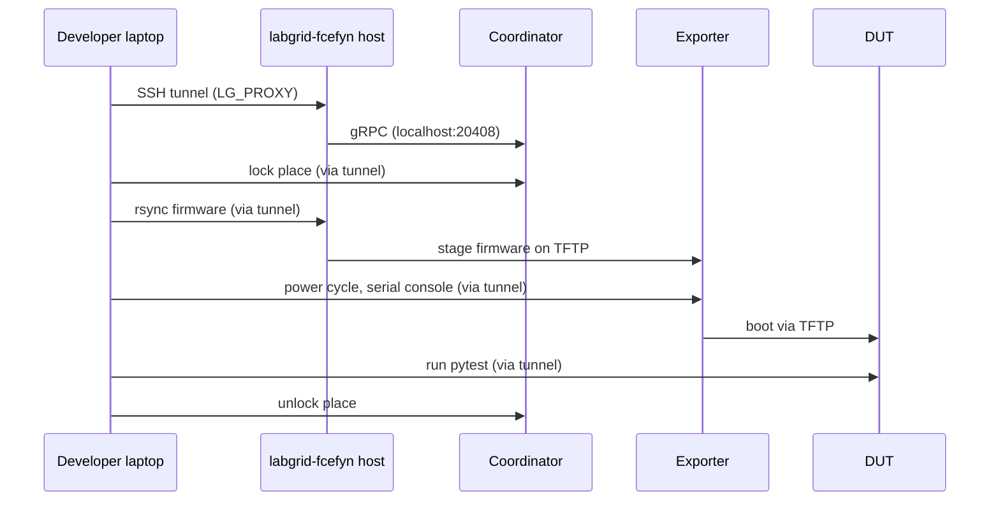
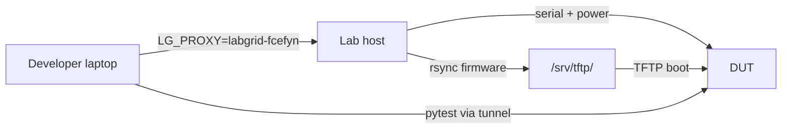

# Developer remote access to the testbed

End-to-end guide for external developers who want to run tests on FCEFyN lab hardware from their own machine. Covers SSH key registration, local configuration, and test execution with both OpenWrt vanilla and LibreMesh firmware.

**Prerequisites:** Linux machine, Python 3.12+, [uv](https://docs.astral.sh/uv/), git. The [libremesh-tests](https://github.com/fcefyn-testbed/libremesh-tests) repo cloned locally.

---

## 1. How remote access works

Labgrid tunnels all traffic (coordinator, exporter, serial, SSH to DUTs) through an SSH connection to the lab host. The developer never needs VPN or direct network access to the lab.



| Component | Where | What |
|-----------|-------|------|
| Coordinator | Lab host (localhost:20408) | Manages place reservations (lock/unlock) |
| Exporter | Lab host | Publishes DUTs (serial, power, TFTP, SSH) |
| `LG_PROXY` | Developer env var | Tells labgrid-client to tunnel through SSH |
| `labgrid-dev` | Host user | Unprivileged account for developers |
| `labnet.yaml` | libremesh-tests repo | Developer SSH keys and lab device inventory |

---

## 2. Register the developer SSH key

### 2.1 Generate key (if needed)

```bash
ssh-keygen -t ed25519 -f ~/.ssh/id_ed25519 -C "your@email" -N ""
cat ~/.ssh/id_ed25519.pub
```

### 2.2 Add public key to labnet.yaml

In the [libremesh-tests](https://github.com/fcefyn-testbed/libremesh-tests) repo, branch `feat/add-fcefyn-labnet`:

```yaml
# labnet.yaml - add under developers:
developers:
  your_username:
    sshkey: ssh-ed25519 AAAAC3Nza... your@email

# labnet.yaml - add your username to the lab's developer list:
labs:
  labgrid-fcefyn:
    developers:
      - your_username
```

Submit a PR with this change. A maintainer merges it.

### 2.3 Deploy the key to the lab host

After the PR is merged, a lab admin runs the Ansible playbook on the lab host to copy the key to `/home/labgrid-dev/.ssh/authorized_keys`:

```bash
cd libremesh-tests
ansible-playbook -i ansible/inventory.ini ansible/playbook_labgrid.yml --limit labgrid-fcefyn -K
```

Alternative (manual, without Ansible):

```bash
ssh admin_user@<HOST_IP>
echo "ssh-ed25519 AAAAC3Nza... your@email" | sudo tee -a /home/labgrid-dev/.ssh/authorized_keys
sudo chown labgrid-dev:labgrid-dev /home/labgrid-dev/.ssh/authorized_keys
sudo chmod 600 /home/labgrid-dev/.ssh/authorized_keys
```

---

## 3. Configure the developer machine

### 3.1 SSH config

Add to `~/.ssh/config` on the developer laptop:

```
Host labgrid-fcefyn
   HostName <HOST_IP>
   User labgrid-dev
   IdentityFile ~/.ssh/id_ed25519
```

`<HOST_IP>` depends on network location:

| Location | HostName value |
|----------|----------------|
| Same LAN as the lab | Lab host LAN IP (e.g. `10.246.3.118`) |
| Remote (via ZeroTier) | Lab host ZeroTier IP (see [ZeroTier setup](zerotier-remote-access.md)) |

### 3.2 Verify SSH access

```bash
ssh labgrid-fcefyn whoami
```

Expected output: `labgrid-dev`. If it asks for a password, the public key was not deployed (see step 2.3).

### 3.3 Clone and install dependencies

```bash
cd ~/pi   # or wherever
git clone https://github.com/fcefyn-testbed/libremesh-tests.git
cd libremesh-tests
```

`uv` resolves dependencies from `pyproject.toml` automatically on first `uv run`. This installs the correct labgrid fork (`aparcar/staging`) with testbed-specific patches (e.g. `TFTPProvider.external_ip`).

### 3.4 Download firmware

`LG_IMAGE` must point to a **local file** on the developer machine. Labgrid rsync's it to the lab host automatically.

Download from the lab host (as admin user, since `labgrid-dev` may not have read access to all paths):

```bash
mkdir -p ~/firmwares

# OpenWrt vanilla
scp admin_user@<HOST_IP>:/srv/tftp/firmwares/bananapi_bpi-r4/openwrt/openwrt-24.10.5-mediatek-filogic-bananapi_bpi-r4-initramfs-recovery.itb ~/firmwares/

# LibreMesh
scp admin_user@<HOST_IP>:/srv/tftp/firmwares/bananapi_bpi-r4/libremesh/lime-24.10.5-mediatek-filogic-bananapi_bpi-r4-initramfs-recovery.itb ~/firmwares/
```

Firmware naming convention: [TFTP - naming convention](../configuracion/tftp-server.md#31-firmware-naming-convention).

---

## 4. Run tests

### 4.1 OpenWrt vanilla (single-node)



```bash
cd ~/pi/libremesh-tests

export LG_PROXY=labgrid-fcefyn
export LG_PLACE=labgrid-fcefyn-bananapi_bpi-r4
export LG_ENV=targets/bananapi_bpi-r4.yaml
export LG_IMAGE=$HOME/firmwares/openwrt-24.10.5-mediatek-filogic-bananapi_bpi-r4-initramfs-recovery.itb

uv run labgrid-client lock
uv run pytest tests/test_base.py -v --log-cli-level=INFO
uv run labgrid-client unlock
```

### 4.2 LibreMesh (single-node)

Same flow, different firmware:

```bash
export LG_IMAGE=$HOME/firmwares/lime-24.10.5-mediatek-filogic-bananapi_bpi-r4-initramfs-recovery.itb

uv run labgrid-client lock
uv run pytest tests/test_libremesh.py -v --log-cli-level=INFO
uv run labgrid-client unlock
```

### 4.3 Available places

List all devices in the lab:

```bash
export LG_PROXY=labgrid-fcefyn
uv run labgrid-client places
```

| Place | Device | Target YAML |
|-------|--------|-------------|
| `labgrid-fcefyn-belkin_rt3200_1` | Belkin RT3200 / Linksys E8450 | `targets/linksys_e8450.yaml` |
| `labgrid-fcefyn-belkin_rt3200_2` | Belkin RT3200 / Linksys E8450 | `targets/linksys_e8450.yaml` |
| `labgrid-fcefyn-belkin_rt3200_3` | Belkin RT3200 / Linksys E8450 | `targets/linksys_e8450.yaml` |
| `labgrid-fcefyn-bananapi_bpi-r4` | BananaPi BPi-R4 | `targets/bananapi_bpi-r4.yaml` |
| `labgrid-fcefyn-openwrt_one` | OpenWrt One | `targets/openwrt_one.yaml` |
| `labgrid-fcefyn-librerouter_1` | LibreRouter v1 | `targets/librerouter_librerouter_v1.yaml` |

### 4.4 Other labgrid-client commands

```bash
# Power cycle a DUT
uv run labgrid-client power cycle

# Interactive serial console
uv run labgrid-client console

# Boot to shell and get console
uv run labgrid-client --state shell console
```

Always unlock when done: `uv run labgrid-client unlock`.

---

## 5. Troubleshooting

| Problem | Cause | Fix |
|---------|-------|-----|
| `Could not resolve hostname labgrid-fcefyn` | Missing `~/.ssh/config` entry | Add `Host labgrid-fcefyn` with `HostName` (section 3.1) |
| `Permission denied (publickey,password)` | Key not deployed on host | Run Ansible playbook or add key manually (section 2.3) |
| `no such identity: ...id_ed25519_fcefyn_lab` | Wrong `IdentityFile` in SSH config | Point to the developer's own private key (section 3.1) |
| `RemoteTFTPProviderAttributes has no attribute external_ip` | Wrong labgrid version (PyPI instead of fork) | Run from `libremesh-tests/` dir with `uv run` (section 3.3) |
| `Local file ... not found` | `LG_IMAGE` path does not exist locally | Download firmware from host first (section 3.4) |
| `Wrong Image Type for bootm command` | Firmware file is a Git LFS pointer (tiny file) | Download the real binary from the host, not the repo (section 3.4) |
| `TIMEOUT ... root@LiMe-d68d45` | Shell prompt regex does not match LibreMesh hostname | Update `prompt` in target YAML: `[\w()-]+` instead of `[\w()]+` |

---

## 6. Reference

- [Running tests](lab-running-tests.md) - host-side test execution and multi-node tests
- [SSH access to DUTs](dut-ssh-access.md) - VLAN lifecycle and mesh SSH IPs
- [TFTP / dnsmasq](../configuracion/tftp-server.md) - firmware layout and naming convention
- [Host configuration](../configuracion/host-config.md) - full host setup including SSH keys (section 3.6)
- [ZeroTier remote access](zerotier-remote-access.md) - VPN setup for admin access outside LAN
- [openwrt-tests README](https://github.com/aparcar/openwrt-tests#remote-access) - upstream remote access documentation
