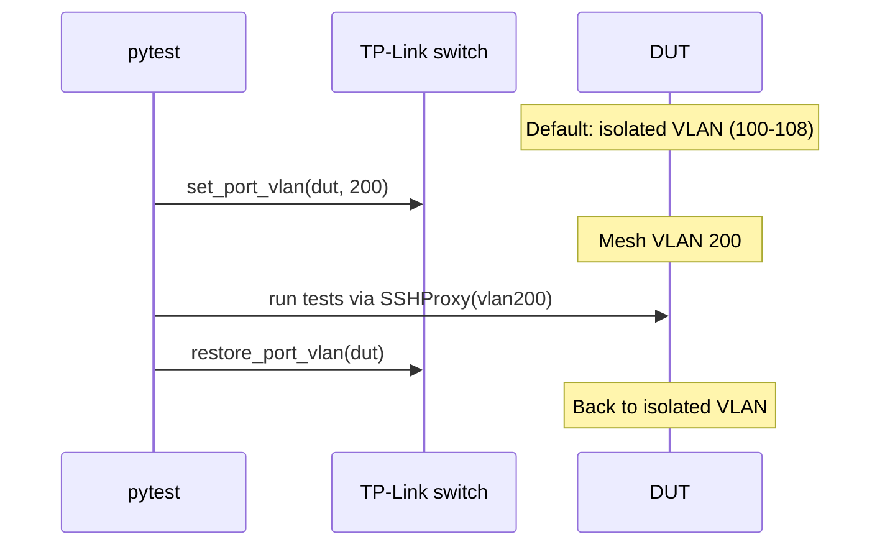

# SSH access to DUTs

How `ssh dut-X` reaches each DUT through its isolated VLAN, and how to connect manually when a DUT is on mesh VLAN 200.

---

## Static ProxyCommand

Each DUT SSH alias in `~/.ssh/config` uses a static `ProxyCommand` that binds to the DUT's **isolated VLAN interface** via `labgrid-bound-connect`:

```
Host dut-belkin-1
    User root
    ProxyCommand sudo labgrid-bound-connect vlan100 192.168.1.1 22
```

`labgrid-bound-connect` uses `socat` with `SO_BINDTODEVICE` to force traffic through the correct VLAN interface. Since all DUTs share `192.168.1.1` on their isolated VLAN, binding to the interface is what distinguishes them.

The full SSH config template is in `configs/templates/ssh_config_fcefyn`.

---

## VLAN lifecycle during tests



- **openwrt-tests**: VLANs never change. DUTs always on isolated VLANs.
- **libremesh-tests**: `conftest_vlan.py` moves ports to VLAN 200 at test start and **always restores** on teardown (even with `LG_MESH_KEEP_POWERED=1`, which only skips power-off).
- **Tests use their own SSH path** (`SSHProxy` with hardcoded `vlan200`), not the `~/.ssh/config` aliases.

---

## Manual access to mesh VLAN 200

If a test crashes before VLAN teardown, a DUT may be stuck on VLAN 200. To SSH in:

```bash
sudo labgrid-bound-connect vlan200 <mesh_ip> 22
```

### Mesh IP table

| DUT | Isolated VLAN | Mesh IP (VLAN 200) |
|-----|---------------|--------------------|
| belkin-1 | 100 | 10.13.200.11 |
| belkin-2 | 101 | 10.13.200.196 |
| belkin-3 | 102 | 10.13.200.118 |
| bananapi | 103 | 10.13.200.169 |
| openwrt-one | 104 | 10.13.200.120 |
| librerouter-1 | 105 | 10.13.200.77 |

To restore all ports to isolated VLANs after a crash:

```bash
switch-vlan --restore-all
```

---

## Host cleanup (one-time)

If the lab host still has legacy scripts installed, remove them:

```bash
sudo rm -f /usr/local/sbin/labgrid-dut-proxy
sudo rm -f /etc/labgrid/dut-proxy.yaml
sudo sed -i '/labgrid-dut-proxy/d' /etc/sudoers.d/labgrid
```
